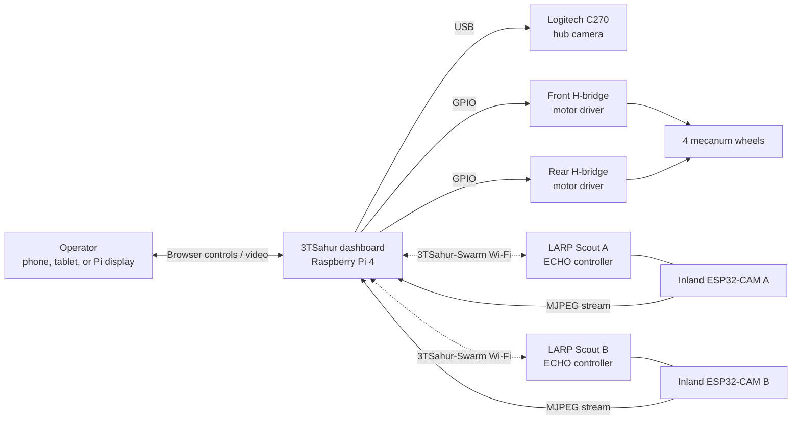

# 3TSahur + LARP Reconnaissance Swarm

<p align="center">
  
  
  
  
</p>

> One rugged Raspberry Pi mecanum hub, two mobile camera scouts, and one browser dashboard for safe local reconnaissance experiments.

**3TSahur** is a Raspberry Pi 4 Model B (4 GB) mecanum-drive control hub with a Logitech C270 USB camera. It coordinates two ECHO differential-drive scout robots—**LARP Scout A** and **LARP Scout B**—each paired with an Inland ESP32-CAM video node. The project creates a self-contained local Wi-Fi control network: no internet connection is required during normal operation.

## What it can do

| System | Capability |
| --- | --- |
| 3TSahur hub | Drive forward, reverse, strafe, and rotate with four independently controlled mecanum wheels. |
| Live vision | Show the Logitech C270 feed plus two LARP ESP32-CAM MJPEG streams in one dashboard. |
| Scout control | Send direction commands to LARP Scout A and B independently over Wi-Fi. |
| Safety | Stop stale commands automatically; includes sequence checks, watchdogs, and a kill-all control. |
| Deployment | Configure a Pi hotspot, dashboard service, local touchscreen/display kiosk, and mDNS address. |
| Optional AI vision | Prepare pretrained YOLO11 Nano person detection for the selected C270 or LARP camera feed. |

## System overview



## Dashboard

Open `http://10.42.0.1` after connecting to the 3TSahur hotspot. On a device that supports mDNS, `http://3tsahur.local` also works. The Pi's attached display opens the same dashboard automatically after installation.

```text
┌─────────────────────────────────────────────────────────────────────┐
│  [ 3TSahur ]  [ LARP Scout A ]  [ LARP Scout B ]     ● Online       │
├───────────────────────────────────┬─────────────────────────────────┤
│  Selected robot's live camera     │  Selected robot's controls      │
│  (one stream active at a time)    │  status, speed, and stop        │
├───────────────────────────────────┴─────────────────────────────────┤
│  Emergency STOP ALL · responsive phone/tablet/desktop layout         │
└─────────────────────────────────────────────────────────────────────┘
```

Only the selected tab keeps its MJPEG feed open. This preserves hotspot
bandwidth for low-latency robot commands instead of competing with three video
streams at once.

The dashboard works with mouse/touch controls and the following keyboard shortcuts when the page is focused:

| Robot | Keys | Action |
| --- | --- | --- |
| 3TSahur | `W` / `S` | Forward / reverse |
| 3TSahur | `A` / `D` | Strafe left / right |
| 3TSahur | `Q` / `E` | Rotate left / right |
| 3TSahur | `Space` | Stop the hub drivetrain |
| LARP Scout A | Arrow keys | Forward, reverse, left, right |
| LARP Scout B | `I` / `K` / `J` / `L` | Forward, reverse, left, right |
| All robots | `Esc` | Emergency kill-all |

Commands are deliberately short-lived. Releasing a key, losing the client connection, or letting the watchdog expire stops the affected robot.

## Hardware and wiring

### 3TSahur hub

| Part | Role |
| --- | --- |
| Raspberry Pi 4 Model B (4 GB) | Runs the hotspot, web dashboard, control service, and USB camera feed. |
| Logitech C270 | USB hub camera. Use a powered USB hub if the Pi cannot supply enough current. |
| Two dual-channel H-bridge motor drivers | Drive the four mecanum motors. Motor power must come from a suitable external supply. |
| Four mecanum DC motors | Front-left, rear-left, front-right, rear-right wheel positions. |

The Pi GPIO layout below is intentionally the same layout as the integration base repository. GPIO numbers are **BCM numbers**, not physical header pin numbers.

| Wheel | Driver channel | GPIO direction pins |
| --- | --- | --- |
| Front left | Front driver IN1 / IN2 | GPIO 5 / GPIO 6 |
| Rear left | Front driver IN3 / IN4 | GPIO 16 / GPIO 19 |
| Front right | Rear driver IN1 / IN2 | GPIO 20 / GPIO 21 |
| Rear right | Rear driver IN3 / IN4 | GPIO 13 / GPIO 26 |

Do not power motors from the Pi's 5 V rail. Share a common ground between the Pi and motor-driver logic, verify each motor direction with wheels raised, and keep an accessible physical power switch. Full connection notes are in [docs/WIRING.md](docs/WIRING.md).

### LARP scouts and cameras

Each scout contains:

- An ECHO robot controller running the LARP drive firmware. The retained motor IDs are left = `1`, right = `6`.
- An Inland ESP32-CAM flashing the LARP camera firmware, configured as an AI Thinker-compatible pin layout.
- The same Wi-Fi SSID/password as the Pi hotspot.

The ESP32-CAM board variations can differ. Check the board silk screen and camera connector before powering it; the full pin map and verification checklist are in [docs/WIRING.md](docs/WIRING.md).

## Install on the Raspberry Pi

1. Flash a current Raspberry Pi OS image and complete its first-boot setup. Use the normal Pi user; do **not** run the installer as root.
2. Connect the C270, motor-driver logic ground, and the GPIO leads above. Keep motor power disconnected for the first software boot.
3. Clone this repository on the Pi and run the installer:

   ```bash
   git clone https://github.com/william-thompsonthe1st/STEM-Research-Academy.git
   cd STEM-Research-Academy
   bash installer/install.sh
   ```

4. The installer installs required packages, builds the app, configures the `3TSahur-Swarm` hotspot, enables services, and reboots the Pi.
5. Join the hotspot, open the dashboard at `http://10.42.0.1`, and test motors with the robot elevated.

Default hotspot credentials are `3TSahur-Swarm` / `roboswarm1`. Change them before any public demonstration: update `/etc/stem-research-academy/config.env` on the Pi and update both LARP firmware sketches to match, then restart the dashboard. See the detailed [setup guide](docs/SETUP.md).

## Configure the system

The installer preserves runtime settings in `/etc/stem-research-academy/config.env` across application updates.

| Setting | Purpose | Typical value |
| --- | --- | --- |
| `HOTSPOT_SSID`, `HOTSPOT_PASSWORD` | Local Wi-Fi network shared by Pi and scouts | `3TSahur-Swarm` |
| `CAMERA_DEVICE` | C270 device selection | `auto` or `/dev/video0` |
| `CAMERA_WIDTH`, `CAMERA_HEIGHT`, `CAMERA_FPS` | Hub video quality and load | `640`, `480`, `10` |
| `LARP_A_CAMERA_URL`, `LARP_B_CAMERA_URL` | MJPEG URLs displayed in the dashboard | ESP32-CAM stream URL |
| `LARP_A_HOST`, `LARP_B_HOST` | Scout command hostnames/IP addresses | `larp-a.local`, `larp-b.local` |
| `DRIVE_WATCHDOG_SECONDS` | Maximum age of an unrefreshed hub command | `0.20` |

After editing runtime configuration, run:

```bash
sudo systemctl restart stem-robot-dashboard
sudo systemctl status stem-robot-dashboard
```

## Optional pretrained AI vision

The base dashboard keeps vision **off by default**. After the optional,
isolated setup is installed, press `C` or use the per-camera **Vision off/on**
button to toggle YOLO for the selected robot tab. It uses **Ultralytics
YOLO11 Nano**, using its pretrained COCO weights and the embedded-friendly
**NCNN** runtime. It requires no dataset, labeling, or training.

For the Pi 4, use YOLO only on the currently selected dashboard camera at
`320px` and 2–5 inference frames per second. Start with COCO class `person`
only. Do not run three full-resolution inference loops at once; that can
compete with video and robot-control traffic. The detection output is an
operator aid, not a safety or identity decision.

Model startup and inference run in a background worker. If the camera, LARP
stream, CSI telemetry, YOLO package, or model files are unavailable, the UI
shows that feature as unavailable; driving, stops, and the motor watchdog
remain independent and active.

### Vision requirements and install

- Current 64-bit Raspberry Pi OS; complete the base installation first.
- Stable power, at least 3 GB free storage, and temporary internet for the
  one-time package/model download and conversion.
- A connected C270 or a verified LARP ESP32-CAM MJPEG stream.
- Install as the normal Pi user in a separate environment—never as `root` and
  never into the dashboard's system Python packages.

```bash
cd ~/STEMResearchAcademy
python3 -m venv --system-site-packages .vision-venv
source .vision-venv/bin/activate
python -m pip install --upgrade pip
python -m pip install "ultralytics>=8.3,<9" ncnn

# Downloads pretrained COCO weights once, then exports the Pi-friendly runtime.
python - <<'PY'
from ultralytics import YOLO
YOLO("yolo11n.pt").export(format="ncnn", imgsz=320)
PY
```

The complete [pretrained vision setup guide](docs/VISION_SETUP.md) includes
the C270 visual test, LARP feed prerequisites, safe performance settings,
offline-use notes, and a hardware validation checklist. Upstream references:
[YOLO11 models](https://docs.ultralytics.com/models/yolo11/),
[NCNN export](https://docs.ultralytics.com/integrations/ncnn/), and
[Raspberry Pi deployment](https://docs.ultralytics.com/guides/raspberry-pi/).

## Flash the LARP firmware

| Target | Sketch | Set before upload |
| --- | --- | --- |
| LARP Scout A/B ECHO board | [firmware/larp-scout/larp_scout_controller.ino](firmware/larp-scout/larp_scout_controller.ino) | `ROBOT_ID`, Wi-Fi credentials, and any board-specific library setup. |
| Inland ESP32-CAM A/B | [firmware/larp-esp32-cam/larp_esp32_cam.ino](firmware/larp-esp32-cam/larp_esp32_cam.ino) | `CAMERA_ID`, Wi-Fi credentials, and the camera board profile. |

Upload one copy configured as `A` and one as `B` for each firmware type. The [LARP controller README](firmware/larp-scout/README.md) and [camera README](firmware/larp-esp32-cam/README.md) cover dependencies and upload notes.

### ESP32-CAM quick start

The Inland ESP32-CAM is a separate Wi-Fi video node, not a motor-controller
accessory. Flash it as `A` or `B`, connect it to stable 5 V power, and use the
matching `larp-a-cam.local/stream` or `larp-b-cam.local/stream` address. The
dashboard opens only the selected LARP feed to protect control responsiveness.
See the complete [Inland ESP32-CAM setup guide](docs/ESP32_CAM_SETUP.md) for
the flash wiring, pin map, network fallback, and troubleshooting steps.

## Tests and simulation evidence

The hardware-independent test suite exercises simulated GPIO/PWM motor decisions, camera discovery, scout command proxy behavior, firmware settings, and installer invariants.

```bash
python -m venv .venv
# Linux/macOS
. .venv/bin/activate
# Windows PowerShell
# .venv\Scripts\Activate.ps1
pip install -r requirements.txt
python -m unittest discover -s tests -v
```

The recorded desktop simulation ran **41 tests successfully**: 6 dashboard UI, 5 motor, 1 camera, 12 firmware, 2 scout-registry, and 15 Flask API/dashboard tests. Hardware validation is still required for motor polarity, motor current, Wi-Fi range, camera focus, CSI calibration, and an emergency-stop test. Read [docs/SIMULATION_RESULTS.md](docs/SIMULATION_RESULTS.md) for the exact results and limitations.

## Project structure

```text
STEM-Research-Academy/
├── robot_server/                 # Python dashboard, GPIO drive, camera, scout proxy
│   ├── static/                   # Browser UI assets
│   ├── templates/                # Dashboard page
│   └── tests/                    # Software simulation tests
├── firmware/
│   ├── larp-scout/               # ECHO drive firmware for Scouts A and B
│   └── larp-esp32-cam/           # Inland ESP32-CAM streaming firmware
├── installer/                    # Pi installer, hotspot, systemd, kiosk setup
├── docs/                         # Wiring, setup, test report, integration changes
├── run.py                        # Dashboard entry point
└── requirements.txt              # Local development dependencies
```

## Local development

Run the dashboard without GPIO hardware for UI work and code review:

```bash
python -m venv .venv
. .venv/bin/activate
pip install -r requirements.txt
python run.py
```

Then browse to `http://127.0.0.1:8080`. On a non-Pi machine, GPIO behavior is simulated/fails safely; it does not move hardware. Keep real motor testing on the Pi, with wheels off the ground for the first run.

## Documentation

- [Setup guide](docs/SETUP.md) — end-to-end Pi, network, firmware, and first-drive procedure.
- [Wiring reference](docs/WIRING.md) — exact 3TSahur motor GPIO mapping and ESP32-CAM notes.
- [Inland ESP32-CAM setup](docs/ESP32_CAM_SETUP.md) — upload wiring, pin map, stream verification, and troubleshooting.
- [Simulation results](docs/SIMULATION_RESULTS.md) — commands run, passed tests, and test limitations.
- [Changes from original](docs/CHANGES_FROM_ORIGINAL.md) — what came from the integration base and what changed.
- [Installer guide](installer/README.md) and [server guide](robot_server/README.md) — package-specific operation details.

## Safety checklist

- Test each motion direction with the wheels clear of the floor.
- Use a fused motor supply sized for motor stall current; never run motor power through the Pi.
- Keep the motor battery disconnected while wiring or flashing boards.
- Make sure every controller shares the intended common logic ground.
- Test `Space`/`Esc` and a network-disconnect stop before operating near people or property.

---

Built from the partner project's deployment/dashboard foundation and adapted for the 3TSahur hub and LARP Scout system. See [docs/CHANGES_FROM_ORIGINAL.md](docs/CHANGES_FROM_ORIGINAL.md) for the complete integration record.
