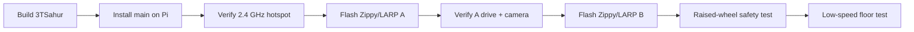
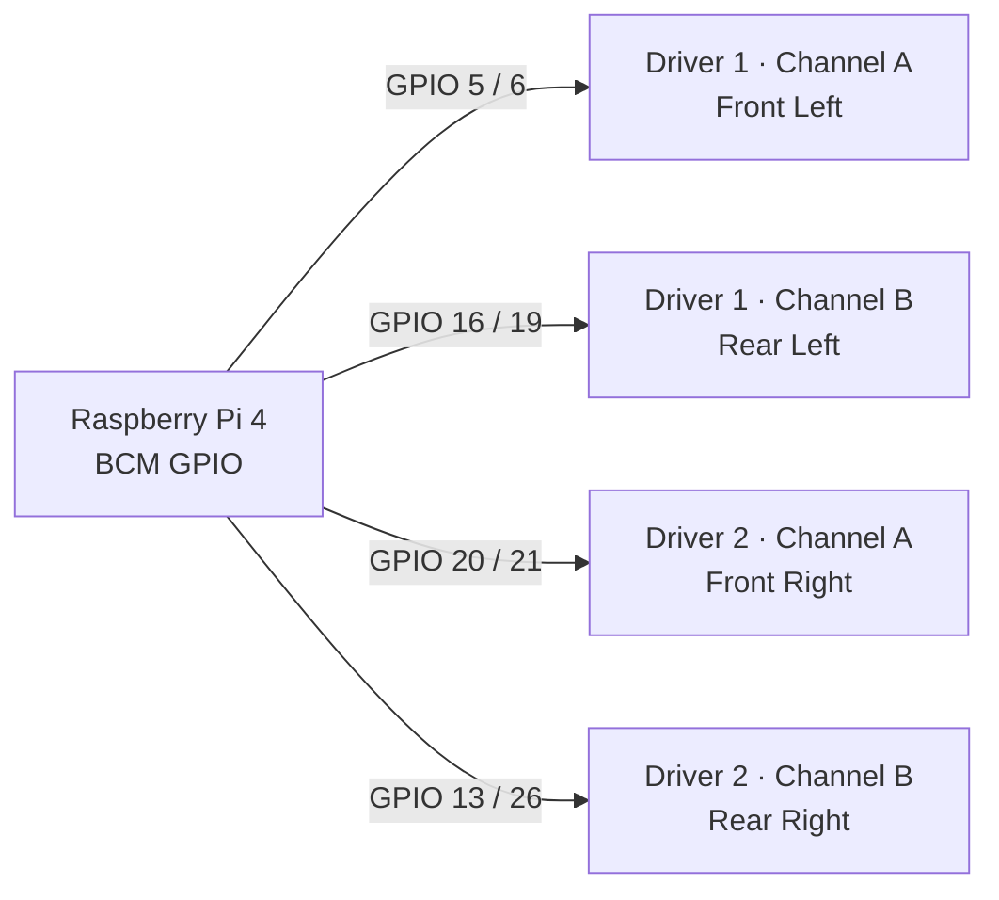
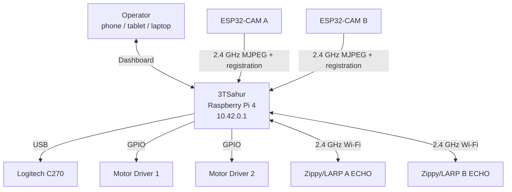
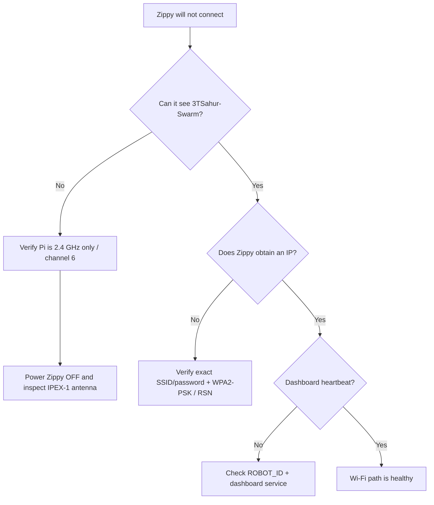
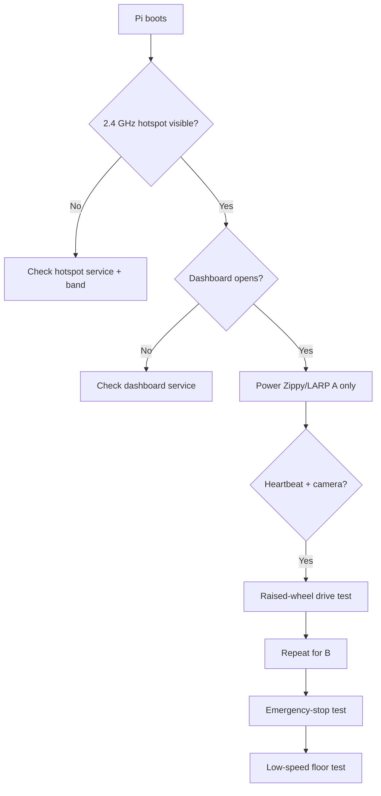

# 3TSahur + LARP Reconnaissance Swarm

<p align="center">
  
  
  
  
  
</p>

> Raspberry Pi 4 mecanum hub + two Zippy/LARP differential-drive scouts + three camera feeds + one local browser dashboard.

**3TSahur** is the Raspberry Pi 4 control hub. **LARP Scout A** and **LARP Scout B** are Zippy/ECHO ESP32-S3 differential-drive robots. Each LARP has its own Inland AI-Thinker-compatible ESP32-CAM. The Pi creates the local robot network, hosts the dashboard, controls 3TSahur, relays LARP video, and can optionally run YOLO11 Nano person detection.

## Critical network requirement

> [!IMPORTANT]
> **Use a dedicated 2.4 GHz robot network.** The Raspberry Pi hotspot must be configured for **2.4 GHz**, and the Zippy/LARP ECHO and ESP32-CAM clients must use that 2.4 GHz network. Do not configure `3TSahur-Swarm` as a 5 GHz-only network. For this validated deployment, keep the Pi robot hotspot explicitly fixed to 2.4 GHz instead of using a dual-band/band-steered hotspot profile.

The project baseline is:

| Network setting | Required project configuration |
| --- | --- |
| SSID | `3TSahur-Swarm` |
| Band | **2.4 GHz only** |
| Channel | **6** |
| Security | **WPA2-Personal / WPA2-PSK** |
| Protocol | **RSN** |
| Pi address | `10.42.0.1` |

A dual-band access point can technically include a usable 2.4 GHz network, but this project intentionally removes that ambiguity: the dedicated Pi robot hotspot is configured and validated as **2.4 GHz only**.

## Quick start

The current integrated project is on **`main`**, and the installer now defaults to `main`.



Install on a Raspberry Pi as the normal Pi user:

```bash
curl -fsSL https://raw.githubusercontent.com/william-thompsonthe1st/STEM-Research-Academy/main/installer/curl-install.sh | bash
```

Or clone it first:

```bash
git clone https://github.com/william-thompsonthe1st/STEM-Research-Academy.git
cd STEM-Research-Academy
git checkout main
bash installer/install.sh
```

After reboot, join `3TSahur-Swarm` and open `http://10.42.0.1` or `http://3tsahur.local` when mDNS is available.

The generated hotspot password is stored locally in:

```text
/etc/stem-research-academy/config.env
```

Copy the same SSID/password into both Zippy/LARP ECHO sketches and both ESP32-CAM sketches. Never commit the generated password to GitHub.

## Setup pinout visual

All GPIO numbers in this project are **BCM GPIO numbers**, not Raspberry Pi physical header-pin numbers.



```text
                 3TSAHUR RASPBERRY PI 4 MOTOR PINOUT

 Raspberry Pi 4 (BCM)                  Dual H-bridge motor drivers
 ────────────────────                  ───────────────────────────
 GPIO 5  ────────────────────────────► Driver 1 IN1 ┐
 GPIO 6  ────────────────────────────► Driver 1 IN2 ┘ Front Left

 GPIO 16 ────────────────────────────► Driver 1 IN3 ┐
 GPIO 19 ────────────────────────────► Driver 1 IN4 ┘ Rear Left

 GPIO 20 ────────────────────────────► Driver 2 IN1 ┐
 GPIO 21 ────────────────────────────► Driver 2 IN2 ┘ Front Right

 GPIO 13 ────────────────────────────► Driver 2 IN3 ┐
 GPIO 26 ────────────────────────────► Driver 2 IN4 ┘ Rear Right

 Pi GND ─────────────────────────────► Driver logic/common ground
 External motor supply ─────────────► Motor-driver power input
                                      (NEVER Pi 5 V)
```

| Wheel | Driver | BCM GPIO pair |
| --- | --- | --- |
| Front left | Driver 1, IN1/IN2 | `5 / 6` |
| Rear left | Driver 1, IN3/IN4 | `16 / 19` |
| Front right | Driver 2, IN1/IN2 | `20 / 21` |
| Rear right | Driver 2, IN3/IN4 | `13 / 26` |

Do not reuse one Pi GPIO across multiple driver inputs. Keep the wheels raised for the first direction test, use a fused external motor supply, and maintain the intended common logic ground. Full details: [docs/WIRING.md](docs/WIRING.md) and [docs/SETUP.md](docs/SETUP.md).

## System architecture



The ECHO drive controller and ESP32-CAM on each Zippy/LARP are separate Wi-Fi clients. They do not require a GPIO connection to each other. Match their identities as `A/A` and `B/B`.

## Flash the Zippy/LARP devices

| Board | Firmware | Arduino profile | Configure |
| --- | --- | --- | --- |
| Zippy/LARP ECHO | [`firmware/larp-scout/larp-scout.ino`](firmware/larp-scout/larp-scout.ino) | **ESP32S3 Dev Module** | `ROBOT_ID`, SSID/password |
| Inland ESP32-CAM | [`firmware/larp-esp32-cam/larp-esp32-cam.ino`](firmware/larp-esp32-cam/larp-esp32-cam.ino) | **AI Thinker ESP32-CAM** | `CAMERA_ID`, SSID/password |

Arduino baseline:

- `esp32 by Espressif Systems` 3.0.7
- 3DBuffalo EchoLib 1.3.0
- Adafruit BusIO
- Serial Monitor at 115200 baud

```text
Zippy/LARP A
├── ECHO:      ROBOT_ID = 'A'
└── ESP32-CAM: CAMERA_ID = 'A'

Zippy/LARP B
├── ECHO:      ROBOT_ID = 'B'
└── ESP32-CAM: CAMERA_ID = 'B'
```

## IPEX-1 antenna + WPA2 troubleshooting

> [!NOTE]
> The **IPEX-1 connector and WPA2 are different layers of the Wi-Fi connection**. WPA2 controls authentication/encryption. The IPEX-1 connector is part of the Zippy/ECHO radio's antenna path. Correct WPA credentials will not fix a loose/damaged antenna connection, and reseating an antenna will not fix an incorrect password/security profile.

With the Zippy powered **off**, inspect the IPEX-1 antenna connection if the robot cannot reliably see the Pi hotspot, works only at very short range, or disconnects much more often than the other robot. Make sure the tiny plug is centered and fully seated and that the antenna lead is not pinched or damaged. Avoid twisting/prying the connector.

For authentication problems, verify the Pi uses the project's WPA2-Personal/RSN profile and the robot has the exact same SSID/password.

Check the Pi's non-secret Wi-Fi settings with:

```bash
nmcli -f 802-11-wireless.ssid,802-11-wireless.band,802-11-wireless.channel connection show stem-robot-hotspot
nmcli -f 802-11-wireless-security.key-mgmt,802-11-wireless-security.proto connection show stem-robot-hotspot
```

Expected values include:

```text
SSID:      3TSahur-Swarm
Band:      bg (2.4 GHz)
Channel:   6
Key mgmt:  wpa-psk
Protocol:  rsn
```

Do not switch the dedicated robot hotspot to WPA3-only/SAE or 5 GHz-only operation.

### Wi-Fi fault-isolation visual



The full symptom-by-symptom guide is in **[docs/TROUBLESHOOTING.md](docs/TROUBLESHOOTING.md)**.

## Dashboard controls

| Robot | Keys | Action |
| --- | --- | --- |
| 3TSahur | `W` / `S` | Forward / reverse |
| 3TSahur | `A` / `D` | Strafe left / right |
| 3TSahur | `Q` / `E` | Rotate left / right |
| 3TSahur | `Space` | Stop 3TSahur |
| LARP A | Arrow keys | Forward / reverse / left / right |
| LARP B | `I` / `K` / `J` / `L` | Forward / reverse / left / right |
| All | `Esc` | Emergency stop all |

The Pi drivetrain watchdog is 200 ms. Releasing controls, losing the client, or missing command refreshes stops motion.

## Verify the complete system



Useful Pi checks:

```bash
sudo systemctl status stem-robot-hotspot --no-pager
sudo systemctl status stem-robot-dashboard --no-pager
curl --fail http://127.0.0.1:8080/healthz
```

## Optional vision

Only add optional vision after drive, stop, hotspot, and camera behavior are stable:

```bash
cd ~/STEMResearchAcademy
bash installer/install-vision.sh
```

Vision runs separately from the core control path and pauses during active robot motion. See [docs/VISION_SETUP.md](docs/VISION_SETUP.md).

## Project structure

```text
STEM-Research-Academy/
├── robot_server/                 # Dashboard, motors, camera, scouts, vision
├── firmware/
│   ├── larp-scout/               # Zippy/LARP ECHO firmware
│   └── larp-esp32-cam/           # ESP32-CAM firmware
├── installer/                    # Pi installer, hotspot and services
├── docs/                         # Setup and troubleshooting documentation
├── tests/                        # Hardware-independent tests
├── run.py
└── requirements.txt
```

## Documentation

- [Setup guide](docs/SETUP.md) — build, pinout, network setup and first-drive procedure.
- [Troubleshooting guide](docs/TROUBLESHOOTING.md) — 2.4 GHz, WPA2/RSN, Zippy IPEX-1 antenna, power and heartbeat diagnosis.
- [Wiring reference](docs/WIRING.md) — exact 3TSahur GPIO mapping.
- [ESP32-CAM setup](docs/ESP32_CAM_SETUP.md) — AI Thinker upload wiring and camera pin map.
- [LARP camera/controller integration](docs/LARP_CAMERA_CONTROLLER_INTEGRATION.md) — identity pairing and field testing.
- [Latency tuning](docs/LATENCY_TUNING.md) — control-priority behavior.
- [Vision setup](docs/VISION_SETUP.md) — optional YOLO11 Nano / NCNN installation.
- [Simulation results](docs/SIMULATION_RESULTS.md) — software test coverage and limitations.

## Safety

- Test every direction with wheels clear of the floor first.
- Disconnect motor power while wiring or flashing electronics.
- Use a fused external motor supply; never power drive motors from the Pi.
- Keep an accessible physical motor-power switch.
- Verify the intended common logic ground.
- Test `Space`, `Esc`, browser disconnect, and network-loss stopping before operating near people or property.
- Power a Zippy/LARP off before inspecting or reseating its IPEX-1 antenna connector.

---

Built from the partner project's deployment/dashboard foundation and adapted for the 3TSahur hub and Zippy/LARP Scout system.