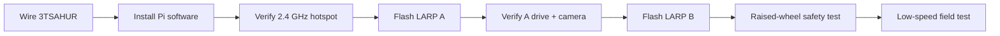
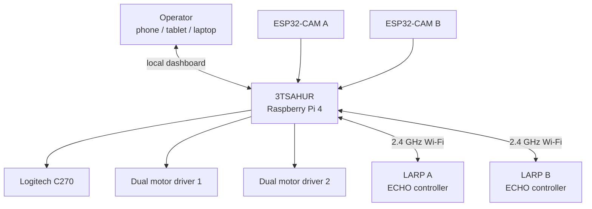
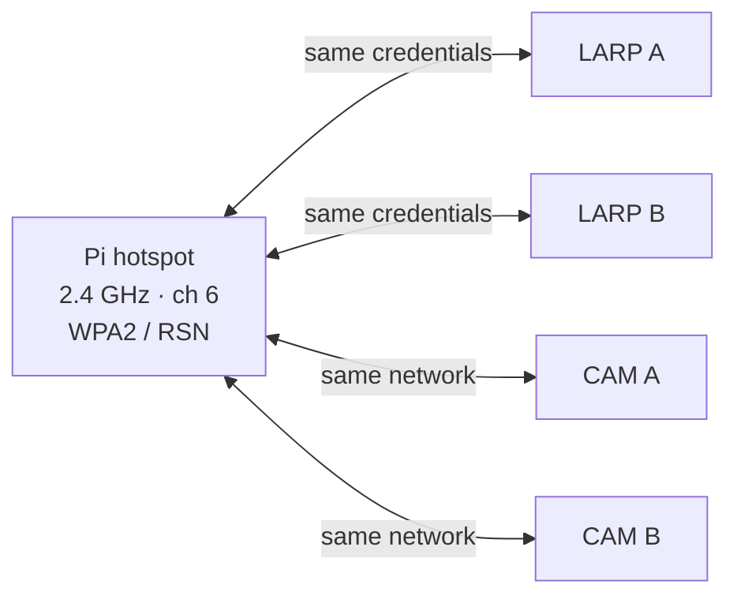
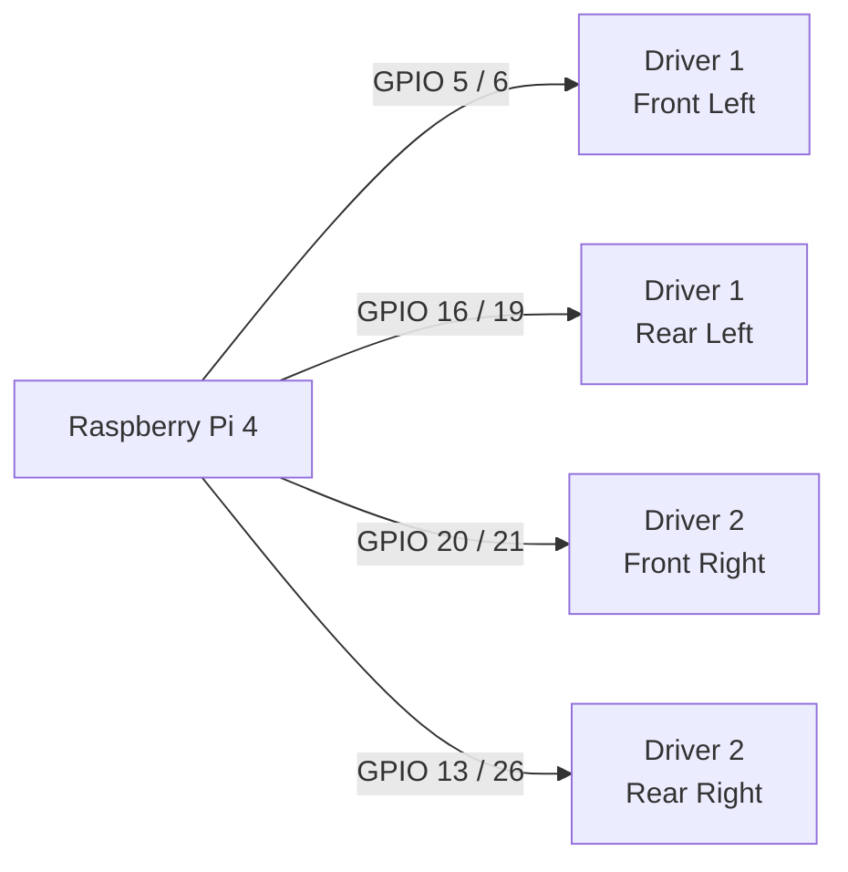
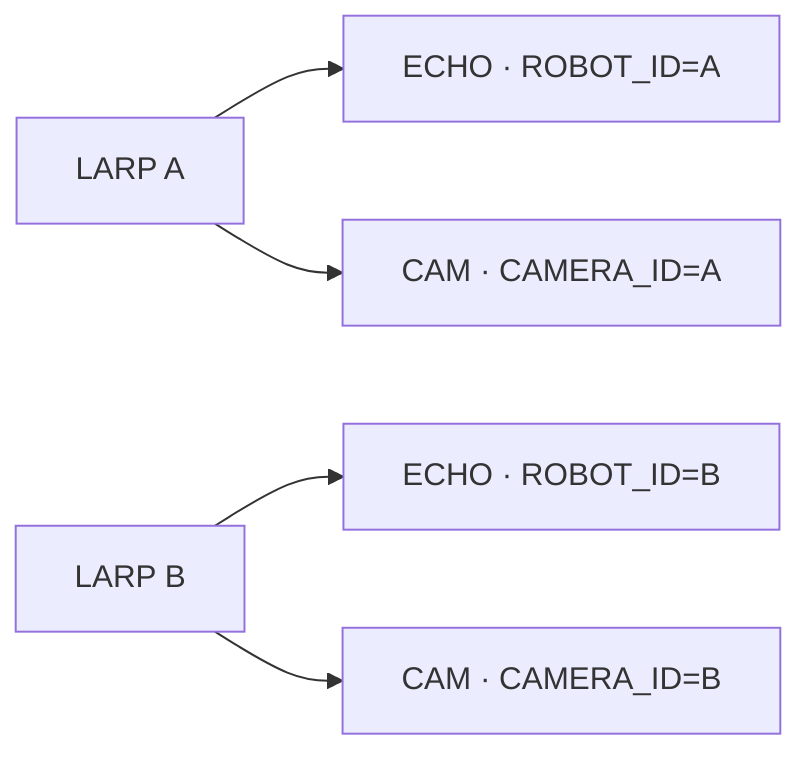
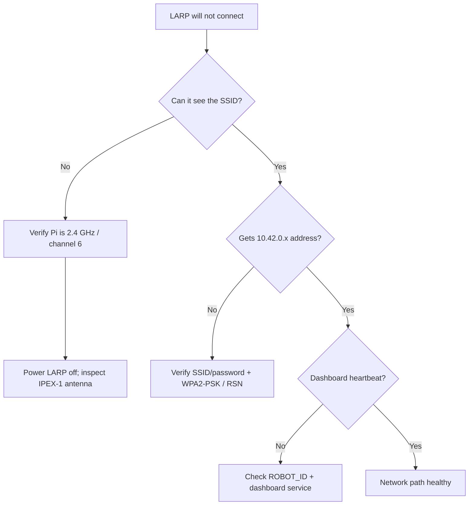
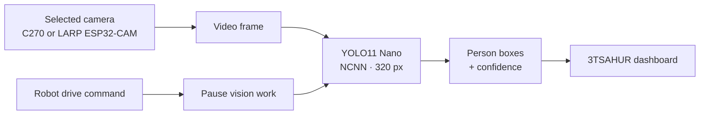
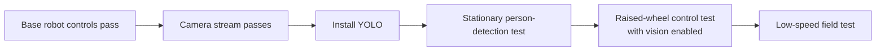
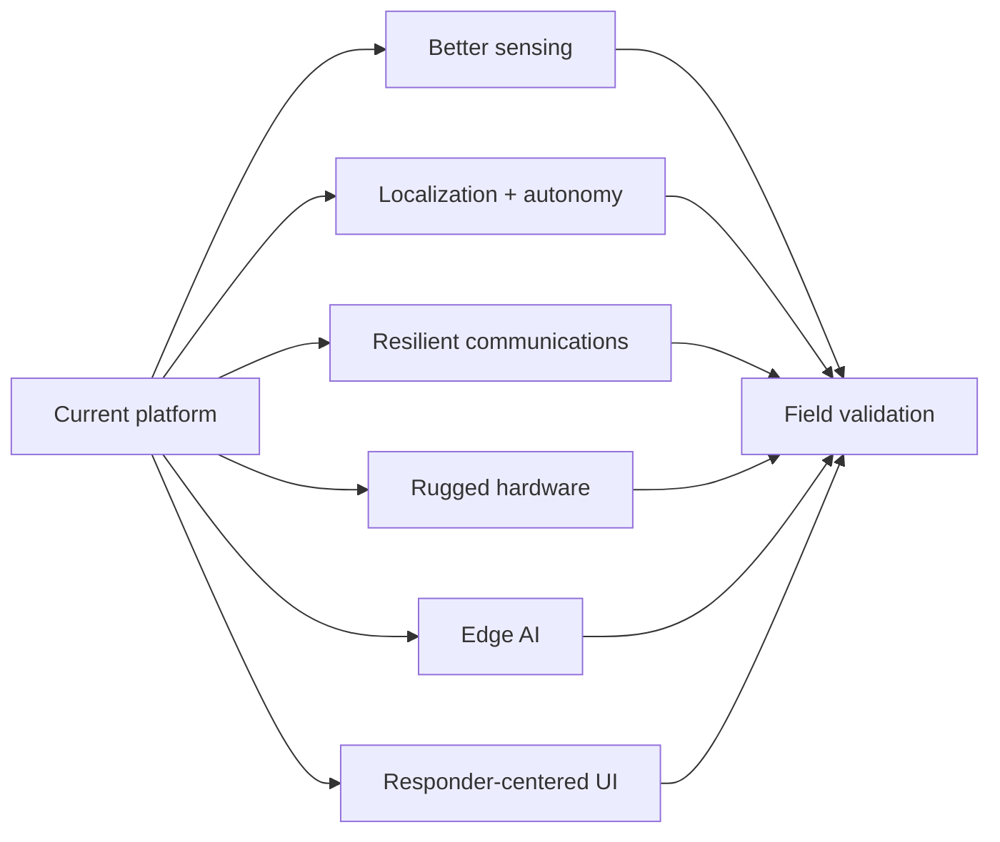

# 3TSAHUR + LARP Reconnaissance Swarm

> A local-first multi-robot reconnaissance platform designed to help first responders gather situational awareness before personnel enter uncertain or hazardous areas.

## Robot names and mission

**3TSAHUR** — **Terrain Tandem Transport Semi-Autonomous Hub Unit for Reconnaissance** — is the large Raspberry Pi 4 mecanum-drive robot and central control hub. Its role is to carry the main compute, networking, camera, and coordination workload while serving as a stable mobile base for reconnaissance.

**LARP** — **Lightweight Autonomous Reconnaissance Platform** — is the project name for each small Zippy/ECHO differential-drive scout. **LARP A** and **LARP B** are intended as lightweight forward scouts that extend the operator's view into areas that may be obstructed, difficult to access, or unsafe for responders to immediately enter.

Together, **3TSAHUR + the LARPs** form a distributed first-responder reconnaissance system. Human operators remain in control; autonomy and sensing are intended to improve situational awareness rather than replace responder judgment.

> [!NOTE]
> `Zippy` and `ECHO` describe the underlying small-robot hardware platform/controller. The project names are **LARP A** and **LARP B**. The existing SSID `3TSahur-Swarm` is retained for deployment compatibility even though the project/display name is **3TSAHUR**.

## Start here



## Current system architecture



Current design priorities are reliable manual control, independent robot/camera failure isolation, a local browser UI, a control watchdog, optional vision, and a simple network that can operate without internet access after setup.

## Critical network requirement

> [!IMPORTANT]
> **Use a dedicated 2.4 GHz robot network.** The Raspberry Pi hotspot and the LARP ECHO/ESP32-CAM clients must use the same **2.4 GHz** network. Do not deploy this configuration as 5 GHz-only or rely on dual-band/band-steering behavior.

| Setting | Project configuration |
| --- | --- |
| SSID | `3TSahur-Swarm` |
| Band | **2.4 GHz only** |
| Channel | **6** |
| Security | **WPA2-Personal / WPA2-PSK** |
| Protocol | **RSN** |
| Pi address | `10.42.0.1` |



## Raspberry Pi installation

Production installs use `main`:

```bash
curl -fsSL https://raw.githubusercontent.com/william-thompsonthe1st/STEM-Research-Academy/main/installer/curl-install.sh | bash
```

Or:

```bash
git clone https://github.com/william-thompsonthe1st/STEM-Research-Academy.git
cd STEM-Research-Academy
git checkout main
bash installer/install.sh
```

After reboot, join `3TSahur-Swarm` and open `http://10.42.0.1` or `http://3tsahur.local` when mDNS is available. The generated hotspot password is stored in `/etc/stem-research-academy/config.env`; copy the same SSID/password into both LARP ECHO sketches and both ESP32-CAM sketches, and never commit the password.

## 3TSAHUR pinout

The code uses **BCM GPIO numbering**.



| Wheel | Driver inputs | BCM GPIO | Physical pins |
| --- | --- | --- | --- |
| Front left | Driver 1 IN1/IN2 | `5 / 6` | `29 / 31` |
| Rear left | Driver 1 IN3/IN4 | `16 / 19` | `36 / 35` |
| Front right | Driver 2 IN1/IN2 | `20 / 21` | `38 / 40` |
| Rear right | Driver 2 IN3/IN4 | `13 / 26` | `33 / 37` |

```text
Raspberry Pi 4 relevant header pins

29 GPIO5   ●  ● GND    30
31 GPIO6   ●  ● GPIO12 32
33 GPIO13  ●  ● GND    34
35 GPIO19  ●  ● GPIO16 36
37 GPIO26  ●  ● GPIO20 38
39 GND     ●  ● GPIO21 40
```

> [!WARNING]
> Use a correctly rated fused external motor supply. Never power the drive motors from the Pi 5 V rail. Maintain the intended common logic ground and perform the first direction test with the wheels raised.

See [docs/WIRING.md](docs/WIRING.md) and [docs/SETUP.md](docs/SETUP.md).

## LARP firmware and camera pairing

| Device | Firmware | Arduino profile | Identity |
| --- | --- | --- | --- |
| LARP ECHO controller | `firmware/larp-scout/larp-scout.ino` | ESP32S3 Dev Module | `ROBOT_ID=A/B` |
| Inland ESP32-CAM | `firmware/larp-esp32-cam/larp-esp32-cam.ino` | AI Thinker ESP32-CAM | `CAMERA_ID=A/B` |



The ECHO controller and ESP32-CAM are separate Wi-Fi clients; they do not require a GPIO connection to each other. Matching IDs pair the drive controller and camera in the dashboard.

## Wi-Fi, WPA2, and IPEX-1 troubleshooting

The **IPEX-1 antenna connector and WPA2 are separate layers**. WPA2 handles authentication/encryption; IPEX-1 is part of the radio antenna path. Correct credentials cannot compensate for a loose antenna, and reseating an antenna cannot correct the wrong WPA profile.



With the LARP powered off, inspect the IPEX-1 connection if the robot has unusually poor range, cannot reliably see the hotspot, or disconnects much more often than the other LARP. See [docs/TROUBLESHOOTING.md](docs/TROUBLESHOOTING.md) for the full diagnostic procedure.

## First-boot verification

```bash
sudo systemctl status stem-robot-hotspot --no-pager
sudo systemctl status stem-robot-dashboard --no-pager
curl --fail http://127.0.0.1:8080/healthz
nmcli -f 802-11-wireless.ssid,802-11-wireless.band,802-11-wireless.channel connection show stem-robot-hotspot
nmcli -f 802-11-wireless-security.key-mgmt,802-11-wireless-security.proto connection show stem-robot-hotspot
```

Verify hotspot → dashboard → C270 → LARP A → LARP B → emergency stop/network-loss stopping, in that order. Power and test one scout at a time before testing the full system.

## YOLO11 Nano person detection

3TSAHUR supports **optional local person detection** using pretrained **Ultralytics YOLO11 Nano (`yolo11n`)** exported to **NCNN** for Raspberry Pi 4 inference. The standard pretrained weights use the COCO dataset; this project initially limits inference to COCO class `0` (`person`). No custom dataset collection, labeling, or training is required for the baseline setup.

> [!IMPORTANT]
> YOLO is an **operator aid**, not a safety decision system, identity system, or guaranteed human detector. A missed detection does not prove an area is empty, and a detection should be confirmed by the operator and other available sensor information.

### How vision fits into the robot



Vision is deliberately isolated from the core motor-control path. It runs in a separate worker, starts disabled after a dashboard restart, and pauses while a 3TSAHUR or LARP drive command is active so inference does not compete with control responsiveness.

### Install YOLO11 Nano

Complete and verify the base robot installation first. Then run the optional installer as the **normal Raspberry Pi user**, without `sudo`:

```bash
cd ~/STEMResearchAcademy
bash installer/install-vision.sh
```

The installer:

1. Creates `~/STEMResearchAcademy/.vision-venv` with system site packages.
2. Installs `ultralytics>=8.3,<9` and `ncnn`.
3. Downloads the pretrained `yolo11n.pt` weights.
4. Exports an NCNN model at **320 px** to `yolo11n_ncnn_model/`.
5. Verifies that the dashboard Python runtime can import the vision packages and load the exported model.
6. Records the vision environment in `/etc/stem-research-academy/config.env`.
7. Restarts `stem-robot-dashboard.service`.

Internet access is needed for the initial package/model download and export. Normal inference can operate locally afterward as long as the exported model and environment remain installed.

### Recommended Raspberry Pi 4 settings

| Setting | Baseline | Reason |
| --- | --- | --- |
| Model | `yolo11n_ncnn_model` | Small YOLO11 detector suitable for edge testing |
| Input size | `320` | Reduces Pi CPU load versus larger inputs |
| Detection class | `person` / class `0` | Keeps the initial research task focused |
| Confidence | `0.45` | Initial test threshold; validate experimentally |
| Inference target | **2–5 FPS** | Leaves resources for control and video |
| Active sources | **One camera at a time** | Avoids unnecessary Pi/Wi-Fi contention |

### Enable vision from the dashboard

After the installer succeeds, reload the dashboard, select **3TSAHUR**, **LARP A**, or **LARP B**, and use that tab's **Vision** control or press `C`. Vision state is maintained per camera feed. Press `C` again to stop future inference on the selected feed.

The dashboard can use the Logitech C270 or the currently selected Pi-relayed LARP ESP32-CAM stream. Before using LARP vision, first confirm that the ESP32-CAM has registered with the Pi and that ordinary video works without YOLO enabled.

### Verify YOLO before driving

A useful validation order is:



Run the repository tests first:

```bash
cd ~/STEMResearchAcademy
.venv/bin/python -m unittest discover -s tests -v
```

Then enable vision while the chassis is stationary and verify that a person in view can produce a labelled bounding box and confidence score. Next, with wheels raised, verify that drive controls, `Space`, and `Esc` remain responsive. If inference causes control latency, excessive temperature, Wi-Fi degradation, or power instability, reduce the vision workload or disable it during motion.

### YOLO troubleshooting

| Symptom | Check |
| --- | --- |
| `Vision unavailable` | Confirm `.vision-venv`, `VISION_SITE_PACKAGES`, and `yolo11n_ncnn_model/` exist |
| Installer says application is missing | Run the base 3TSAHUR installer first |
| C270 has no detections | Verify camera works normally, lighting, subject visibility, and confidence threshold |
| LARP vision unavailable | Verify the ESP32-CAM registers and streams normally before enabling YOLO |
| Model/package download fails | Check internet access and available storage, then rerun the vision installer |
| Dashboard works but vision does not | Check `stem-robot-dashboard` logs and the vision environment; core driving should remain independent |
| Control/video performance drops | Use one active vision source, 320 px input, low inference rate, or disable vision during motion |

A missing model, missing package, unreachable camera, or failed inference should **not** disable driving, emergency stop, the motor watchdog, normal camera streaming, or CSI status. Detailed installation, manual export, preview, and benchmarking instructions are in [docs/VISION_SETUP.md](docs/VISION_SETUP.md).

## Future research and recommended improvements

The current platform is a strong teleoperated research baseline, but a first-responder reconnaissance system can be improved substantially. Future work should be measured against three questions: **Does it increase useful situational awareness? Does it make the system more reliable in degraded environments? Does it reduce operator workload without removing meaningful human control?**



### 1. Localization, mapping, and navigation

Add wheel encoders and an IMU to 3TSAHUR and the LARPs, then evaluate odometry, visual-inertial odometry, or SLAM. LiDAR, depth cameras, or stereo vision could provide obstacle geometry where GPS is unavailable. Useful semi-autonomous functions include assisted obstacle avoidance, return-to-home, waypoint driving, automatic stopping near hazards, and communications-aware navigation, all with immediate operator override.

### 2. Sensor fusion for first-responder reconnaissance

Future sensor packages could investigate thermal imaging, depth sensing, ambient temperature/humidity, smoke/particulate sensing, appropriately calibrated gas sensing, audio, light level, and structural/vibration measurements. Research should focus on combining these sources into a simple operator display rather than overwhelming the user with raw telemetry. Prototype environmental sensing must not be represented as certified life-safety equipment without appropriate validation.

### 3. CSI human-presence research

Collect controlled Wi-Fi Channel State Information datasets across rooms, wall materials, distances, antenna orientations, moving machinery, and occupant counts. Report false-positive and false-negative rates. Compare CSI alone with CSI fused with RGB, thermal, or depth observations.

### 4. Communications resilience

Study a dedicated second radio, external/protected antennas, improved antenna placement, mesh/relay nodes, store-and-forward telemetry, and separate backhaul where compatible. Keep command traffic isolated from video/AI load. Measure latency, packet loss, range, recovery time, and emergency-stop behavior under link degradation.

### 5. Closed-loop drivetrain control

Add encoders and current sensing for closed-loop wheel-speed control, repeatable mecanum motion, stall detection, traction analysis, and improved odometry. Future motor electronics could add hardware PWM, per-channel current measurement, thermal monitoring, and appropriate protection.

### 6. Power and endurance

Add battery voltage/current telemetry and log energy use by drivetrain, cameras, Wi-Fi, and AI workloads so mission time can be measured and estimated. Compare battery capacity, regulated power architecture, swappable packs, low-voltage shutdown, and autonomous low-battery return behavior.

### 7. Edge AI and perception

Use the current YOLO11 Nano/NCNN baseline as a measured starting point. Future experiments can compare TensorFlow Lite, ONNX/runtime alternatives, tracking such as ByteTrack, or dedicated accelerators while recording inference latency, power, CPU temperature, video latency, and control responsiveness. Expand perception only for clear responder tasks and display confidence/uncertainty rather than presenting AI output as guaranteed truth.

### 8. Multi-robot coordination

Study shared maps, task allocation, communications-aware scout placement, duplicate-exploration avoidance, and observation handoff between 3TSAHUR and the LARPs. Measure whether automation actually lowers operator workload.

### 9. Mechanical ruggedization

Improve impact protection, strain relief, connector retention, antenna protection, wheel/camera guards, dust/water resistance, cooling, and serviceability. The LARP IPEX-1 antenna connection is a particularly useful target for mechanical protection.

### 10. Human factors and dashboard design

Conduct timed user studies for robot selection, target identification, lost-camera recovery, low-battery recognition, emergency stopping, and source identification. Compare keyboard, touchscreen, and gamepad control and test the interface in low-light and gloved-use scenarios.

### 11. Reliability, cybersecurity, and failure testing

Deliberately test camera loss, scout reboot, Pi service restart, delayed commands, congestion, low battery, stalled motors, and browser loss. Add structured mission logs/replay. Future security work can study stronger device authentication, credential rotation, signed releases, least-privilege services, and protection of mission recordings.

### 12. Field-validation methodology

Create a repeatable test matrix covering rooms, hallways, corners, obstacles, low light, safe simulated visibility degradation, RF interference, and increasing range. Record command/video latency, packet loss, reconnection time, endurance, detection accuracy, operator task time, and recovery success.

| Priority | Research area | Why |
| --- | --- | --- |
| 1 | Reliability + instrumentation | Establish a trustworthy baseline |
| 2 | Encoders/IMU + battery telemetry | Improve control and mission awareness |
| 3 | Communications resilience | Protect control/video availability |
| 4 | Thermal/depth/environment sensing | Add information beyond RGB video |
| 5 | CSI validation + sensor fusion | Test the distinctive non-camera sensing concept |
| 6 | SLAM + assisted navigation | Reduce workload in complex environments |
| 7 | Edge-AI optimization | Add perception without sacrificing control latency |
| 8 | Multi-robot autonomy | Build on a reliable measured platform |

**Recommended research strategy:** instrument first, establish a baseline, change one subsystem at a time, and compare measured results.

## Documentation

- [Setup guide](docs/SETUP.md) — build, network setup, and first-drive procedure.
- [Troubleshooting guide](docs/TROUBLESHOOTING.md) — 2.4 GHz, WPA2/RSN, IPEX-1, power, and heartbeat diagnosis.
- [Wiring reference](docs/WIRING.md) — exact 3TSAHUR GPIO mapping.
- [ESP32-CAM setup](docs/ESP32_CAM_SETUP.md) — AI Thinker upload wiring and camera pin map.
- [LARP camera/controller integration](docs/LARP_CAMERA_CONTROLLER_INTEGRATION.md) — identity pairing and field testing.
- [Latency tuning](docs/LATENCY_TUNING.md) — control-priority behavior.
- [Vision setup](docs/VISION_SETUP.md) — complete YOLO11 Nano / NCNN installation, verification, and benchmarking.
- [Robot naming](docs/ROBOT_NAMES.md) — canonical project names and acronym expansions.

## Safety

Test every direction with the wheels clear of the floor first. Disconnect motor power while wiring or flashing electronics. Use a fused external motor supply and an accessible physical motor-power switch. Verify the intended common logic ground. Test emergency stop, browser disconnect, and network-loss stopping before operating near people or property. Power a LARP off before inspecting or reseating its IPEX-1 antenna connector.

---

Built as a research platform for distributed robotic reconnaissance and first-responder situational awareness.