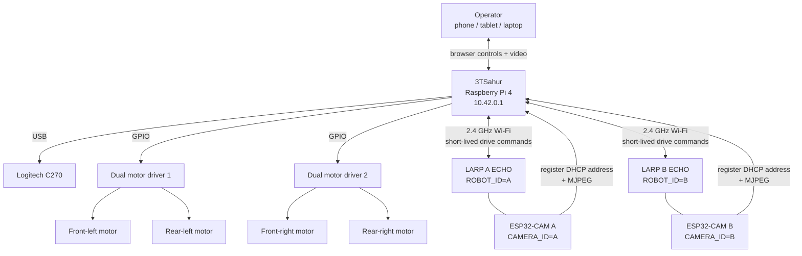
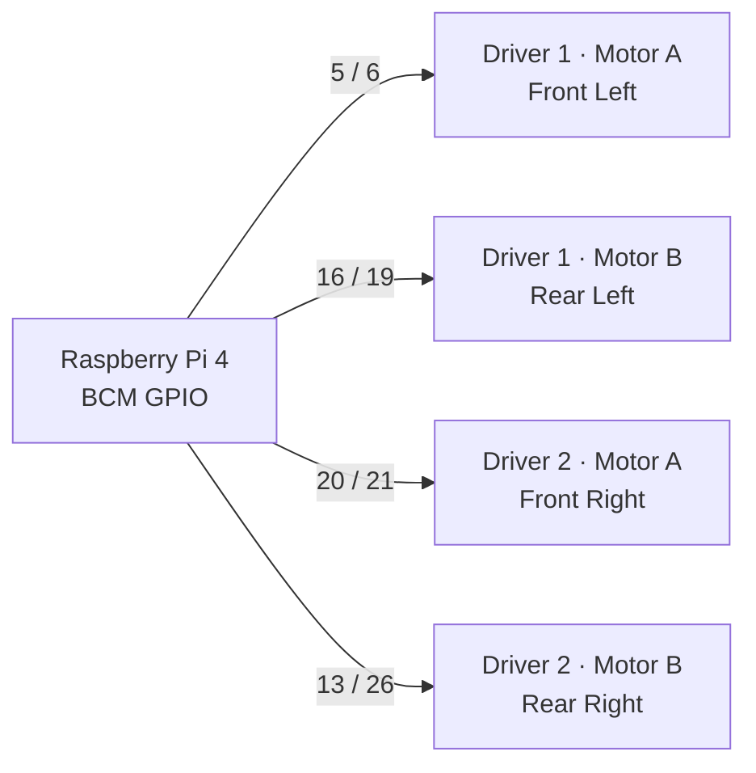
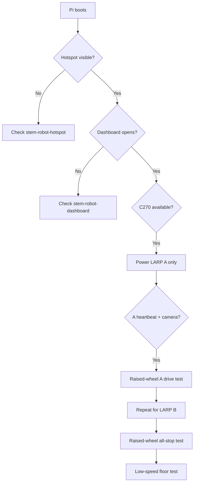

# 3TSahur + LARP Reconnaissance Swarm

<p align="center">
  
  
  
  
</p>

> A Raspberry Pi 4 mecanum hub, two LARP differential-drive scouts, three camera feeds, and one local browser dashboard.

**3TSahur** is the Raspberry Pi 4 control hub. **LARP Scout A** and **LARP Scout B** are independent ECHO/ESP32-S3 differential-drive robots. Each LARP has its own Inland AI-Thinker-compatible ESP32-CAM video node. The Raspberry Pi creates the local Wi-Fi network, hosts the dashboard, controls the mecanum drivetrain, relays the LARP camera feeds, and can optionally run YOLO11 Nano person detection.

Normal robot operation is local-first and does **not** require internet access after setup.

## Latest-code quick start

The current integrated project lives on the repository's **`main` branch**. The installer scripts still retain the older integration branch as their internal default, so the commands below explicitly set `STEM_REPO_BRANCH=main` to guarantee that a new Pi installs the latest code from `main`.

```mermaid
flowchart LR
    A["1. Build 3TSahur\nPi + C270 + motor drivers"] --> B["2. Install latest main\non Raspberry Pi"]
    B --> C["3. Join 3TSahur-Swarm\nand verify dashboard"]
    C --> D["4. Flash LARP A\nECHO + ESP32-CAM"]
    D --> E["5. Verify A\nheartbeat + video + drive"]
    E --> F["6. Flash LARP B\nECHO + ESP32-CAM"]
    F --> G["7. Raised-wheel safety test"]
    G --> H["8. Low-speed floor test"]
    H --> I["9. Optional CSI / YOLO"]
```



### 1. Install the latest `main` code on the Raspberry Pi

Run the installer as the **normal Pi user**, not as `root`.

```bash
curl -fsSL https://raw.githubusercontent.com/william-thompsonthe1st/STEM-Research-Academy/main/installer/curl-install.sh \
  | STEM_REPO_BRANCH=main bash
```

The installer configures the application, Python environment, hotspot, systemd services, Avahi/mDNS, camera dependencies, GPIO support, and local dashboard. It intentionally reboots when installation completes.

If you prefer to clone and inspect everything before installing:

```bash
git clone https://github.com/william-thompsonthe1st/STEM-Research-Academy.git
cd STEM-Research-Academy
git checkout main
STEM_REPO_BRANCH=main bash installer/install.sh
```

For an existing Pi installation, preserve the working application and configuration before upgrading:

```bash
cp -a ~/STEMResearchAcademy ~/STEMResearchAcademy.partner-backup
sudo cp /etc/stem-research-academy/config.env ~/stem-config.partner-backup.env
```

Then install `main` without performing a full OS package upgrade:

```bash
curl -fsSL https://raw.githubusercontent.com/william-thompsonthe1st/STEM-Research-Academy/main/installer/curl-install.sh \
  | STEM_REPO_BRANCH=main STEM_SKIP_OS_UPGRADE=1 bash
```

### 2. Connect to the robot network

After reboot, connect your phone, tablet, laptop, or Pi display to:

- **Wi-Fi:** `3TSahur-Swarm`
- **Band:** 2.4 GHz
- **Channel:** 6
- **Security:** WPA2-Personal / RSN
- **Pi address:** `10.42.0.1`
- **Dashboard:** `http://10.42.0.1`
- **mDNS dashboard:** `http://3tsahur.local` when the client supports mDNS

The installer stores the hotspot credentials in:

```text
/etc/stem-research-academy/config.env
```

Do not commit the hotspot password to GitHub. The same SSID/password must be copied into both LARP ECHO sketches and both ESP32-CAM sketches.

## How the system fits together



The ECHO controller and ESP32-CAM on a LARP are **separate Wi-Fi clients**. They do not need a GPIO connection to each other. Their `A/A` or `B/B` identity simply tells the Pi which drive controller and camera belong to the same dashboard tab.

## 3TSahur motor wiring

The current code uses **BCM GPIO numbering** and six unique GPIO pairs across two dual-channel H-bridge boards. Do not reuse one GPIO input across both motor-driver boards.



| Wheel | Motor-driver channel | BCM direction pins |
| --- | --- | --- |
| Front left | Driver 1 · Motor A | GPIO `5` / `6` |
| Rear left | Driver 1 · Motor B | GPIO `16` / `19` |
| Front right | Driver 2 · Motor A | GPIO `20` / `21` |
| Rear right | Driver 2 · Motor B | GPIO `13` / `26` |

The rear-right channel is intentionally handled as the reversed wheel in the current motor configuration. Verify all four wheel directions with the chassis raised before putting the robot on the floor.

**Power rule:** never power the DC motors from the Raspberry Pi 5 V rail. Use a correctly rated fused motor supply and share the intended logic ground between the Pi and motor-driver electronics.

See [docs/WIRING.md](docs/WIRING.md) for the full connection reference.

## Flash the LARP robots

There are two firmware projects:

| Board | Firmware | Arduino board profile | Set before upload |
| --- | --- | --- | --- |
| LARP ECHO controller | [`firmware/larp-scout/larp-scout.ino`](firmware/larp-scout/larp-scout.ino) | **ESP32S3 Dev Module** | `ROBOT_ID`, Wi-Fi SSID/password |
| Inland ESP32-CAM | [`firmware/larp-esp32-cam/larp-esp32-cam.ino`](firmware/larp-esp32-cam/larp-esp32-cam.ino) | **AI Thinker ESP32-CAM** | `CAMERA_ID`, Wi-Fi SSID/password |

Verified Arduino baseline used by this project:

- `esp32 by Espressif Systems` **3.0.7**
- 3DBuffalo **EchoLib 1.3.0** for the ECHO controller
- **Adafruit BusIO** for the ECHO build
- Serial Monitor: **115200 baud**

Configure the devices like this:

```text
LARP Scout A
├── ECHO controller: ROBOT_ID = 'A'
└── ESP32-CAM:       CAMERA_ID = 'A'

LARP Scout B
├── ECHO controller: ROBOT_ID = 'B'
└── ESP32-CAM:       CAMERA_ID = 'B'
```

Both ECHOs and both cameras use the same `3TSahur-Swarm` hotspot credentials.

### ESP32-CAM behavior in the latest code

The current camera firmware joins the Pi hotspot, receives a DHCP address, and registers that address directly with the Pi at `10.42.0.1:8080`. The dashboard then relays the camera through its own local routes:

```text
LARP A video -> /api/scouts/a/camera.mjpg
LARP B video -> /api/scouts/b/camera.mjpg
```

This means normal dashboard operation no longer depends on a browser resolving `larp-a-cam.local` or `larp-b-cam.local`. Those names remain useful as diagnostics/fallbacks.

A successful ESP32-CAM serial log should include a stream address followed by:

```text
Camera registered with Pi dashboard.
```

For flash wiring and the AI Thinker pin map, see [docs/ESP32_CAM_SETUP.md](docs/ESP32_CAM_SETUP.md). For the full controller/camera pairing procedure, see [docs/LARP_CAMERA_CONTROLLER_INTEGRATION.md](docs/LARP_CAMERA_CONTROLLER_INTEGRATION.md).

## Dashboard controls

The dashboard keeps only the selected robot's video stream active to preserve 2.4 GHz airtime for control traffic.

```text
┌──────────────────────────────────────────────────────────────────────┐
│                 3TSAHUR-SWARM LOCAL COMMAND CENTER                  │
├──────────────────────┬──────────────────────┬────────────────────────┤
│      3TSahur         │    LARP Scout A      │     LARP Scout B       │
├──────────────────────┴──────────────────────┴────────────────────────┤
│  Selected camera feed           │ Selected robot controls           │
│  Snapshot / optional vision     │ Speed / status / stop             │
├─────────────────────────────────┴────────────────────────────────────┤
│  STOP ALL (Esc) · health · CSI · timeline · gamepad/dead-man        │
└──────────────────────────────────────────────────────────────────────┘
```

| Robot | Keys | Action |
| --- | --- | --- |
| 3TSahur | `W` / `S` | Forward / reverse |
| 3TSahur | `A` / `D` | Strafe left / right |
| 3TSahur | `Q` / `E` | Rotate left / right |
| 3TSahur | `Space` | Stop 3TSahur |
| LARP Scout A | Arrow keys | Forward / reverse / left / right |
| LARP Scout B | `I` / `K` / `J` / `L` | Forward / reverse / left / right |
| All robots | `Esc` | Emergency stop all |

The Pi drivetrain watchdog is currently **200 ms**. Browser drive controls continuously refresh held commands; stale or reordered input is rejected. Releasing the control, losing the client, or missing the watchdog refresh stops motion.

## Verify the complete system

Bring the robots up one subsystem at a time.



On the Pi, these checks should succeed:

```bash
sudo systemctl status stem-robot-hotspot --no-pager
sudo systemctl status stem-robot-dashboard --no-pager
curl --fail http://127.0.0.1:8080/healthz
```

To verify the Wi-Fi profile without printing the password:

```bash
nmcli -f 802-11-wireless.ssid,802-11-wireless.band,802-11-wireless.channel \
  connection show stem-robot-hotspot

nmcli -f 802-11-wireless-security.key-mgmt,802-11-wireless-security.proto \
  connection show stem-robot-hotspot
```

Expected network settings are 2.4 GHz `bg`, channel `6`, `wpa-psk`, and `rsn`.

## Control-priority behavior

The latest server intentionally protects robot-control responsiveness:

- only the selected LARP MJPEG stream stays open in the dashboard;
- camera feeds automatically recover after temporary disconnects;
- ESP32-CAM nodes repeatedly register their current DHCP address with the Pi;
- the Pi relays LARP feeds through the dashboard rather than requiring client-side `.local` resolution;
- camera-profile changes and snapshots are blocked/deferred while control is active;
- optional vision pauses while a robot is moving;
- optional CSI, vision, timeline, snapshot, gamepad, and health features are isolated from the core drive/stop path.

If an optional feature fails, **motor control, stop commands, watchdog behavior, and basic video should remain independently usable**.

## Optional YOLO11 Nano vision

Do not enable AI vision until basic drive, stop, hotspot, and camera operation are stable.

Install the optional vision environment from the latest `main` checkout:

```bash
cd ~/STEMResearchAcademy
bash installer/install-vision.sh
```

The vision installer creates a separate `.vision-venv`, installs the Ultralytics/NCNN dependencies, and prepares the Pi-friendly `yolo11n_ncnn_model` used by the dashboard.

After installation, reload the dashboard and press the selected tab's **Vision** control (or `C`). Vision starts disabled after a dashboard restart and runs per selected camera. It deliberately pauses during robot motion so it does not compete with the command path.

A missing model, package, or camera reports vision as unavailable without disabling the robots.

See [docs/VISION_SETUP.md](docs/VISION_SETUP.md) for the full setup and performance guidance.

## Planned gimbal and ramp controls

The dashboard contains staging controls for the C270 gimbal and ramp (`G` for gimbal mode and `R` for the ramp toggle), but the current implementation intentionally does **not** drive physical servos. It stores requested positions/state only. Do not connect servo hardware expecting motion until the servo driver, power supply, I2C/PWM mapping, channels, and mechanical limits are defined.

See [docs/3TSAHUR_AUXILIARY_ACTUATORS.md](docs/3TSAHUR_AUXILIARY_ACTUATORS.md).

## Common troubleshooting

| Symptom | Check first |
| --- | --- |
| `3TSahur-Swarm` does not appear | `stem-robot-hotspot` service and `wlan0` state |
| ECHO repeatedly retries Wi-Fi | Matching SSID/password, 2.4 GHz/WPA2 profile, IPEX-1 antenna, range and power |
| ECHO has an IP but dashboard says offline | `stem-robot-dashboard`, `ROBOT_ID`, registration/heartbeat |
| ESP32-CAM does not appear | AI Thinker profile, stable regulated 5 V, `CAMERA_ID`, registration message |
| Drive works but camera is offline | Troubleshoot the ESP32-CAM only; it is independent from the ECHO drive controller |
| `Failed to connect to ESP32-S3: No serial data received` | USB/bootloader path, correct port, data cable, PROG/RESET sequence; this is not a Wi-Fi error |
| Video slows control | Keep one stream open, use the control-priority camera profile, disable optional vision during drive testing |
| Robot stops after key release/network interruption | Expected watchdog/command-expiry behavior |
| A and B control the wrong robot | Check for duplicate or mismatched `ROBOT_ID` / `CAMERA_ID` values |

More detailed fault isolation is in [docs/SETUP.md](docs/SETUP.md), [docs/LATENCY_TUNING.md](docs/LATENCY_TUNING.md), and [docs/FIELD_INFORMATION_CHECKLIST.md](docs/FIELD_INFORMATION_CHECKLIST.md).

## Run the software tests

The test suite can run without robot hardware:

```bash
python -m venv .venv
. .venv/bin/activate
pip install -r requirements.txt
python -m unittest discover -s tests -v
```

The suite covers simulated motor/GPIO behavior, dashboard APIs, camera handling, LARP registration/proxy behavior, firmware invariants, mission features, and optional-feature failure isolation. Hardware testing is still required for motor polarity/current, actual Wi-Fi range, camera focus, CSI calibration, gamepad mapping, and physical emergency-stop behavior.

## Local development

For UI/code work on a non-Pi machine:

```bash
python -m venv .venv
. .venv/bin/activate
pip install -r requirements.txt
python run.py
```

Open `http://127.0.0.1:8080`. If Raspberry Pi GPIO is unavailable, the drivetrain safely falls back to simulation behavior.

## Project structure

```text
STEM-Research-Academy/
├── robot_server/                 # Flask dashboard, motor, camera, scouts, vision
│   ├── app.py                    # Main API/dashboard runtime
│   ├── motor.py                  # 3TSahur mecanum GPIO control
│   ├── camera.py                 # C270 capture/recovery
│   ├── scouts.py                 # LARP + camera registration
│   ├── vision.py                 # Optional vision manager
│   ├── static/                   # Browser CSS/JavaScript/assets
│   └── templates/                # Dashboard HTML
├── firmware/
│   ├── larp-scout/               # ECHO differential-drive firmware
│   └── larp-esp32-cam/           # Inland ESP32-CAM firmware
├── installer/                    # Pi install, hotspot, systemd, kiosk, vision
├── docs/                         # Detailed build/setup/validation documents
├── tests/                        # Hardware-independent test suite
├── run.py                        # Dashboard entry point
└── requirements.txt
```

## Detailed documentation

- [Setup guide](docs/SETUP.md) — end-to-end Raspberry Pi, network, firmware, and first-drive procedure.
- [Wiring reference](docs/WIRING.md) — exact 3TSahur GPIO mapping and connection notes.
- [ESP32-CAM setup](docs/ESP32_CAM_SETUP.md) — AI Thinker upload wiring, pin map, camera testing, and troubleshooting.
- [LARP camera/controller integration](docs/LARP_CAMERA_CONTROLLER_INTEGRATION.md) — power separation, identity pairing, flashing, and field testing.
- [Latency tuning](docs/LATENCY_TUNING.md) — control-priority and reconnection behavior.
- [Vision setup](docs/VISION_SETUP.md) — optional YOLO11 Nano / NCNN installation.
- [Simulation results](docs/SIMULATION_RESULTS.md) — software test results and limitations.
- [Partner baseline comparison](docs/PARTNER_BASELINE_COMPARISON.md) — retained drivetrain/network behavior and integration changes.
- [Changes from original](docs/CHANGES_FROM_ORIGINAL.md) — file-level integration history.
- [Tomorrow field checklist](docs/TOMORROW_CHECKLIST.md) — next-session hardware validation steps.

## Safety

- Test every motion direction with the wheels clear of the floor first.
- Keep motor power disconnected while wiring or flashing electronics.
- Use a fused motor supply sized for the motor load; never run motor power through the Pi.
- Keep an accessible physical motor-power switch.
- Verify the intended common logic ground.
- Test `Space`, `Esc`, browser disconnect, and network-loss stopping before operating near people or property.
- Add optional CSI/vision features only after basic control and stop behavior are stable.

---

Built from the partner project's deployment/dashboard foundation and adapted for the 3TSahur hub and LARP Scout system.