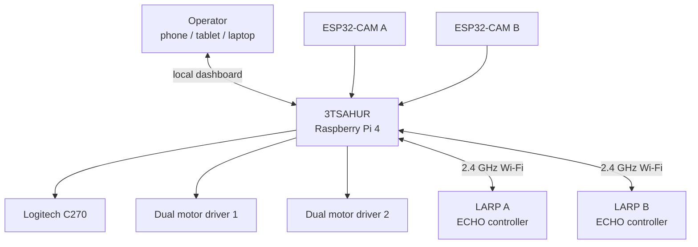
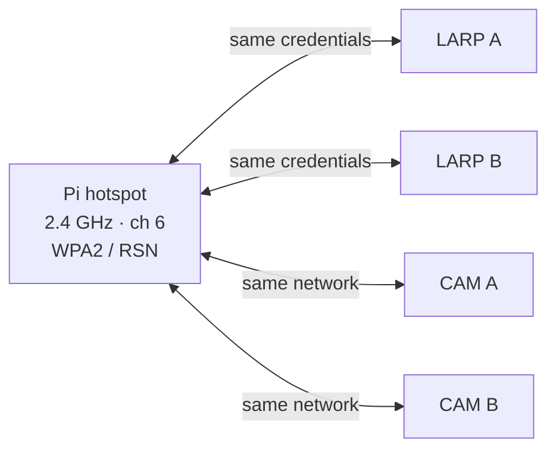
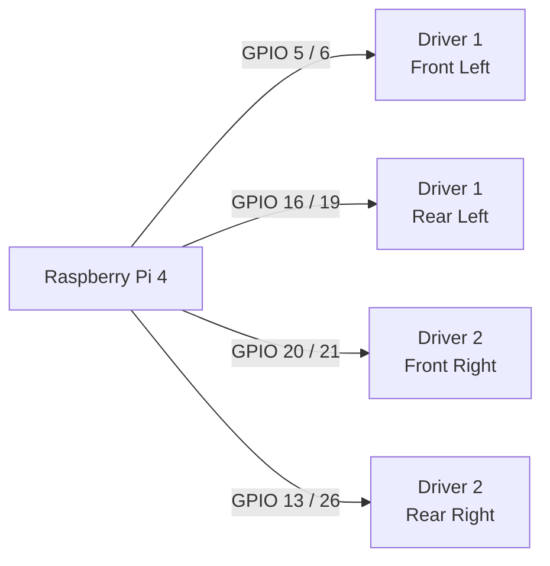
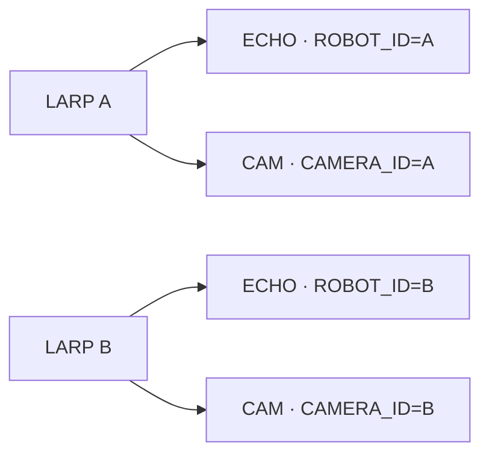
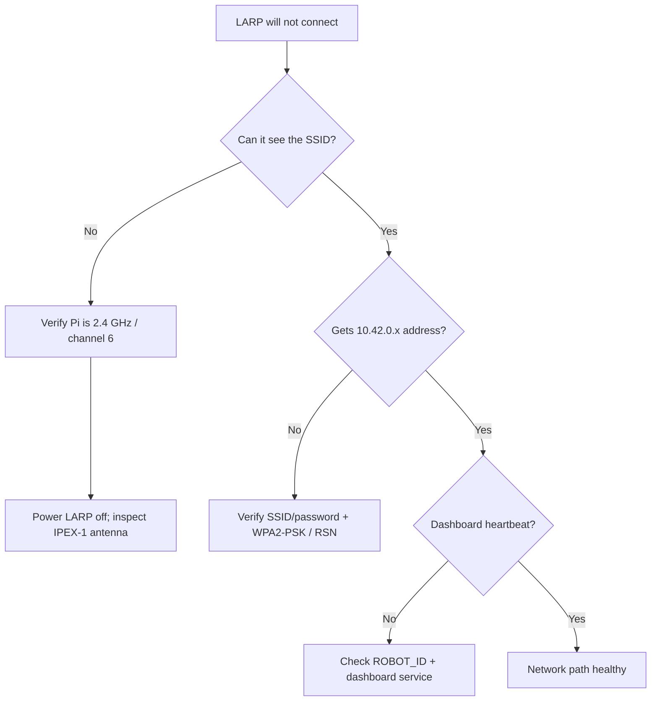
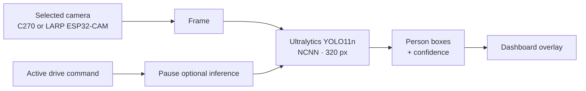
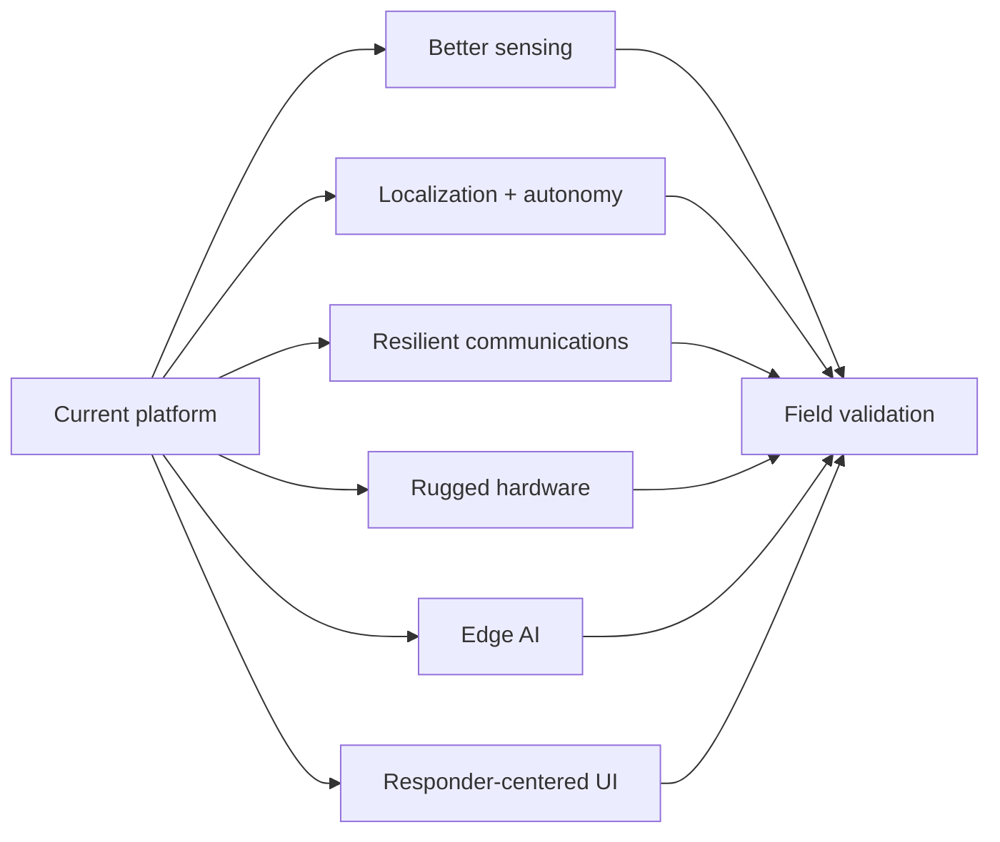

# 3TSAHUR + LARP Reconnaissance Swarm

> A local-first multi-robot reconnaissance platform designed to help first responders gather situational awareness before personnel enter uncertain or hazardous areas.

## Robot names and mission

**3TSAHUR** — **Terrain Tandem Transport Semi-Autonomous Hub Unit for Reconnaissance** — is the large Raspberry Pi 4 mecanum-drive robot and central control hub.

**LARP** — **Lightweight Autonomous Reconnaissance Platform** — is the project name for each small Zippy/ECHO differential-drive scout. The two scouts are **LARP A** and **LARP B**.

The project investigates how accessible, lower-cost robotics, sensing, networking, and semi-autonomous perception can support first responders while keeping a human operator in control.

> [!NOTE]
> `Zippy` and `ECHO` describe the underlying small-robot hardware platform/controller. The deployed SSID remains `3TSahur-Swarm` for compatibility even though the current display/project name is **3TSAHUR**.

## Start here


## Current system architecture



The core design priorities are reliable manual control, independent robot/camera failure isolation, a local browser UI, watchdog-based stopping, optional CSI sensing, optional YOLO perception, and operation without internet after setup.

## Critical network requirement

> [!IMPORTANT]
> **Use a dedicated 2.4 GHz robot network.** The Raspberry Pi hotspot and the LARP ECHO/ESP32-CAM clients must use the same **2.4 GHz** network. Do not deploy this validated configuration as 5 GHz-only or rely on dual-band/band-steering behavior.

| Setting | Project configuration |
| --- | --- |
| SSID | `3TSahur-Swarm` |
| Band | **2.4 GHz only** |
| Channel | **6** |
| Security | **WPA2-Personal / WPA2-PSK** |
| Protocol | **RSN** |
| Pi address | `10.42.0.1` |



## Raspberry Pi installation

Production installs use `main`:

```bash
curl -fsSL https://raw.githubusercontent.com/william-thompsonthe1st/STEM-Research-Academy/main/installer/curl-install.sh | bash
```

Or clone first:

```bash
git clone https://github.com/william-thompsonthe1st/STEM-Research-Academy.git
cd STEM-Research-Academy
git checkout main
bash installer/install.sh
```

After reboot, join `3TSahur-Swarm` and open `http://10.42.0.1` or `http://3tsahur.local` when mDNS is available. The generated hotspot password is stored in `/etc/stem-research-academy/config.env`. Copy the same SSID/password into both LARP ECHO sketches and both ESP32-CAM sketches; do not commit the password.

## 3TSAHUR pinout

The current Python drivetrain uses **BCM GPIO numbering**.



| Wheel | Driver inputs | BCM GPIO | Physical pins |
| --- | --- | --- | --- |
| Front left | Driver 1 IN1/IN2 | `5 / 6` | `29 / 31` |
| Rear left | Driver 1 IN3/IN4 | `16 / 19` | `36 / 35` |
| Front right | Driver 2 IN1/IN2 | `20 / 21` | `38 / 40` |
| Rear right | Driver 2 IN3/IN4 | `13 / 26` | `33 / 37` |

```text
Raspberry Pi 4 relevant header pins

29 GPIO5   ●  ● GND    30
31 GPIO6   ●  ● GPIO12 32
33 GPIO13  ●  ● GND    34
35 GPIO19  ●  ● GPIO16 36
37 GPIO26  ●  ● GPIO20 38
39 GND     ●  ● GPIO21 40
```

> [!WARNING]
> Use a correctly rated fused external motor supply. Never power the drive motors from the Pi 5 V rail. Maintain the intended common logic ground and perform the first direction test with the wheels raised.

See [docs/WIRING.md](docs/WIRING.md) and [docs/SETUP.md](docs/SETUP.md).

## LARP firmware and camera pairing

| Device | Firmware | Arduino profile | Identity |
| --- | --- | --- | --- |
| LARP ECHO controller | `firmware/larp-scout/larp-scout.ino` | ESP32S3 Dev Module | `ROBOT_ID=A/B` |
| Inland ESP32-CAM | `firmware/larp-esp32-cam/larp-esp32-cam.ino` | AI Thinker ESP32-CAM | `CAMERA_ID=A/B` |



The ECHO controller and ESP32-CAM are separate Wi-Fi clients; they do not require a GPIO connection to each other. Matching IDs pair the drive controller and camera in the dashboard.

## Wi-Fi, WPA2, and IPEX-1 troubleshooting

The **IPEX-1 antenna connector and WPA2 are separate layers**. WPA2 handles authentication/encryption; IPEX-1 is part of the radio antenna path. Correct credentials cannot compensate for a loose antenna, and reseating an antenna cannot correct the wrong WPA profile.



With the LARP powered off, inspect the IPEX-1 connection if the robot has unusually poor range, cannot reliably see the hotspot, or disconnects much more often than the other LARP. See [docs/TROUBLESHOOTING.md](docs/TROUBLESHOOTING.md).

## First-boot verification

```bash
sudo systemctl status stem-robot-hotspot --no-pager
sudo systemctl status stem-robot-dashboard --no-pager
curl --fail http://127.0.0.1:8080/healthz
nmcli -f 802-11-wireless.ssid,802-11-wireless.band,802-11-wireless.channel connection show stem-robot-hotspot
nmcli -f 802-11-wireless-security.key-mgmt,802-11-wireless-security.proto connection show stem-robot-hotspot
```

Verify hotspot → dashboard → C270 → LARP A → LARP B → emergency stop/network-loss stopping, in that order. Power and test one scout at a time before testing the complete system.

## YOLO11 Nano person detection

3TSAHUR supports optional local perception using pretrained **Ultralytics YOLO11 Nano (`yolo11n.pt`)**, exported to **NCNN** for Raspberry Pi 4 inference. The baseline implementation requests COCO class `0` (`person`) and displays bounding boxes and confidence values on the selected dashboard feed.

> [!IMPORTANT]
> YOLO is an **operator aid**, not proof that an area is occupied or empty and not an identity system. Detection results should be interpreted with the camera feed and other available information.

### Current vision pipeline



The normal 3TSAHUR camera profile is **640×480 at 10 FPS**. The vision manager defaults to `VISION_INTERVAL_SECONDS=0.5`, so it attempts about **2 inference cycles per second before model-processing time**. Camera streaming and inference rate are intentionally separate; YOLO does not need to process every video frame.

### Install or repair YOLO11n

Complete the base robot installation first, then run this as the normal Pi user:

```bash
cd ~/STEMResearchAcademy
git pull
bash installer/install-vision.sh
```

The current installer intentionally rebuilds the optional `.vision-venv`, installs `ultralytics>=8.3,<9` plus `ncnn`, verifies Ultralytics/PyTorch/NCNN imports, downloads `yolo11n.pt`, exports `yolo11n_ncnn_model` at 320 px, verifies that the dashboard interpreter can load the exported model, writes absolute `VISION_SITE_PACKAGES` and `VISION_MODEL` paths to `/etc/stem-research-academy/config.env`, and restarts the dashboard.

This project keeps YOLO in a separate environment so a failed optional ML dependency does not become a prerequisite for motor control.

### C-key toggle behavior

The dashboard binds **`C` as a toggle** for the currently selected robot/camera tab:

```text
C press 1 → Vision ON for selected feed
C press 2 → Vision OFF for selected feed
C press 3 → Vision ON again
```

The on/off state is maintained separately for `3tsahur`, `larp-a`, and `larp-b`. Turning Vision off clears the overlay and stops future inference for that source. Turning it back on wakes the worker and, if the first model load previously failed, the Python vision manager now permits a fresh load attempt instead of permanently caching the first failure.

### Recommended Pi 4 baseline

| Setting | Current baseline |
| --- | --- |
| Model | `yolo11n_ncnn_model` |
| Input size | `320` |
| Class | `person` / COCO class `0` |
| Confidence | `0.45` |
| Camera default | `640×480 @ 10 FPS` |
| Vision interval | `0.5 s` (~2 scheduled inferences/s before processing time) |
| Active vision feeds | Prefer one at a time |

### Verify after installation

```bash
cd ~/STEMResearchAcademy
.venv/bin/python -m unittest discover -s tests -v
sudo systemctl status stem-robot-dashboard --no-pager
journalctl -u stem-robot-dashboard -n 100 --no-pager
```

Then reload the dashboard, select the 3TSAHUR tab, keep the robot stationary, and press `C`. The button should change to **Vision on · C**. A visible person may produce a labelled box after the model initializes. Press `C` again and verify the overlay clears. Repeat with a LARP only after that ESP32-CAM is already streaming normally.

If the installer fails, use the exact line printed immediately before the failure—especially the Python version, Ultralytics/PyTorch import check, NCNN export, or dashboard model-load check—to isolate the dependency that failed.

Detailed setup is in [docs/VISION_SETUP.md](docs/VISION_SETUP.md).

---

# Research Poster Archive — CUNY STEM Research Academy 2026

> [!NOTE]
> This section preserves the research poster as a **separate archival record**. The poster uses the original notation **T.T.T.S.A.H.U.R.** and **L.A.R.P.**; the current repository uses the shorter display names **3TSAHUR** and **LARP**. Hardware/software details in the live project may have evolved after the poster was prepared.

## Alleviating Sociotechnical Anxieties Surrounding Automation: Semi-Autonomous Reconnaissance Robot

**Students:** Wilson Tom and Kaitlin Lam  
**Mentor:** Prof. Andy Zhang  
**Department:** Mechanical Engineering Technology  
**Institution:** New York City College of Technology, CUNY  
**Address shown on poster:** 300 Jay Street, Brooklyn, NY 11201

### Abstract

As technology has advanced, automation has become more prominent. From automating production with the power loom to automating thinking with AI, automation has come a long way. Accompanying that advancement is a persistent question: **Can it be trusted?** The poster connects this concern to historical Luddite resistance and modern fears that automation threatens livelihoods.

The research goal is to engineer and evaluate a **cost-effective robot with a minimalistic architecture** that can assist first responders in reconnaissance efforts while helping dispel fears around automation. Accessible and low-cost components are emphasized to foster a more open-minded and trusting sentiment toward automated technology. Although improvements in mobility and object identification are identified as promising, the poster states that time and cost constraints made the primary objective the construction of a cost-effective reconnaissance robot with a minimalist architecture that could help alleviate sociotechnical anxieties surrounding automation.

### Introduction

The poster describes AI-driven automation as having renewed Luddite-style resistance among workers concerned about job loss and cites research estimating that **47% of occupations are at risk of automation**. It also notes benefits of automation, including improved efficiency in task automation and data analysis and support for interdisciplinary research.

Rather than focusing only on traditional Return on Investment, the project adopts a modern low-cost automation perspective emphasizing **ergonomics, user compatibility, and cost-effectiveness**. It builds on European research integrating reconnaissance technologies to help first responders assess disaster sites without requiring human exposure to perilous environments. The intended broader outcome is to reduce anxiety around automation and encourage human-technology collaboration.

### Methodology

The experiment loosely followed the **engineering design process**.

1. Concepts for the **T.T.T.S.A.H.U.R.** and **L.A.R.P.**, with the L.A.R.P. based on the Zippy architecture, were created in CAD using **Onshape**.
2. The chassis and component housings for both robots were modeled.
3. Additional concepts included a **ramp door**, **camera gimbal**, and **cam-driven jumping mechanism**.
4. The large robot was assembled using extrusions and 3D-printed components. Its poster dimensions are **18 in × 17.5 in × 7.5 in**.
5. The small robot used the **3DBU Zippy kit** and 3D-printed components. Its poster dimensions are **4.5 in × 6 in × 4 in**.
6. The L.A.R.P. motor functions and L.A.R.P.-specific functions were programmed using the **Arduino IDE**.
7. T.T.T.S.A.H.U.R. motor functions were programmed in Python using a Python interpreter/PyCharm workflow.
8. **Ultralytics YOLO11n (You Only Look Once)** was incorporated for AI integration with the T.T.T.S.A.H.U.R. camera feeds.

### Materials shown on the poster

| Poster item | Description |
| --- | --- |
| Figure 2(a) | Motor driver |
| Figure 2(b) | Raspberry Pi 4 Model B, 4 GB RAM |
| Figure 2(c) | Mecanum wheel |
| Figure 2(d) | Yellowjacket motor, 435 RPM |
| Figure 2(e) | T-slot extrusion |
| Figure 3(a) | 3DBU Zippy |

### Design/build and code figures shown on the poster

- **Figure 1(a):** CAD of T.T.T.S.A.H.U.R.
- **Figure 1(b):** CAD of L.A.R.P.
- **Figure 1(c):** Cutting of extrusions for T.T.T.S.A.H.U.R. in the CNC workshop.
- **Figure 1(d):** L.A.R.P. prototype.
- **Figure 4(a):** Code snippet of the **Channel State Information (CSI)** function of L.A.R.P. in the Arduino IDE.
- **Figure 4(b):** Code snippet of the website UI for T.T.T.S.A.H.U.R. in PyCharm.

The poster expands the original acronyms as:

- **T.T.T.S.A.H.U.R. — Terrain Tandem-Transport Semi-Autonomous Hub Unit for Reconnaissance**
- **L.A.R.P. — Lightweight Autonomous Reconnaissance Platform**

### Conclusion

Based on the performance of T.T.T.S.A.H.U.R. and L.A.R.P., the poster concludes that the prototype of a **cost-effective semi-autonomous reconnaissance robot was successful**. It also identifies important limitations: **time constraints, funding constraints, and technological bottlenecks**.

The poster recommends future expansion of the **compactness and mobility** of the robots and states that additional computing power could improve their ability to **identify and analyze objects and/or people**.

### References from the poster

1. Frey, C. B.; Osborne, M. A. *The Future of Employment: How Susceptible Are Jobs to Computerisation?* Technol. Forecast. Soc. Change 2017, Vol. 114, 265–267.
2. Madanchian, M.; Taherdoost, H. *The Impact of Artificial Intelligence on Research Efficiency.* Results Eng. 2025, Vol. 26, 61, 78–79, 165. DOI: 10.1016/j.rineng.2025.104743.
3. 3DBU. *Zippy* [Product Image]. 3DBU.
4. Cintora-Sanz, A. M.; Blanco-Hermo, P.; Gómez-De la Oliva, S.; Marechal, R.; Balet, O.; Gonzalez-Rico, P. *Intelligent Toolkit for Reconnaissance, Assessments and Prehospital Support in Perilous Incidents: A Realistic Experiment in Prehospital Environment.* BMC Health Serv. Res. 2024, 24, 1331. DOI: 10.1186/s12913-024-11786-3.
5. Fast-Berglund, Å.; Salunkhe, O.; Åkerman, M. *Low-Cost Automation – Changing the Traditional View on Automation Strategies Using Collaborative Applications.* IFAC-PapersOnLine 2020, 53 (2), 10285–10290. DOI: 10.1016/j.ifacol.2020.12.2762.
6. Ivanov, S.; Kuyumdzhiev, M.; Webster, C. *Automation Fears: Drivers and Solutions.* Technol. Soc. 2020, 63, 101431. DOI: 10.1016/j.techsoc.2020.101431.

### Acknowledgments from the poster

The poster states that the research was funded by the **NYC Science Research Mentoring Consortium (NYCSRM)**, **CollegeNow**, and the **CUNY STEM Research Academy**. It thanks mentors **Mark Salib, Abdullah Luna, Angelo Demetroulakos, and Gabriela Bernales** for their insight and guidance.

---

## Future research and recommended improvements

The current platform is a teleoperated research baseline. Future work should be measured against three questions: **Does it increase useful situational awareness? Does it make the system more reliable in degraded environments? Does it reduce operator workload without removing meaningful human control?**



### Localization, mapping, and navigation

Add wheel encoders and IMUs, then evaluate odometry, visual-inertial odometry, LiDAR/depth/stereo sensing, and SLAM. Candidate semi-autonomous functions include obstacle assistance, return-to-home, waypoint driving, and communications-aware navigation with immediate operator override.

### Sensor fusion

Evaluate thermal imaging, depth, temperature/humidity, smoke/particulate sensing, appropriately calibrated gas sensing, audio, light, and structural/vibration sensors. Emphasize a simple fused operator display rather than raw telemetry. Prototype environmental sensing should not be treated as certified life-safety equipment without appropriate validation.

### CSI human-presence research

Collect controlled Wi-Fi Channel State Information datasets across rooms, wall materials, distances, antenna orientations, moving machinery, and occupant counts. Report false-positive/false-negative rates and compare CSI alone with CSI fused with RGB, thermal, or depth observations.

### Communications resilience

Study a dedicated second radio, protected/external antennas, improved antenna placement, mesh/relay nodes, store-and-forward telemetry, and a separate backhaul where compatible. Measure latency, packet loss, range, recovery time, and stop behavior under degraded links.

### Drivetrain, power, and endurance

Add encoders, current sensing, closed-loop wheel-speed control, hardware PWM, thermal monitoring, and battery voltage/current telemetry. Log subsystem energy consumption so mission endurance can be measured rather than guessed.

### Edge AI and perception

Use the current YOLO11n/NCNN baseline as a measured starting point. Compare other edge runtimes or accelerators using inference latency, power consumption, CPU temperature, video delay, and control responsiveness. Expand detection only for clearly defined responder tasks.

### Multi-robot coordination

Study shared maps, task allocation, communications-aware scout placement, duplicate-exploration avoidance, and observation handoff between 3TSAHUR and the LARPs. Measure whether automation actually reduces operator workload.

### Mechanical ruggedization

Improve impact protection, strain relief, connector retention, IPEX-1 antenna protection, wheel/camera guards, dust/water resistance, cooling, and serviceability. Evaluate modular payload/sensor mounting on 3TSAHUR.

### Human factors

Conduct timed user studies for robot selection, target identification, camera-loss recovery, emergency stopping, low-battery recognition, and source identification. Compare keyboard, touchscreen, and gamepad operation in low-light and gloved-use scenarios.

### Reliability and cybersecurity

Deliberately test camera loss, scout reboot, service restart, delayed commands, congestion, low battery, stalled motors, and browser loss. Add structured logging and mission replay. Future security work can evaluate stronger device authentication, credential rotation, signed releases, least-privilege services, and mission-data protection.

### Field-validation methodology

Create a repeatable test matrix covering rooms, hallways, corners, obstacles, low light, safe simulated visibility degradation, RF interference, and increasing range. Record command/video latency, packet loss, reconnection time, endurance, detection accuracy, operator task time, and recovery success.

| Priority | Research area | Why |
| --- | --- | --- |
| 1 | Reliability + instrumentation | Establish a trustworthy baseline |
| 2 | Encoders/IMU + battery telemetry | Improve control and mission awareness |
| 3 | Communications resilience | Protect control/video availability |
| 4 | Thermal/depth/environment sensing | Add information beyond RGB video |
| 5 | CSI validation + sensor fusion | Test the non-camera sensing concept |
| 6 | SLAM + assisted navigation | Reduce workload in complex environments |
| 7 | Edge-AI optimization | Add perception without sacrificing control latency |
| 8 | Multi-robot autonomy | Build on a reliable measured platform |

**Recommended research strategy:** instrument first, establish a baseline, change one subsystem at a time, and compare measured results.

## Documentation

- [Setup guide](docs/SETUP.md)
- [Troubleshooting guide](docs/TROUBLESHOOTING.md)
- [Wiring reference](docs/WIRING.md)
- [ESP32-CAM setup](docs/ESP32_CAM_SETUP.md)
- [LARP camera/controller integration](docs/LARP_CAMERA_CONTROLLER_INTEGRATION.md)
- [Latency tuning](docs/LATENCY_TUNING.md)
- [Vision setup](docs/VISION_SETUP.md)
- [Robot naming](docs/ROBOT_NAMES.md)

## Safety

Test every direction with the wheels clear of the floor first. Disconnect motor power while wiring or flashing electronics. Use a fused external motor supply and an accessible physical motor-power switch. Verify the intended common logic ground. Test emergency stop, browser disconnect, and network-loss stopping before operating near people or property. Power a LARP off before inspecting or reseating its IPEX-1 antenna connector.

---

Built as a research platform for distributed robotic reconnaissance and first-responder situational awareness.