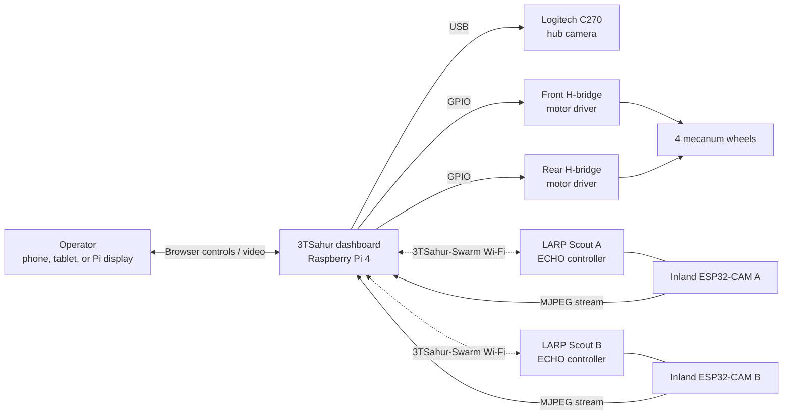
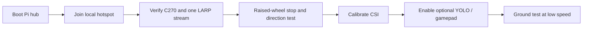
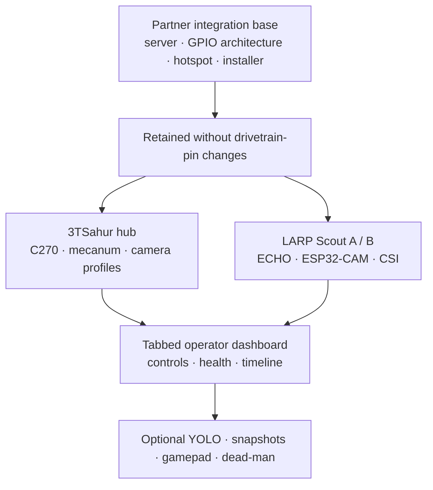
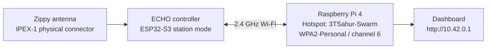

# 3TSahur + LARP Reconnaissance Swarm

<p align="center">
  
  
  
  
</p>

> One rugged Raspberry Pi mecanum hub, two mobile camera scouts, and one browser dashboard for safe local reconnaissance experiments.

**3TSahur** is a Raspberry Pi 4 Model B (4 GB) mecanum-drive control hub with a Logitech C270 USB camera. It coordinates two ECHO differential-drive scout robots—**LARP Scout A** and **LARP Scout B**—each paired with an Inland ESP32-CAM video node. The project creates a self-contained local Wi-Fi control network: no internet connection is required during normal operation.

## What it can do

| System | Capability |
| --- | --- |
| 3TSahur hub | Drive forward, reverse, strafe, and rotate with four independently controlled mecanum wheels. |
| Live vision | Show the Logitech C270 feed plus two LARP ESP32-CAM MJPEG streams in one dashboard. |
| Scout control | Send direction commands to LARP Scout A and B independently over Wi-Fi. |
| Safety | Stop stale commands automatically; includes sequence checks, watchdogs, and a kill-all control. |
| Deployment | Configure a Pi hotspot, dashboard service, local touchscreen/display kiosk, and mDNS address. |
| Optional AI vision | Prepare pretrained YOLO11 Nano person detection for the selected C270 or LARP camera feed. |
| Mission tools | Keep a bounded event timeline, save per-camera snapshots, calibrate LARP CSI baselines, and use browser gamepads/dead-man control. |

## System overview



## Reproduction methodology

This project is designed as a local-first system: the Pi hosts the Wi-Fi
network, dashboard, motor control, C270 camera feed, and optional vision
worker. The two LARPs join that same network, register a heartbeat, receive
short-lived drive commands, and expose their own camera feeds. Nothing in
normal operation requires cloud access.

1. **Build safely.** Assemble and wire the parts in the rebuild checklist,
   leaving motor power disconnected until software checks pass.
2. **Install the Pi hub.** Flash Raspberry Pi OS, clone this repository, run
   the installer, and join the resulting `3TSahur-Swarm` hotspot.
3. **Flash the four scout boards.** Configure A/B identifiers and matching
   hotspot credentials in both LARP drive boards and both ESP32-CAM boards.
4. **Validate one subsystem at a time.** Confirm the Pi dashboard, C270, each
   camera stream, each LARP heartbeat, then raised-wheel drive directions.
5. **Operate with control priority.** Keep one dashboard camera stream open,
   start in the Control Priority camera profile if radio capacity is limited,
   and test `Space`/`Esc` before floor operation.
6. **Enable optional analysis last.** Use CSI calibration with the scene clear,
   then enable YOLO only for the selected camera when its performance is
   acceptable.

### What happens when the system runs

- The browser sends only current, expiring commands; stale/reordered input is
  rejected and the Pi watchdog stops 3TSahur if refreshes cease.
- Switching robot tabs stops all robots and closes inactive MJPEG streams to
  protect control bandwidth.
- LARP drive status, CSI, timeline, health, vision, snapshots, and camera
  profiles are auxiliary features. Their failure must display a status only;
  it cannot disable the core stop/watchdog/control paths.
- The mission timeline is capped at 120 in-memory events. Snapshots are saved
  locally by the Pi; copy any images you need before rebooting or updating.

### Quick field-validation flow



For the next field session, use the step-by-step
[tomorrow checklist](docs/TOMORROW_CHECKLIST.md). It includes the precise
gimbal/ramp servo information needed before new actuator code is written.

## What changed from the partner integration base

The partner repository remains the software foundation. We retained the Python
server/package structure, motor-control pattern, hotspot installer, systemd
deployment, and original Pi mecanum GPIO mapping; the work here adapts and
extends that base for the 3TSahur/LARP swarm.

| Area | Partner-base behavior retained | 3TSahur/LARP changes |
| --- | --- | --- |
| Drivetrain | Python mecanum drive and GPIO architecture | Names changed only; exact BCM mapping remains `5/6`, `16/19`, `20/21`, `13/26`. |
| Deployment | Hotspot, service, kiosk, installer/update rollback | 3TSahur names, local operator workflow, beginner setup/checklists. |
| Dashboard | Responsive browser controls | Three robot tabs, single active stream, health panel, profiles, timeline, gamepad/dead-man controls. |
| Scouts | ECHO drive/control foundations | LARP A/B identities, Wi-Fi recovery, heartbeats, CSI display/calibration, separate camera feeds. |
| Vision | No optional hub inference workflow | Per-feed YOLO11 Nano toggles, overlays, snapshots, and failure isolation. |
| Validation | Original functional test foundation | Expanded simulation coverage, API expiry/sequence checks, feature-isolation checks, and timing results. |



Read [docs/CHANGES_FROM_ORIGINAL.md](docs/CHANGES_FROM_ORIGINAL.md) for the
full file-level integration record.

### Verified compatibility with the partner baseline

The current project retains the partner team's tested mecanum GPIO mapping,
mixer, shared 15 ms reversal dead-time, latest-command-only control channel,
300 ms command expiry, 200 ms Pi watchdog, ECHO motor IDs (`1`/`6`), and
ESP32 Wi-Fi sleep-disable behavior. The 3TSahur/LARP work adds tabs, camera
isolation, optional mission tools, and control-priority tuning around that
foundation; it does not replace the motor architecture. See the detailed
[partner baseline comparison](docs/PARTNER_BASELINE_COMPARISON.md) for every
retained behavior, added feature, latency difference, and test limitation.

## Dashboard

Open `http://10.42.0.1` after connecting to the 3TSahur hotspot. On a device that supports mDNS, `http://3tsahur.local` also works. The Pi's attached display opens the same dashboard automatically after installation.

```text
┌─────────────────────────────────────────────────────────────────────┐
│  [ 3TSahur ]  [ LARP Scout A ]  [ LARP Scout B ]     ● Online       │
├───────────────────────────────────┬─────────────────────────────────┤
│  Selected robot's live camera     │  Selected robot's controls      │
│  (one stream active at a time)    │  status, speed, and stop        │
├───────────────────────────────────┴─────────────────────────────────┤
│  Emergency STOP ALL · responsive phone/tablet/desktop layout         │
└─────────────────────────────────────────────────────────────────────┘
```

Only the selected tab keeps its MJPEG feed open. This preserves hotspot
bandwidth for low-latency robot commands instead of competing with three video
streams at once.

### Current dashboard visual system

The UI uses a static control-room visual system: an editorial status header,
compact safety pills, a three-robot navigation dock, and layered control cards.
It is a presentation-only refresh: the tabs, controls, keyboard bindings,
single-stream policy, safety stops, optional vision, CSI, mission tools, and
actuator staging all retain their existing behavior.

```text
+-----------------------------------------------------------------------+
|  3TSAHUR-SWARM LOCAL COMMAND CENTER              [ LOCAL CONTROL ]   |
|  Reconnaissance dashboard     [ one camera ] [ watchdog protected ]  |
+-----------------------------------------------------------------------+
| [01 3TSahur]       [02 LARP Scout A]       [03 LARP Scout B]         |
+--------------------------------------+--------------------------------+
| Selected live camera                 | Selected robot controls        |
| vision + snapshot overlay            | status, speed, drive, stop     |
|                                      | CSI / gimbal / ramp as needed  |
+--------------------------------------+--------------------------------+
| STOP ALL (Esc)       Mission timeline, health, dead-man controls      |
+-----------------------------------------------------------------------+
```

The visual layer adds no JavaScript, packages, API calls, polling, video
streams, model work, or motor-control code. It also removes the former
camera CSS filter and mission-panel backdrop filter to avoid extra compositor
work on the Raspberry Pi.

The dashboard works with mouse/touch controls and the following keyboard shortcuts when the page is focused:

| Robot | Keys | Action |
| --- | --- | --- |
| 3TSahur | `W` / `S` | Forward / reverse |
| 3TSahur | `A` / `D` | Strafe left / right |
| 3TSahur | `Q` / `E` | Rotate left / right |
| 3TSahur | `Space` | Stop the hub drivetrain |
| LARP Scout A | Arrow keys | Forward, reverse, left, right |
| LARP Scout B | `I` / `K` / `J` / `L` | Forward, reverse, left, right |
| All robots | `Esc` | Emergency kill-all |

Commands are deliberately short-lived. Releasing a key, losing the client connection, or letting the watchdog expire stops the affected robot.

## Hardware and wiring

### Rebuild checklist

**Required parts**

- [ ] Raspberry Pi 4 Model B (4 GB), microSD card, official-grade 5 V / 3 A supply, case/cooling, and a local display or operator phone/tablet.
- [ ] Logitech C270 USB webcam and four mecanum DC motors with compatible wheels/chassis.
- [ ] Two dual-channel H-bridge drivers, correctly rated fused motor battery/supply, wiring, common ground, and an accessible physical motor-power switch.
- [ ] For the planned C270 gimbal and ramp: a verified servo-driver board, a separate servo-rated regulated supply, four servo channels, compatible pan/tilt and ramp servos, and mechanical end-stop testing before the driver is enabled.
- [ ] Two ECHO robots, two Inland ESP32-CAM boards, matching camera modules, two stable regulated 5 V camera supplies, and either built-in camera USB or 3.3 V-safe USB-to-serial flashing hardware.
- [ ] A 2.4 GHz Wi-Fi-capable operator device. A browser gamepad is optional; no Pi-side gamepad hardware is required.

**Raspberry Pi software checklist**

- [ ] Current 64-bit Raspberry Pi OS with internet available for initial installation.
- [ ] Run `bash installer/install.sh` as the normal Pi user. It installs Python, Flask, OpenCV, V4L2 tools, NetworkManager, Avahi, and required GPIO support.
- [ ] Flash and configure the two LARP controller sketches and two ESP32-CAM sketches with the same hotspot credentials.
- [ ] Optional YOLO: follow [docs/VISION_SETUP.md](docs/VISION_SETUP.md) to install `ultralytics` and `ncnn` inside `.vision-venv` and export `yolo11n_ncnn_model`.

**Arduino IDE checklist**

- [ ] Install Arduino IDE and the **esp32 by Espressif Systems** board package for the Inland ESP32-CAM; select the AI Thinker-compatible profile described in [docs/ESP32_CAM_SETUP.md](docs/ESP32_CAM_SETUP.md).
- [ ] Install the ECHO/EchoLib dependencies specified in [firmware/larp-scout/README.md](firmware/larp-scout/README.md) before flashing the LARP drive controllers.
- [ ] Upload with GPIO0 grounded only during ESP32-CAM flashing, then remove the jumper before normal boot.
- [ ] Read [the LARP camera/controller integration guide](docs/LARP_CAMERA_CONTROLLER_INTEGRATION.md) before connecting the camera to power or using an Arduino as a serial bridge.

### 3TSahur hub

| Part | Role |
| --- | --- |
| Raspberry Pi 4 Model B (4 GB) | Runs the hotspot, web dashboard, control service, and USB camera feed. |
| Logitech C270 | USB hub camera. Use a powered USB hub if the Pi cannot supply enough current. |
| Two dual-channel H-bridge motor drivers | Drive the four mecanum motors. Motor power must come from a suitable external supply. |
| Four mecanum DC motors | Front-left, rear-left, front-right, rear-right wheel positions. |

The Pi GPIO layout below is intentionally the same layout as the integration base repository. GPIO numbers are **BCM numbers**, not physical header pin numbers.

| Wheel | Driver channel | GPIO direction pins |
| --- | --- | --- |
| Front left | Front driver IN1 / IN2 | GPIO 5 / GPIO 6 |
| Rear left | Front driver IN3 / IN4 | GPIO 16 / GPIO 19 |
| Front right | Rear driver IN1 / IN2 | GPIO 20 / GPIO 21 |
| Rear right | Rear driver IN3 / IN4 | GPIO 13 / GPIO 26 |

Do not power motors from the Pi's 5 V rail. Share a common ground between the Pi and motor-driver logic, verify each motor direction with wheels raised, and keep an accessible physical power switch. Full connection notes are in [docs/WIRING.md](docs/WIRING.md).

### Planned C270 gimbal and ramp

The dashboard now includes **Gimbal mode** (`G`, then arrow keys) and a **ramp toggle** (`R`) on the 3TSahur tab. This release is intentionally a no-output staging layer: it records bounded requested pan/tilt and ramp positions but contains no servo-driver library, GPIO mapping, I2C address, PWM channel, or physical output. It cannot move servos until the team supplies the driver model, power plan, channels, and calibrated mechanical limits. See [auxiliary-actuator setup requirements](docs/3TSAHUR_AUXILIARY_ACTUATORS.md).

### LARP scouts and cameras

Each scout contains:

- An ECHO robot controller running the LARP drive firmware. The retained motor IDs are left = `1`, right = `6`.
- An Inland ESP32-CAM flashing the LARP camera firmware, configured as an AI Thinker-compatible pin layout.
- The same Wi-Fi SSID/password as the Pi hotspot.

The ESP32-CAM board variations can differ. Check the board silk screen and camera connector before powering it. The camera is a separate Wi-Fi video node: retain the ECHO controller's existing motor wiring, power the camera from a regulated 5 V branch, and pair `ROBOT_ID` with `CAMERA_ID` (`A`/`A`, `B`/`B`). See the [LARP camera/controller integration guide](docs/LARP_CAMERA_CONTROLLER_INTEGRATION.md) for the complete safe-power, flashing, Wi-Fi, and field-test procedure.

## Install on the Raspberry Pi

### Fast install (recommended after review)

On a current Raspberry Pi OS image with internet access, run this as the
normal Pi user—not `root`. It downloads the repository's installer, which
then performs package installation, preflight validation, atomic app
replacement, hotspot/service setup, and reboot.

```bash
curl -fsSL https://raw.githubusercontent.com/william-thompsonthe1st/STEM-Research-Academy/agent/integrate-3tsahur-larp/installer/curl-install.sh | bash
```

To install a reviewed non-default branch, send the branch name to **bash**:

```bash
curl -fsSL https://raw.githubusercontent.com/william-thompsonthe1st/STEM-Research-Academy/agent/integrate-3tsahur-larp/installer/curl-install.sh | STEM_REPO_BRANCH=agent/integrate-3tsahur-larp bash
```

The installer intentionally reboots. Read the script or use the clone method
below first if your team prefers to inspect every install step locally.

### Upgrade an existing Pi installation

If the Pi already runs the partner project or another dashboard build, **do
not reflash Raspberry Pi OS**. The 3TSahur installer replaces the installed
application and restarts the existing `stem-robot-dashboard` service. It uses
the same application path (`~/STEMResearchAcademy`) and configuration location
(`/etc/stem-research-academy/config.env`), so do not attempt to run both
dashboard versions at the same time.

Before upgrading, run these commands as the normal Pi user to preserve the
currently working partner build and its settings:

```bash
cp -a ~/STEMResearchAcademy ~/STEMResearchAcademy.partner-backup
sudo cp /etc/stem-research-academy/config.env ~/stem-config.partner-backup.env
```

Then install the tested 3TSahur/LARP integration branch. This command skips a
full Raspberry Pi OS package upgrade for a faster field update; it still
installs and validates the project before switching the dashboard:

```bash
curl -fsSL https://raw.githubusercontent.com/william-thompsonthe1st/STEM-Research-Academy/agent/integrate-3tsahur-larp/installer/curl-install.sh | STEM_REPO_BRANCH=agent/integrate-3tsahur-larp STEM_SKIP_OS_UPGRADE=1 bash
```

After the Pi reboots, expect these intentional changes:

- The hotspot is `3TSahur-Swarm` and the Pi hostname is `3tsahur`.
- The dashboard is at `http://10.42.0.1` after joining that hotspot.
- The retained mecanum GPIO layout and motor wiring stay the same.
- Reflash each LARP controller with the LARP firmware and matching Wi-Fi
  credentials before expecting it to reconnect. Reflash the ESP32-CAM boards
  only when their new dashboard feeds are needed.

Verify the service, then test 3TSahur with its wheels raised before connecting
or driving the LARPs:

```bash
sudo systemctl status stem-robot-dashboard --no-pager
sudo systemctl status stem-robot-hotspot --no-pager
```

If you need to return to the partner build after a successful upgrade, use the
backup above or rerun the partner repository's installer. See the [partner
baseline comparison](docs/PARTNER_BASELINE_COMPARISON.md) for the retained
motor architecture and the exact configuration differences.

### Optional one-command YOLO install

Install the base hub first. Then, if you want pretrained person detection,
run this separate command as the normal Pi user. It creates `.vision-venv`,
installs Ultralytics/NCNN, downloads the pretrained `yolo11n` weights, and
exports the 320px NCNN model used by the dashboard.

```bash
curl -fsSL https://raw.githubusercontent.com/william-thompsonthe1st/STEM-Research-Academy/agent/integrate-3tsahur-larp/installer/install-vision.sh | bash
```

YOLO remains optional: do not install it until the base dashboard, cameras,
and controls have passed their physical checks. It is never required for motor
control or LARP operation.

### Manual vision install

Use this alternative only if you prefer to inspect each command rather than using
the one-command installer above.

- Current 64-bit Raspberry Pi OS; complete the base installation first.
- Stable power, at least 3 GB free storage, and temporary internet for the
  one-time package/model download and conversion.
- A connected C270 or a verified LARP ESP32-CAM MJPEG stream.
- Install as the normal Pi user in a separate environment—never as `root` and
  never into the dashboard's system Python packages.

```bash
cd ~/STEMResearchAcademy
python3 -m venv --system-site-packages .vision-venv
source .vision-venv/bin/activate
python -m pip install --upgrade pip
python -m pip install "ultralytics>=8.3,<9" ncnn

# Downloads pretrained COCO weights once, then exports the Pi-friendly runtime.
python - <<'PY'
from ultralytics import YOLO
YOLO("yolo11n.pt").export(format="ncnn", imgsz=320)
PY
```

The complete [pretrained vision setup guide](docs/VISION_SETUP.md) includes
the C270 visual test, LARP feed prerequisites, safe performance settings,
offline-use notes, and a hardware validation checklist. Upstream references:
[YOLO11 models](https://docs.ultralytics.com/models/yolo11/),
[NCNN export](https://docs.ultralytics.com/integrations/ncnn/), and
[Raspberry Pi deployment](https://docs.ultralytics.com/guides/raspberry-pi/).

## Flash the LARP firmware

| Target | Sketch | Set before upload |
| --- | --- | --- |
| LARP Scout A/B ECHO board | [firmware/larp-scout/larp_scout_controller.ino](firmware/larp-scout/larp_scout_controller.ino) | `ROBOT_ID`, Wi-Fi credentials, and any board-specific library setup. |
| Inland ESP32-CAM A/B | [firmware/larp-esp32-cam/larp_esp32_cam.ino](firmware/larp-esp32-cam/larp_esp32_cam.ino) | `CAMERA_ID`, Wi-Fi credentials, and the camera board profile. |

Upload one copy configured as `A` and one as `B` for each firmware type. The [LARP controller README](firmware/larp-scout/README.md) and [camera README](firmware/larp-esp32-cam/README.md) cover dependencies and upload notes.

### LARP connectivity: beginner setup and troubleshooting

This section is the one to follow if a LARP Scout will not appear in the
dashboard. It deliberately keeps the working LARP firmware unchanged. Start
with the Pi hotspot, then check one ECHO at a time; changing several things at
once makes the cause impossible to identify.

**Important:** the Inland ESP32-CAM does not connect to the ECHO controller at
runtime. They are separate Wi-Fi clients. The ECHO drives the motors and the
camera streams video; both independently connect to the Raspberry Pi hotspot.
Their only pairing is the matching `A` or `B` identity. A camera failure must
not prevent the matching ECHO from registering and receiving drive commands.



#### Compatibility check: what this project now enforces

| Piece | Required setting | Why it works together |
| --- | --- | --- |
| ECHO controller | ESP32-S3 in Wi-Fi station mode | The LARP sketch uses `WiFi.begin(...)`, auto-reconnect, and disables Wi-Fi sleep. It does not request WPA1, WPA3, enterprise Wi-Fi, or 5 GHz. |
| Zippy/ECHO radio | 2.4 GHz Wi-Fi 4 | 3DBuffalo specifies that ECHO is an ESP32-S3 board with 2.4 GHz Wi-Fi and an external IPEX-1 antenna. |
| Pi hotspot | 2.4 GHz `bg`, channel 6 | Channel 6 is a normal 2.4 GHz channel shared by the Pi and ESP32-S3. The project does not use 5 GHz. |
| Pi hotspot security | WPA2-Personal / RSN (`wpa-psk` + `proto rsn`) | `rsn` explicitly prevents legacy WPA1 negotiation. ESP32 supports WPA2-Personal. The project does not use WPA3-only or enterprise security. |
| Network addressing | Pi at `10.42.0.1`; ESP32 receives DHCP | The controller registers directly to the Pi's IPv4 address, so control does not depend on `.local` name resolution. |

The IPEX-1 antenna is **hardware**, not a Wi-Fi protocol setting. A loose,
damaged, poorly placed, or missing antenna can reduce radio signal enough to
prevent connection, but changing antenna code cannot select WPA1 or WPA2.

#### Step 1: start and check the Pi hotspot

1. Connect a screen/keyboard to the Pi or SSH into it. Open a terminal.
2. Run the commands below exactly. They do not reveal the Wi-Fi password.

   ```bash
   sudo systemctl restart stem-robot-hotspot
   sudo systemctl status stem-robot-hotspot --no-pager
   nmcli -f GENERAL.STATE,IP4.ADDRESS device show wlan0
   nmcli -f 802-11-wireless.ssid,802-11-wireless.band,802-11-wireless.channel connection show stem-robot-hotspot
   nmcli -f 802-11-wireless-security.key-mgmt,802-11-wireless-security.proto connection show stem-robot-hotspot
   ```

3. Read the output. You should find the hotspot name, 2.4 GHz `bg` band,
   channel `6`, `wpa-psk`, and `rsn`. `rsn` is the name NetworkManager uses
   for WPA2. If `proto` is blank, the Pi is still using an older hotspot
   profile; reinstall/update this project and restart the hotspot so the new
   profile is applied.
4. From a phone or laptop, look for `3TSahur-Swarm` in the Wi-Fi list. Seeing
   the name proves only that the Pi is broadcasting; it does not yet prove an
   ECHO has joined.

Do **not** run Raspberry Pi's hotel-Wi-Fi hotspot tutorial on this Pi. It is a
dual-adapter travel-router setup and would compete with this project's
`stem-robot-hotspot` service for `wlan0`.

#### Step 2: set credentials once, then copy them to every Wi-Fi board

The Pi, both LARP controllers, and both ESP32-CAMs must use the **same** SSID
and password. The installer preserves an existing hotspot password during an
upgrade; it cannot automatically send a changed password to the four boards.

1. On the Pi, open the protected configuration file:

   ```bash
   sudoedit /etc/stem-research-academy/config.env
   ```

2. A new installation creates a private password automatically. Keep it, or set
   `HOTSPOT_SSID` and `HOTSPOT_PASSWORD` yourself. For a beginner-friendly,
   trouble-free value, use a password of 12–63 ASCII letters, numbers, hyphens,
   or underscores. Do not use spaces, quotes, or `#` unless you understand
   shell quoting. Do not paste the password into a commit, issue, or shared log.
3. Restart the Pi hotspot:

   ```bash
   sudo systemctl restart stem-robot-hotspot
   ```

4. In each controller and camera sketch, change the matching lines:

   ```cpp
   constexpr char WIFI_SSID[] = "your-Pi-hotspot-name";
   constexpr char WIFI_PASSWORD[] = "your-private-password";
   ```

5. Flash both LARP ECHOs and both ESP32-CAM boards. Use `ROBOT_ID = 'A'` on
   Scout A and `ROBOT_ID = 'B'` on Scout B. Use the same matching `CAMERA_ID`
   values for the two cameras.

#### Step 3: inspect the Zippy IPEX-1 antenna

3DBuffalo lists an IPEX-1 antenna with Zippy, and states that the ECHO's
IPEX-1 antenna is required. Do this with robot power **off**:

1. Locate the tiny round gold antenna socket on the ECHO board and the matching
   tiny connector at the end of the Zippy antenna cable.
2. Center the connector directly above the socket. Press straight down on the
   connector's metal collar using a fingertip or non-metal tool. Do not lever it
   sideways or pull on the cable.
3. Confirm it sits flat and centered. Do not power the ECHO with the antenna
   disconnected.
4. Route the thin antenna lead away from battery leads, motor wires, motor
   drivers, and large metal chassis pieces. Do not trap, sharply bend, or pinch
   it under a screw.
5. If Scout A connects but Scout B does not, swap only the known-good antenna
   between the powered-off robots. If the failure follows the antenna, replace
   it. If it stays with the robot, check that robot's credentials, power, and
   board configuration next.

An antenna issue affects signal strength and association reliability. It does
not cause an Espressif compile error and it does not alter WPA protocol choice.

**Photo-specific check.** The supplied Scout photo shows an ECHO controller
installed on the chassis and an external antenna lead present. A photo cannot
prove that the tiny IPEX-1 connector is fully snapped on, that the cable is
undamaged, or that the antenna has good radio performance, so perform the
powered-off re-seat check above. The Inland ESP32-CAM and its camera ribbon are
not visible in that photo; verify separately that it has a regulated 5 V,
1 A-or-greater supply and is not powered from the ECHO logic rail or any motor
terminal.

#### Step 4: watch one ECHO join the hotspot

1. Connect the ECHO to USB and open Arduino IDE's Serial Monitor at `115200`.
2. Power the Pi and wait until the hotspot is visible on a phone/laptop.
3. Power one ECHO. A successful controller log includes a line similar to:

   ```text
   LARP Scout A joining 3TSahur-Swarm in station mode...
   Wi-Fi connected. IP address: 10.42.0.x
   Pi dashboard: http://10.42.0.1/
   ```

4. Only after Scout A is visible in the dashboard should you repeat the test
   with Scout B.

| What you see | Most likely cause | Next action |
| --- | --- | --- |
| The hotspot name never appears on phone/laptop | Pi service or Wi-Fi interface problem | Repeat Step 1 and read `stem-robot-hotspot` service status. |
| `Retrying 3TSahur-Swarm...` repeats | Credentials, antenna, range, or Pi profile mismatch | Recheck Step 1 security output, Step 2 credentials, then Step 3 antenna. Test close to the Pi. |
| An IP address appears but the scout is offline in dashboard | Dashboard service not listening or registration has not completed | On the Pi run `sudo systemctl status stem-robot-dashboard --no-pager` and `curl --fail http://127.0.0.1:8080/healthz`. |
| Works beside the Pi but fails across the room | Antenna placement, weak supply, radio interference, or metal/motor wiring | Re-seat and re-route IPEX-1; test with motors off and battery fully charged. |
| Only the second ECHO will not upload | USB/bootloader issue, not hotspot Wi-Fi | Use Step 5. The first working board proves the network settings are valid. |

#### Performance safeguards already in the code

| Safeguard | Effect |
| --- | --- |
| ECHO and camera Wi-Fi sleep disabled | Favors control/stream response over battery life while each board is powered. |
| Camera retry timing differs (`2.0 s` for A, `2.4 s` for B) | Prevents both cameras from repeatedly reconnecting at the exact same moment after a hotspot restart. |
| Camera HTTP server is reused after Wi-Fi reconnect | A temporary hotspot outage cannot create a second competing camera server. |
| ESP32-CAM registers its current DHCP address with the Pi every four seconds | The dashboard no longer depends on a browser resolving the camera's `.local` name. |
| Pi relays the registered camera feed on the local dashboard URL | A camera that reconnects with a different DHCP address resumes on the selected LARP tab. |
| MJPEG capture uses the latest frame and is capped at 10 FPS | Avoids a growing camera backlog and leaves airtime for drive commands. |
| Dashboard keeps only the selected LARP stream open | Do not open both camera streams manually while driving; one active stream is the control-priority operating mode. |
| Pi USB-camera capture supervises disconnects and stale frames | A dashboard USB camera retries after a disconnect, and a stopped feed is reported unavailable instead of being treated as live. |

For the first test, keep the robot close to the Pi, motors disabled, and only
one camera powered. Add the second camera only after the first ECHO and camera
remain connected for ten minutes. This separates Wi-Fi issues from motor noise,
power drops, and radio congestion.

#### Camera connection behavior: flash this version on both ESP32-CAMs

The ESP32-CAM firmware in this project now calls the Pi directly at
`10.42.0.1:8080` after joining Wi-Fi. It registers its actual DHCP address as
Camera A or B, and the dashboard relays the matching feed at
`/api/scouts/a/camera.mjpg` or `/api/scouts/b/camera.mjpg`. This removes the
previous requirement for the browser or Pi to resolve `larp-a-cam.local` and
`larp-b-cam.local` before a camera feed can appear.

After flashing, the serial monitor should print both a camera stream address
and `Camera registered with Pi dashboard.` Existing camera firmware that is not
reflashed still has the legacy `.local`/`LARP_*_CAMERA_URL` fallback only. Do
not set a static camera IP unless you deliberately need to override the normal
automatic registration.

#### Step 5: separate an upload error from a Wi-Fi error

`Failed to connect to ESP32-S3: No serial data received` is an
**upload/bootloader** error. It happens after compilation, before the ECHO has
run any Wi-Fi code. Select `ESP32S3 Dev Module`, use the same Espressif board
package, direct USB data cable, serial port, and 115200 upload speed as the
working ECHO. Close Serial Monitor, then hold **PROG** for about five seconds,
press and release **RESET** while continuing to hold **PROG**, wait for the
newly enumerated serial port, and upload again.

#### Protocol decisions that should not be changed

- Keep the Pi on 2.4 GHz. ECHO is specified as Wi-Fi 4 (2.4 GHz); it cannot
  join a 5 GHz-only hotspot.
- Keep the Pi at WPA2-Personal/RSN. Do not enable WPA1 for compatibility, and
  do not make the hotspot WPA3-only.
- Keep the Pi address at `10.42.0.1/24` unless the controller firmware's
  `PI_ADDRESS` is changed and reflashed at the same time.
- Keep IPv6 disabled for this local hotspot. The project uses direct IPv4 and
  DHCP; IPv6 is not needed for LARP control.
- Do not use captive portals, enterprise Wi-Fi, hidden SSIDs, or the hotel
  hotspot guide for this robot network.

Vendor and protocol references: [ECHO basic setup](https://3dbuffalo.gitbook.io/echolib/getting-started/basic-setup-+-first-program), [Zippy hardware](https://www.3dbuffalo.co/product-page/zippy), [ECHO hardware](https://www.3dbuffalo.co/echo), [Espressif Wi-Fi security modes](https://docs.espressif.com/projects/esp-idf/en/stable/esp32/api-guides/wifi-driver/security-and-roaming.html), [NetworkManager WPA protocol settings](https://www.networkmanager.dev/docs/api/latest/settings-802-11-wireless-security.html), and [Espressif ESP32-S3 upload troubleshooting](https://docs.espressif.com/projects/esptool/en/latest/esp32s3/troubleshooting.html). The [Raspberry Pi hotel-hotspot guide](https://www.raspberrypi.com/tutorials/host-a-hotel-wifi-hotspot/) applies only to a separate travel-router configuration with an additional Wi-Fi adapter.

### ESP32-CAM quick start

The Inland ESP32-CAM is a separate Wi-Fi video node, not a motor-controller
accessory. Flash it as `A` or `B`, connect it to stable 5 V power, and confirm
its serial log says `Camera registered with Pi dashboard.` The dashboard then
uses the Pi's registered-feed proxy automatically; the matching
`larp-a-cam.local/stream` or `larp-b-cam.local/stream` address remains useful
only as a direct diagnostic. The dashboard opens only the selected LARP feed to
protect control responsiveness.
See the complete [Inland ESP32-CAM setup guide](docs/ESP32_CAM_SETUP.md) for
the flash wiring, pin map, network fallback, and troubleshooting steps.
For the complete LARP-level procedure—including power separation, when an
Arduino can safely act as a serial bridge, controller/camera pairing, and a
field-test checklist—read the [LARP camera/controller integration guide](docs/LARP_CAMERA_CONTROLLER_INTEGRATION.md).

## Tests and simulation evidence

The hardware-independent test suite exercises simulated GPIO/PWM motor decisions, camera discovery, scout command proxy behavior, firmware settings, and installer invariants.

```bash
python -m venv .venv
# Linux/macOS
. .venv/bin/activate
# Windows PowerShell
# .venv\Scripts\Activate.ps1
pip install -r requirements.txt
python -m unittest discover -s tests -v
```

The automated suite covers dashboard/UI behavior, mecanum mixing, camera
discovery/recovery, firmware invariants, scout registry, Flask control APIs,
mission events, snapshots, and optional vision failure handling. Hardware
validation is still required for motor
polarity/current, Wi-Fi range, camera focus, CSI calibration, gamepad mapping,
and physical emergency-stop behavior. Read
[docs/SIMULATION_RESULTS.md](docs/SIMULATION_RESULTS.md) for the exact
results and limitations.

## Project structure

```text
STEM-Research-Academy/
├── robot_server/                 # Python dashboard, GPIO drive, camera, scout proxy
│   ├── static/                   # Browser UI assets
│   ├── templates/                # Dashboard page
│   └── tests/                    # Software simulation tests
├── firmware/
│   ├── larp-scout/               # ECHO drive firmware for Scouts A and B
│   └── larp-esp32-cam/           # Inland ESP32-CAM streaming firmware
├── installer/                    # Pi installer, hotspot, systemd, kiosk setup
├── docs/                         # Wiring, setup, test report, integration changes
├── run.py                        # Dashboard entry point
└── requirements.txt              # Local development dependencies
```

## Local development

Run the dashboard without GPIO hardware for UI work and code review:

```bash
python -m venv .venv
. .venv/bin/activate
pip install -r requirements.txt
python run.py
```

Then browse to `http://127.0.0.1:8080`. On a non-Pi machine, GPIO behavior is simulated/fails safely; it does not move hardware. Keep real motor testing on the Pi, with wheels off the ground for the first run.

## Documentation

- [Setup guide](docs/SETUP.md) — end-to-end Pi, network, firmware, and first-drive procedure.
- [Tomorrow field checklist](docs/TOMORROW_CHECKLIST.md) — physical validation and the servo/gimbal data required for the next development step.
- [Field information checklist](docs/FIELD_INFORMATION_CHECKLIST.md) — exact photos, serial logs, network evidence, and hardware data needed for the next integration step.
- [Latency and connection tuning](docs/LATENCY_TUNING.md) — control-priority safeguards, reconnection behavior, and field-test sequence.
- [Wiring reference](docs/WIRING.md) — exact 3TSahur motor GPIO mapping and ESP32-CAM notes.
- [Inland ESP32-CAM setup](docs/ESP32_CAM_SETUP.md) — upload wiring, pin map, stream verification, and troubleshooting.
- [LARP camera/controller integration](docs/LARP_CAMERA_CONTROLLER_INTEGRATION.md) — safe power, Arduino-bridge decision guide, pairing, setup, and field tests.
- [Simulation results](docs/SIMULATION_RESULTS.md) — commands run, passed tests, and test limitations.
- [Changes from original](docs/CHANGES_FROM_ORIGINAL.md) — what came from the integration base and what changed.
- [Installer guide](installer/README.md) and [server guide](robot_server/README.md) — package-specific operation details.

## Safety checklist

- Test each motion direction with the wheels clear of the floor.
- Use a fused motor supply sized for motor stall current; never run motor power through the Pi.
- Keep the motor battery disconnected while wiring or flashing boards.
- Make sure every controller shares the intended common logic ground.
- Test `Space`/`Esc` and a network-disconnect stop before operating near people or property.

---

Built from the partner project's deployment/dashboard foundation and adapted for the 3TSahur hub and LARP Scout system. See [docs/CHANGES_FROM_ORIGINAL.md](docs/CHANGES_FROM_ORIGINAL.md) for the complete integration record.
