# 3TSAHUR + LARP Reconnaissance Swarm

> A local-first, lower-cost multi-robot reconnaissance research platform intended to help first responders gather situational awareness before personnel enter uncertain or hazardous areas.

## Robot names and mission

**3TSAHUR** — **Terrain Tandem Transport Semi-Autonomous Hub Unit for Reconnaissance** — is the large Raspberry Pi 4 mecanum-drive robot and central control hub.

**LARP** — **Lightweight Autonomous Reconnaissance Platform** — is the project name for each small Zippy/ECHO differential-drive scout. The two scouts are **LARP A** and **LARP B**.

The names describe their roles: 3TSAHUR carries the heavier compute, networking, video, and coordination workload, while the LARPs act as lightweight forward scouts. The project investigates whether accessible robotics, sensing, networking, and semi-autonomous perception can increase first-responder situational awareness while keeping a human operator in control.

> [!NOTE]
> `Zippy` and `ECHO` describe the small-robot hardware platform/controller. The deployed SSID remains `3TSahur-Swarm` for compatibility even though the display/project name is **3TSAHUR**.

## Quick navigation

- [Materials checklist](#materials-checklist)
- [Complete wiring and pinouts](#complete-wiring-and-pinouts)
- [2.4 GHz / WPA2 network setup](#critical-network-requirement)
- [Raspberry Pi installation](#raspberry-pi-installation)
- [LARP firmware and camera setup](#larp-firmware-and-camera-setup)
- [YOLO11 Nano setup](#yolo11-nano-person-detection)
- [First-boot validation](#first-boot-validation)
- [Research poster archive](#research-poster-archive--cuny-stem-research-academy-2026)
- [Future research](#future-research-and-recommended-improvements)

## Build-at-a-glance

```mermaid
flowchart LR
    A["1 · Gather hardware"] --> B["2 · Wire 3TSAHUR"]
    B --> C["3 · Install Pi software"]
    C --> D["4 · Verify 2.4 GHz WPA2 hotspot"]
    D --> E["5 · Flash LARP A + CAM A"]
    E --> F["6 · Verify A"]
    F --> G["7 · Flash LARP B + CAM B"]
    G --> H["8 · Raised-wheel drive test"]
    H --> I["9 · Optional YOLO11n"]
    I --> J["10 · Low-speed field test"]
```

## Current system architecture

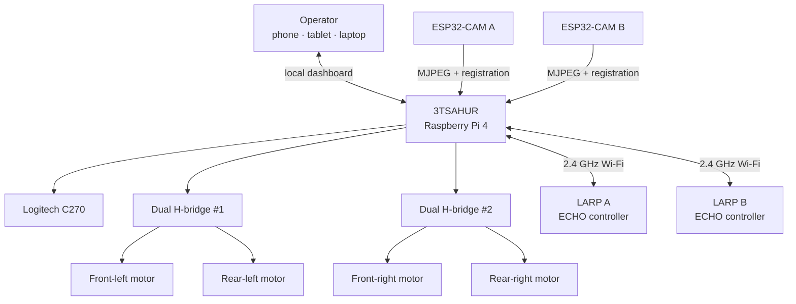

The core design priorities are reliable manual control, watchdog-based stopping, independent robot/camera failure isolation, optional CSI sensing, optional YOLO perception, and local operation without internet after installation.

# Materials checklist

The checklist below combines the hardware shown in the research poster with the current repository implementation. Quantities marked **2×** or **4×** are required for the current three-robot configuration.

## 3TSAHUR hardware

- [ ] **1× Raspberry Pi 4 Model B, 4 GB** with a 64-bit Raspberry Pi OS installation
- [ ] **1× microSD card** suitable for Raspberry Pi OS
- [ ] **1× Logitech C270 USB webcam**
- [ ] **4× DC gearmotors** for the mecanum drivetrain; the poster documents 435 RPM Yellowjacket motors
- [ ] **4× mecanum wheels**
- [ ] **2× dual-channel DC H-bridge motor-driver boards**
- [ ] **T-slot aluminum extrusion / chassis hardware**
- [ ] 3D-printed mounts, housings, brackets, and other project-specific mechanical parts
- [ ] Motor-rated external battery/power supply
- [ ] Correct fuse and accessible motor-power switch
- [ ] Wire, terminals/connectors, strain relief, and common logic-ground wiring
- [ ] Fasteners and mounting hardware

## LARP hardware

- [ ] **2× 3DBU Zippy/ECHO differential-drive robots**
- [ ] **2× Inland AI-Thinker-compatible ESP32-CAM boards**
- [ ] **2× camera modules/ribbon cables** mounted correctly to the ESP32-CAMs
- [ ] **2× IPEX-1 Wi-Fi antennas** when required by the ECHO/Zippy radio hardware
- [ ] Stable regulated **5 V camera power capable of at least 1 A per ESP32-CAM**
- [ ] LARP batteries/power systems appropriate for the Zippy/ECHO hardware
- [ ] 3D-printed camera mounts/protection as required

## Setup/programming tools

- [ ] USB data cable for the Raspberry Pi workflow as needed
- [ ] USB cable/programming connection for each ECHO controller
- [ ] USB-to-serial adapter for ESP32-CAM flashing
- [ ] Jumper wires for ESP32-CAM flash mode
- [ ] Laptop/desktop with **Arduino IDE**
- [ ] `esp32 by Espressif Systems` Arduino board package; project baseline: **3.0.7**
- [ ] 3DBuffalo **EchoLib 1.3.0** and **Adafruit BusIO** for the ECHO firmware
- [ ] Internet access during initial Pi software and YOLO package/model installation

## Optional/research expansion hardware

The repository discusses, but does not require for the baseline, wheel encoders, an IMU, thermal/depth/LiDAR sensing, environmental sensors, current/battery telemetry, and dedicated edge-AI accelerators.

# Complete wiring and pinouts

## 3TSAHUR Raspberry Pi → motor drivers

The drivetrain code uses **BCM GPIO numbering**. Each motor channel has its own direction pair; do not reuse one Pi GPIO across different driver inputs.

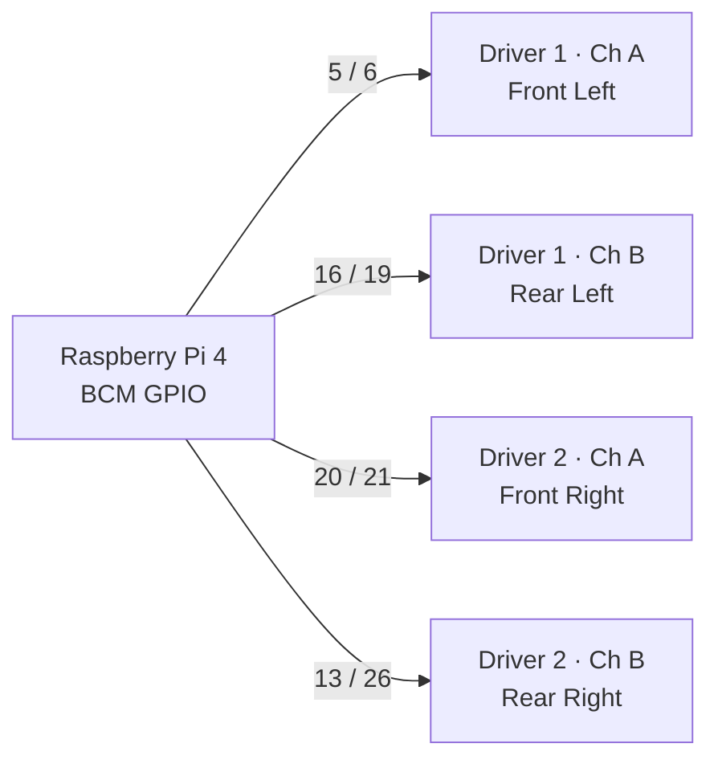

| Wheel | Driver inputs | BCM GPIO | Physical Pi pins |
| --- | --- | --- | --- |
| Front left | Driver 1 IN1 / IN2 | `5 / 6` | `29 / 31` |
| Rear left | Driver 1 IN3 / IN4 | `16 / 19` | `36 / 35` |
| Front right | Driver 2 IN1 / IN2 | `20 / 21` | `38 / 40` |
| Rear right | Driver 2 IN3 / IN4 | `13 / 26` | `33 / 37` |

```text
Relevant Raspberry Pi 4 header positions

29 GPIO5   ●  ● GND    30
31 GPIO6   ●  ● GPIO12 32
33 GPIO13  ●  ● GND    34
35 GPIO19  ●  ● GPIO16 36
37 GPIO26  ●  ● GPIO20 38
39 GND     ●  ● GPIO21 40
```

```text
Pi GPIO                   Driver                  Motor
────────                  ──────                  ─────
GPIO 5 / GPIO 6   ──────► Driver 1 Channel A ──► Front Left
GPIO16 / GPIO19   ──────► Driver 1 Channel B ──► Rear Left
GPIO20 / GPIO21   ──────► Driver 2 Channel A ──► Front Right
GPIO13 / GPIO26   ──────► Driver 2 Channel B ──► Rear Right

Pi GND ─────────────────► driver logic/common ground
Motor battery ──────────► fused motor-driver supply
                         NOT the Raspberry Pi 5 V rail
```

> [!WARNING]
> Never power the drive motors from the Raspberry Pi 5 V rail. Use the motor supply appropriate for the motors/drivers, fuse it, provide a physical power switch, and verify the intended common logic ground. Perform the first direction test with all wheels raised.

## LARP ECHO/Zippy drivetrain mapping

The LARP firmware uses the ECHO library's motor-channel abstraction rather than raw ESP32 GPIO assignments:

| LARP side | ECHO motor ID used by firmware |
| --- | ---: |
| Left drivetrain | `1` |
| Right drivetrain | `6` |

Do **not** invent or rewire raw ESP32 GPIO pins based on this table. The ECHO/Zippy board and EchoLib handle the underlying motor-driver mapping.

## Inland / AI Thinker ESP32-CAM camera pin map

These signals are internal camera-module connections already encoded in `firmware/larp-esp32-cam/larp-esp32-cam.ino`; they are **not wires to the Raspberry Pi**.

| Camera signal | ESP32-CAM GPIO |
| --- | ---: |
| PWDN | `32` |
| RESET | `-1` / not connected |
| XCLK | `0` |
| SIOD / SCCB data | `26` |
| SIOC / SCCB clock | `27` |
| D0–D7 | `5, 18, 19, 21, 36, 39, 34, 35` |
| VSYNC | `25` |
| HREF | `23` |
| PCLK | `22` |

### ESP32-CAM upload wiring

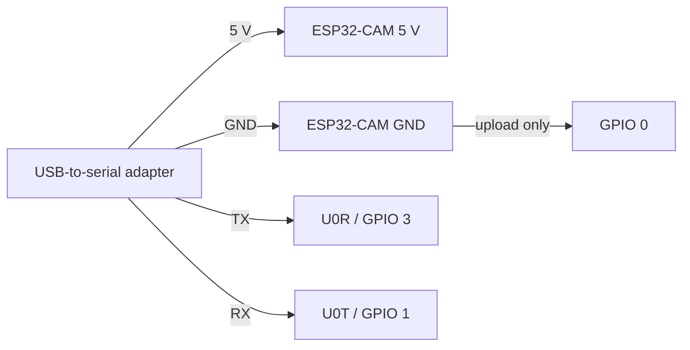

| USB-to-serial | ESP32-CAM |
| --- | --- |
| 5 V | 5 V |
| GND | GND |
| TX | U0R / GPIO 3 |
| RX | U0T / GPIO 1 |
| GND, upload only | GPIO 0 |

**Remove the GPIO 0-to-GND jumper after upload** or the camera will remain in flashing mode instead of booting normally.

# Critical network requirement

> [!IMPORTANT]
> **The Pi hotspot and every LARP/ECHO/ESP32-CAM must use the dedicated 2.4 GHz robot network.** Do not run this validated configuration as 5 GHz-only and do not rely on dual-band band-steering behavior.

| Setting | Project configuration |
| --- | --- |
| SSID | `3TSahur-Swarm` |
| Band | **2.4 GHz only** |
| Channel | **6** |
| Security | **WPA2-Personal / WPA2-PSK** |
| Protocol | **RSN** |
| Pi address | `10.42.0.1` |

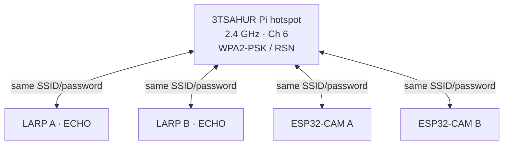

The **IPEX-1 connector is part of the RF antenna path; WPA2 is authentication/encryption**. A loose antenna can look like a networking failure, but changing WPA credentials cannot repair an antenna connection, and reseating an antenna cannot repair the wrong password/security profile.

# Raspberry Pi installation

Production installations use `main`:

```bash
curl -fsSL https://raw.githubusercontent.com/william-thompsonthe1st/STEM-Research-Academy/main/installer/curl-install.sh | bash
```

Or clone first:

```bash
git clone https://github.com/william-thompsonthe1st/STEM-Research-Academy.git
cd STEM-Research-Academy
git checkout main
bash installer/install.sh
```

After reboot, join `3TSahur-Swarm` and open `http://10.42.0.1` or `http://3tsahur.local` when mDNS works. The generated hotspot password is stored in `/etc/stem-research-academy/config.env`; copy the same SSID/password to both ECHO sketches and both camera sketches. Never commit the password.

# LARP firmware and camera setup

| Device | Firmware | Arduino profile | Identity |
| --- | --- | --- | --- |
| LARP ECHO | `firmware/larp-scout/larp-scout.ino` | ESP32S3 Dev Module | `ROBOT_ID=A` or `B` |
| Inland ESP32-CAM | `firmware/larp-esp32-cam/larp-esp32-cam.ino` | AI Thinker ESP32-CAM | `CAMERA_ID=A` or `B` |

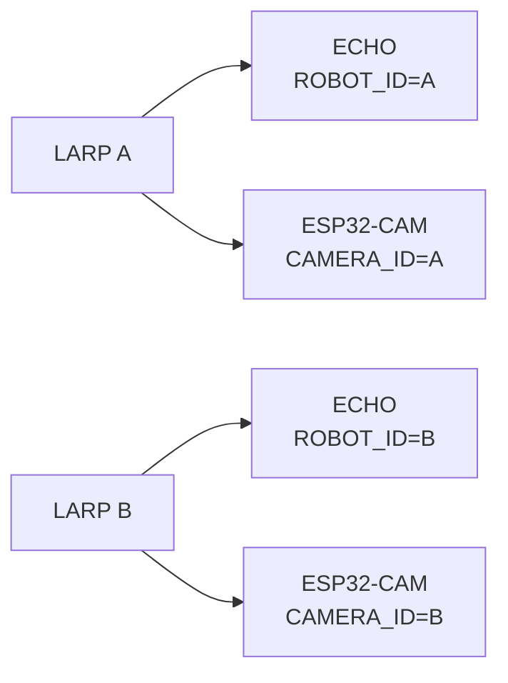

The ECHO controller and camera are independent Wi-Fi clients. They do not require a GPIO connection to each other. Matching `A/A` or `B/B` identity pairs them in the dashboard.

# YOLO11 Nano person detection

3TSAHUR supports optional local person detection using pretrained **Ultralytics YOLO11 Nano (`yolo11n.pt`)**, exported to **NCNN** at 320 px for the Raspberry Pi 4. Inference requests COCO class `0` (`person`).

> [!IMPORTANT]
> YOLO is an operator aid, not proof that an area is occupied or empty and not an identity system. A missed detection does not establish that no person is present.

## Partner-repository compatibility review

The current partner implementation in `AloeVeraZ/CityTechClubProjects/stem-research-academy` uses the same important control-preservation approach: a 200 ms drive watchdog, short current-command paths, a 640×480 @ 10 FPS balanced camera profile, a separate optional YOLO worker that pauses during active driving, a persistent vision environment, an NCNN export, bounded native compute threads, and a fallback to the ordinary dashboard runtime if the vision environment is incomplete.

The 3TSAHUR installer now follows that deployment pattern on `main`: the core dashboard remains independently installable, YOLO lives in its own persistent virtual environment, the exported model path is absolute, and systemd uses the vision interpreter only after the installer validates it.

### What “new weight” means here

This repository does **not** claim to train a new neural-network checkpoint because no custom labeled training dataset is supplied. Instead, the installer creates a new **deployment artifact** from the official pretrained `yolo11n.pt` weights:


The deployment manifest is written under:

```text
~/.local/share/stem-research-academy/vision/deployment-manifest.txt
```

This makes the installed artifact easier to reproduce/audit without misrepresenting it as a newly trained model.

## Performance-protection design

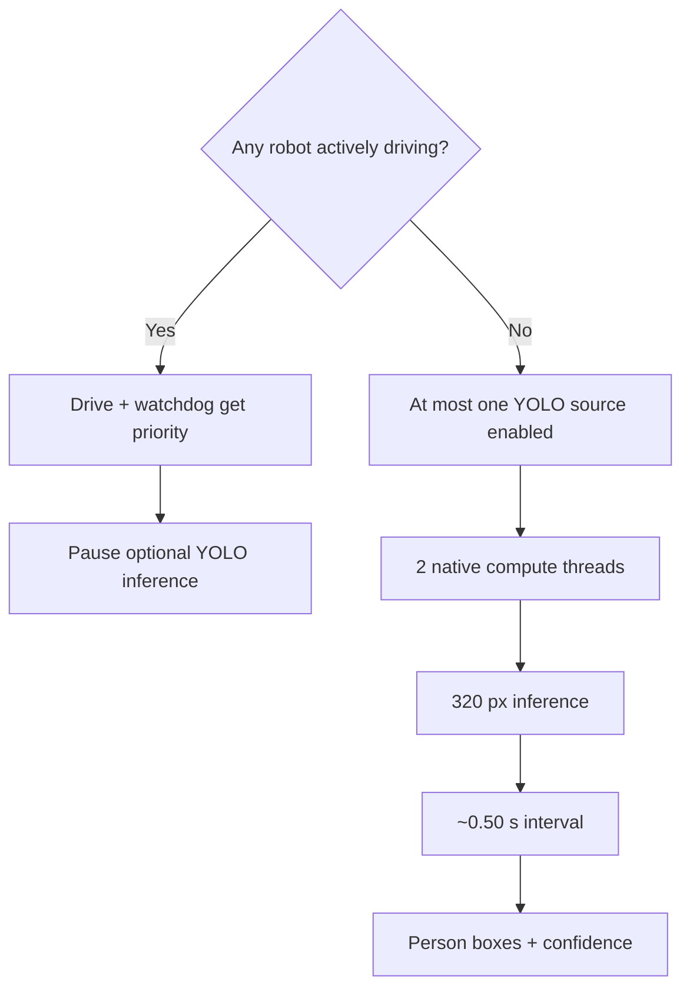

Baseline settings installed for the Pi 4:

| Setting | Baseline |
| --- | --- |
| Source weights | `yolo11n.pt` |
| Runtime | NCNN |
| Input | `320` px |
| Class | person / COCO `0` |
| Confidence | `0.20` |
| Scheduled interval | `0.50 s` (~2 cycles/s before processing time) |
| Native compute threads | `2` |
| Concurrent YOLO sources | `1` |
| Normal 3TSAHUR camera profile | `640×480 @ 10 FPS` |

These choices are designed to protect core control responsiveness, but real hardware validation is still required; software architecture cannot guarantee zero performance impact under every power, thermal, or RF condition.

## Install or repair YOLO11n

First make sure the base robot already works. Then, while the Pi has internet access, run as the **normal Pi user**:

```bash
cd ~/STEMResearchAcademy
git pull
bash installer/install-vision.sh
```

The installer performs this sequence:

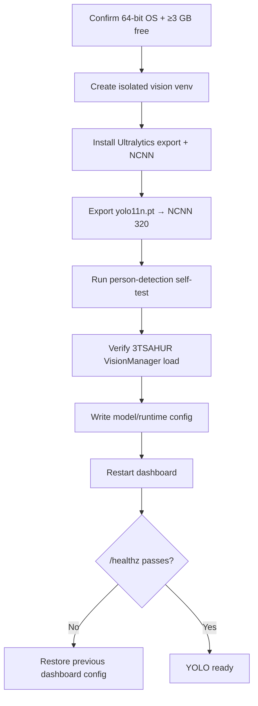

Internet is required for the initial packages, weights, and installer self-test image. Normal field inference can operate locally afterward.

## C-key UI toggle

The current UI binds `C` to the selected robot/camera tab:

```text
C press 1  → YOLO ON
C press 2  → YOLO OFF
C press 3  → YOLO ON again
```

The server permits only one active YOLO source at a time, and inference is failure-isolated from driving. If model loading fails, the motor controls, watchdog, stop paths, and ordinary camera functionality remain separate.

## Verify YOLO without risking motion

```bash
cd ~/STEMResearchAcademy
sudo systemctl status stem-robot-dashboard --no-pager
curl --fail http://127.0.0.1:8080/healthz
journalctl -u stem-robot-dashboard -n 100 --no-pager
cat ~/.local/share/stem-research-academy/vision/deployment-manifest.txt
```

Then:

1. Keep the chassis stationary or wheels raised.
2. Confirm the ordinary C270 video works with YOLO off.
3. Select the **3TSAHUR** tab and press `C` once.
4. Confirm the Vision button changes to the enabled state.
5. Place a visible person in the camera view and wait for the model to initialize.
6. Press `C` again and confirm the overlay clears/stops updating.
7. Test LARP vision only after that LARP camera already streams normally.
8. Perform the raised-wheel control/watchdog test with Vision enabled before any floor test.

## YOLO troubleshooting

| Symptom | Check first |
| --- | --- |
| Installer stops before export | 64-bit OS, internet, ≥3 GB free storage |
| Python/Ultralytics import fails | Re-run installer; inspect the printed package/version failure |
| NCNN export fails | Internet/download integrity, storage, Python package errors |
| Self-test fails | Do not force activation; rerun after fixing the runtime/export |
| Dashboard fails after install | Installer restores previous config; inspect `journalctl` |
| `C` toggles but no detections | Confirm normal video, subject visibility, model initialization, and logs |
| LARP YOLO fails | Prove the ESP32-CAM stream works first |
| Controls become sluggish | Disable YOLO, confirm one stream/source, check Pi temperature/power/RF conditions |

See [docs/VISION_SETUP.md](docs/VISION_SETUP.md) for more detail.

# First-boot validation

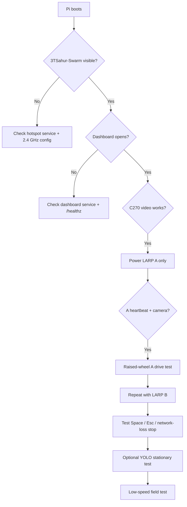

Useful Pi checks:

```bash
sudo systemctl status stem-robot-hotspot --no-pager
sudo systemctl status stem-robot-dashboard --no-pager
curl --fail http://127.0.0.1:8080/healthz
nmcli -f 802-11-wireless.ssid,802-11-wireless.band,802-11-wireless.channel connection show stem-robot-hotspot
nmcli -f 802-11-wireless-security.key-mgmt,802-11-wireless-security.proto connection show stem-robot-hotspot
```

# Wi-Fi, WPA2, and IPEX-1 troubleshooting

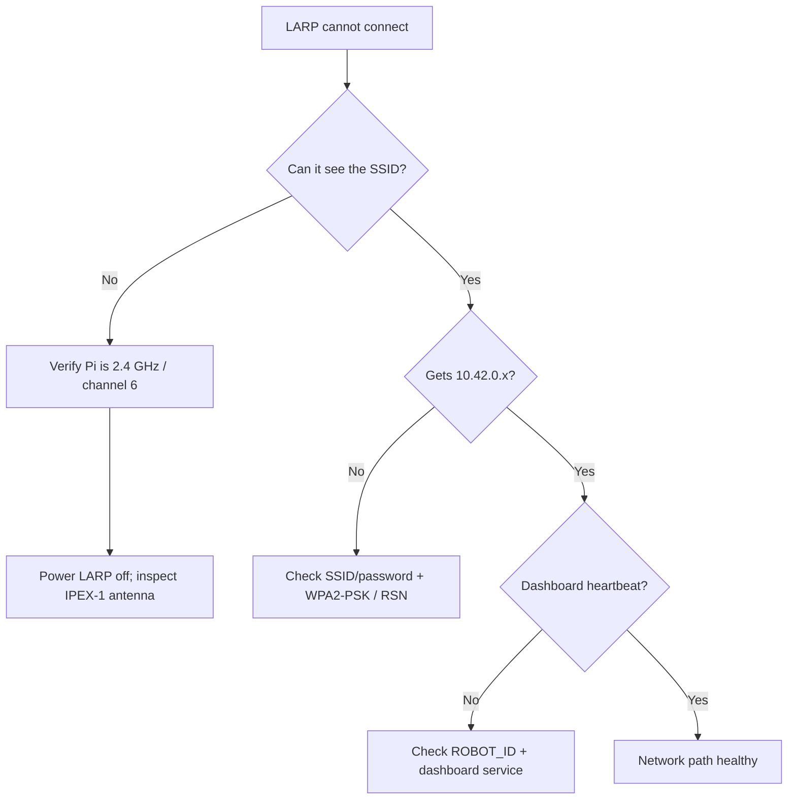

See [docs/TROUBLESHOOTING.md](docs/TROUBLESHOOTING.md) for the full procedure.

---

# Research Poster Archive — CUNY STEM Research Academy 2026

> [!NOTE]
> This is an archival record of the research poster and is intentionally separate from the live implementation/setup sections above. The poster uses **T.T.T.S.A.H.U.R.** and **L.A.R.P.** notation; the current display names are **3TSAHUR** and **LARP**.

## Alleviating Sociotechnical Anxieties Surrounding Automation: Semi-Autonomous Reconnaissance Robot

**Students:** Wilson Tom and Kaitlin Lam  
**Mentor:** Prof. Andy Zhang  
**Department:** Mechanical Engineering Technology  
**Institution:** New York City College of Technology, CUNY  
**Address shown on poster:** 300 Jay Street, Brooklyn, NY 11201

## Abstract

As technology has advanced, automation has become more prominent. From automating production with the power loom to automating thinking with AI, automation has come a long way. Accompanying that advancement is a persistent question: **Can it be trusted?** The poster connects this concern to historical Luddite resistance and modern fears that automation threatens livelihoods.

The research goal is to engineer and evaluate a **cost-effective robot with a minimalistic architecture** that can assist first responders in reconnaissance efforts while helping dispel fears around automation. Accessible and low-cost components are emphasized to foster a more open-minded and trusting sentiment toward automated technology. Time and cost constraints made the primary objective construction of a cost-effective reconnaissance robot with a minimalist architecture; improvements in mobility and object identification were identified as future opportunities.

## Introduction

The poster describes AI-driven automation as renewing Luddite-style resistance among workers concerned about job loss and cites research estimating that **47% of occupations are at risk of automation**. It also notes potential benefits of automation, including improved task/data-analysis efficiency and support for interdisciplinary research.

Rather than focusing only on traditional ROI, the project adopts a low-cost automation perspective emphasizing **ergonomics, user compatibility, and cost-effectiveness**. It builds on research integrating reconnaissance technologies to help first responders assess disaster sites without requiring immediate human exposure to perilous environments. The intended broader outcome is to encourage human-technology collaboration while reducing anxiety around automation.

## Methodology

The experiment loosely followed the engineering design process:

1. T.T.T.S.A.H.U.R. and L.A.R.P. concepts were created in **Onshape** CAD, with L.A.R.P. based on the Zippy architecture.
2. Chassis and component housings were modeled.
3. Additional concepts included a ramp door, camera gimbal, and cam-driven jumping mechanism.
4. The large robot used extrusions and 3D-printed parts; poster dimensions: **18 × 17.5 × 7.5 in**.
5. The small robot used the **3DBU Zippy kit** and printed parts; poster dimensions: **4.5 × 6 × 4 in**.
6. L.A.R.P. motor/special functions were programmed using the **Arduino IDE**.
7. T.T.T.S.A.H.U.R. motor functions were programmed in Python using a Python/PyCharm workflow.
8. **Ultralytics YOLO11n** was incorporated for AI integration with the T.T.T.S.A.H.U.R. camera feeds.

## Materials shown on the poster

| Poster item | Description |
| --- | --- |
| Figure 2(a) | Motor driver |
| Figure 2(b) | Raspberry Pi 4 Model B, 4 GB RAM |
| Figure 2(c) | Mecanum wheel |
| Figure 2(d) | Yellowjacket motor, 435 RPM |
| Figure 2(e) | T-slot extrusion |
| Figure 3(a) | 3DBU Zippy |

## Design/build and code figures shown on the poster

- **Figure 1(a):** CAD of T.T.T.S.A.H.U.R.
- **Figure 1(b):** CAD of L.A.R.P.
- **Figure 1(c):** Cutting of extrusions for T.T.T.S.A.H.U.R. in the CNC workshop.
- **Figure 1(d):** L.A.R.P. prototype.
- **Figure 4(a):** Channel State Information (CSI) code snippet for L.A.R.P. in Arduino IDE.
- **Figure 4(b):** T.T.T.S.A.H.U.R. website UI code snippet in PyCharm.

Poster acronym expansions:

- **T.T.T.S.A.H.U.R. — Terrain Tandem-Transport Semi-Autonomous Hub Unit for Reconnaissance**
- **L.A.R.P. — Lightweight Autonomous Reconnaissance Platform**

## Conclusion

Based on T.T.T.S.A.H.U.R. and L.A.R.P. performance, the poster concludes that a prototype **cost-effective semi-autonomous reconnaissance robot was successfully developed**. It identifies **time constraints, funding constraints, and technological bottlenecks** as limitations. Future work proposed in the poster includes greater compactness/mobility and additional computing power to improve identification and analysis of objects and/or people.

## References from the poster

1. Frey, C. B.; Osborne, M. A. *The Future of Employment: How Susceptible Are Jobs to Computerisation?* Technol. Forecast. Soc. Change 2017, 114, 265–267.
2. Madanchian, M.; Taherdoost, H. *The Impact of Artificial Intelligence on Research Efficiency.* Results Eng. 2025, 26. DOI: 10.1016/j.rineng.2025.104743.
3. 3DBU. *Zippy* [Product Image].
4. Cintora-Sanz, A. M.; et al. *Intelligent Toolkit for Reconnaissance, Assessments and Prehospital Support in Perilous Incidents: A Realistic Experiment in Prehospital Environment.* BMC Health Serv. Res. 2024, 24, 1331. DOI: 10.1186/s12913-024-11786-3.
5. Fast-Berglund, Å.; Salunkhe, O.; Åkerman, M. *Low-Cost Automation – Changing the Traditional View on Automation Strategies Using Collaborative Applications.* IFAC-PapersOnLine 2020, 53(2), 10285–10290. DOI: 10.1016/j.ifacol.2020.12.2762.
6. Ivanov, S.; Kuyumdzhiev, M.; Webster, C. *Automation Fears: Drivers and Solutions.* Technol. Soc. 2020, 63, 101431. DOI: 10.1016/j.techsoc.2020.101431.

## Acknowledgments from the poster

The poster states that the research was funded by the **NYC Science Research Mentoring Consortium (NYCSRM)**, **CollegeNow**, and the **CUNY STEM Research Academy**. It thanks mentors **Mark Salib, Abdullah Luna, Angelo Demetroulakos, and Gabriela Bernales** for their insight and guidance.

---

# Future research and recommended improvements

The current platform is a teleoperated research baseline. Future work should ask: **Does the change increase useful situational awareness? Does it improve reliability in degraded environments? Does it reduce operator workload without removing meaningful human control?**

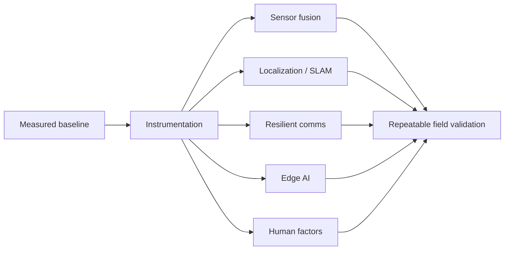

Recommended directions include wheel encoders/IMUs and odometry; LiDAR/depth/stereo SLAM; thermal and environmental sensing; controlled CSI human-presence datasets; second-radio/relay/mesh experiments; closed-loop wheel-speed control; current/battery telemetry; edge-AI accelerators and alternative runtimes; multi-robot task allocation/shared maps; impact/antenna/connector ruggedization; responder-centered UI testing; security/credential/signing improvements; and deliberate failure testing for camera loss, scout reboot, congestion, low battery, stalled motors, browser loss, and service restarts.

| Priority | Research area | Why |
| --- | --- | --- |
| 1 | Reliability + instrumentation | Establish a trustworthy baseline |
| 2 | Encoders/IMU + battery telemetry | Improve control and mission awareness |
| 3 | Communications resilience | Protect control/video availability |
| 4 | Thermal/depth/environment sensing | Add information beyond RGB video |
| 5 | CSI validation + sensor fusion | Test the distinctive non-camera sensing concept |
| 6 | SLAM + assisted navigation | Reduce workload in complex environments |
| 7 | Edge-AI optimization | Add perception without sacrificing control latency |
| 8 | Multi-robot autonomy | Build on a reliable measured platform |

**Recommended research strategy:** instrument first, establish a baseline, change one subsystem at a time, and compare measured results.

# Documentation

- [Setup guide](docs/SETUP.md)
- [Troubleshooting guide](docs/TROUBLESHOOTING.md)
- [Wiring reference](docs/WIRING.md)
- [ESP32-CAM setup](docs/ESP32_CAM_SETUP.md)
- [LARP camera/controller integration](docs/LARP_CAMERA_CONTROLLER_INTEGRATION.md)
- [Latency tuning](docs/LATENCY_TUNING.md)
- [Vision setup](docs/VISION_SETUP.md)
- [Partner baseline comparison](docs/PARTNER_BASELINE_COMPARISON.md)
- [Robot naming](docs/ROBOT_NAMES.md)

# Safety

Test every direction with the wheels clear of the floor first. Disconnect motor power while wiring or flashing electronics. Use a fused external motor supply and an accessible physical motor-power switch. Verify the intended common logic ground. Test emergency stop, browser disconnect, and network-loss stopping before operating near people or property. Power a LARP off before inspecting or reseating its IPEX-1 antenna connector. Treat YOLO and CSI as advisory research sensors, not certified life-safety systems.

---

Built as a research platform for distributed robotic reconnaissance and first-responder situational awareness.
