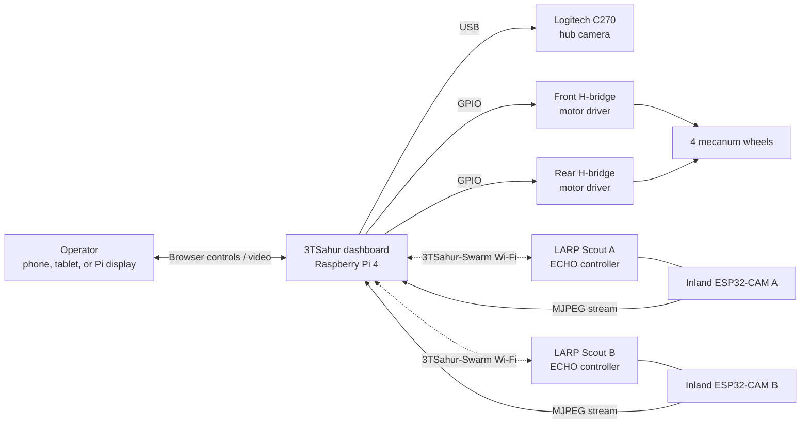
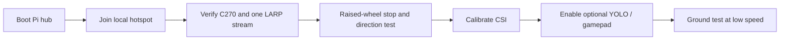
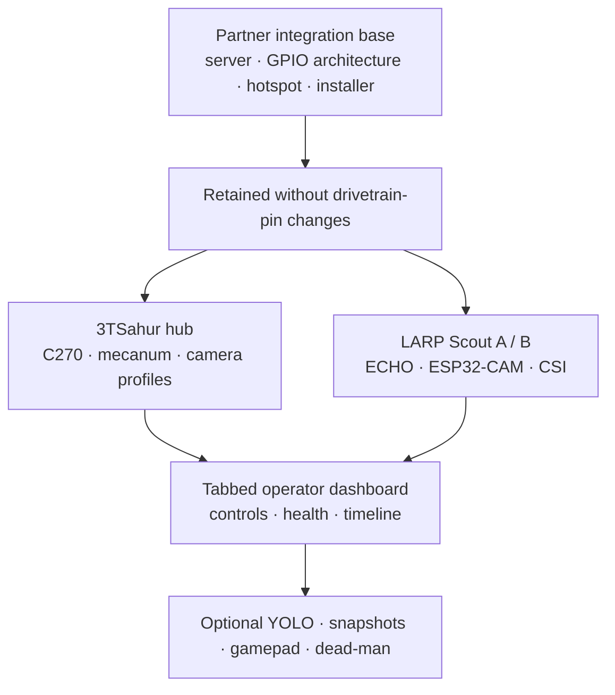

# 3TSahur + LARP Reconnaissance Swarm

<p align="center">
  
  
  
  
</p>

> One rugged Raspberry Pi mecanum hub, two mobile camera scouts, and one browser dashboard for safe local reconnaissance experiments.

**3TSahur** is a Raspberry Pi 4 Model B (4 GB) mecanum-drive control hub with a Logitech C270 USB camera. It coordinates two ECHO differential-drive scout robots—**LARP Scout A** and **LARP Scout B**—each paired with an Inland ESP32-CAM video node. The project creates a self-contained local Wi-Fi control network: no internet connection is required during normal operation.

## What it can do

| System | Capability |
| --- | --- |
| 3TSahur hub | Drive forward, reverse, strafe, and rotate with four independently controlled mecanum wheels. |
| Live vision | Show the Logitech C270 feed plus two LARP ESP32-CAM MJPEG streams in one dashboard. |
| Scout control | Send direction commands to LARP Scout A and B independently over Wi-Fi. |
| Safety | Stop stale commands automatically; includes sequence checks, watchdogs, and a kill-all control. |
| Deployment | Configure a Pi hotspot, dashboard service, local touchscreen/display kiosk, and mDNS address. |
| Optional AI vision | Prepare pretrained YOLO11 Nano person detection for the selected C270 or LARP camera feed. |
| Mission tools | Keep a bounded event timeline, save per-camera snapshots, calibrate LARP CSI baselines, and use browser gamepads/dead-man control. |

## System overview



## Reproduction methodology

This project is designed as a local-first system: the Pi hosts the Wi-Fi
network, dashboard, motor control, C270 camera feed, and optional vision
worker. The two LARPs join that same network, register a heartbeat, receive
short-lived drive commands, and expose their own camera feeds. Nothing in
normal operation requires cloud access.

1. **Build safely.** Assemble and wire the parts in the rebuild checklist,
   leaving motor power disconnected until software checks pass.
2. **Install the Pi hub.** Flash Raspberry Pi OS, clone this repository, run
   the installer, and join the resulting `3TSahur-Swarm` hotspot.
3. **Flash the four scout boards.** Configure A/B identifiers and matching
   hotspot credentials in both LARP drive boards and both ESP32-CAM boards.
4. **Validate one subsystem at a time.** Confirm the Pi dashboard, C270, each
   camera stream, each LARP heartbeat, then raised-wheel drive directions.
5. **Operate with control priority.** Keep one dashboard camera stream open,
   start in the Control Priority camera profile if radio capacity is limited,
   and test `Space`/`Esc` before floor operation.
6. **Enable optional analysis last.** Use CSI calibration with the scene clear,
   then enable YOLO only for the selected camera when its performance is
   acceptable.

### What happens when the system runs

- The browser sends only current, expiring commands; stale/reordered input is
  rejected and the Pi watchdog stops 3TSahur if refreshes cease.
- Switching robot tabs stops all robots and closes inactive MJPEG streams to
  protect control bandwidth.
- LARP drive status, CSI, timeline, health, vision, snapshots, and camera
  profiles are auxiliary features. Their failure must display a status only;
  it cannot disable the core stop/watchdog/control paths.
- The mission timeline is capped at 120 in-memory events. Snapshots are saved
  locally by the Pi; copy any images you need before rebooting or updating.

### Quick field-validation flow



For the next field session, use the step-by-step
[tomorrow checklist](docs/TOMORROW_CHECKLIST.md). It includes the precise
gimbal/ramp servo information needed before new actuator code is written.

## What changed from the partner integration base

The partner repository remains the software foundation. We retained the Python
server/package structure, motor-control pattern, hotspot installer, systemd
deployment, and original Pi mecanum GPIO mapping; the work here adapts and
extends that base for the 3TSahur/LARP swarm.

| Area | Partner-base behavior retained | 3TSahur/LARP changes |
| --- | --- | --- |
| Drivetrain | Python mecanum drive and GPIO architecture | Names changed only; exact BCM mapping remains `5/6`, `16/19`, `20/21`, `13/26`. |
| Deployment | Hotspot, service, kiosk, installer/update rollback | 3TSahur names, local operator workflow, beginner setup/checklists. |
| Dashboard | Responsive browser controls | Three robot tabs, single active stream, health panel, profiles, timeline, gamepad/dead-man controls. |
| Scouts | ECHO drive/control foundations | LARP A/B identities, Wi-Fi recovery, heartbeats, CSI display/calibration, separate camera feeds. |
| Vision | No optional hub inference workflow | Per-feed YOLO11 Nano toggles, overlays, snapshots, and failure isolation. |
| Validation | Original functional test foundation | Expanded simulation coverage, API expiry/sequence checks, feature-isolation checks, and timing results. |



Read [docs/CHANGES_FROM_ORIGINAL.md](docs/CHANGES_FROM_ORIGINAL.md) for the
full file-level integration record.

## Dashboard

Open `http://10.42.0.1` after connecting to the 3TSahur hotspot. On a device that supports mDNS, `http://3tsahur.local` also works. The Pi's attached display opens the same dashboard automatically after installation.

```text
┌─────────────────────────────────────────────────────────────────────┐
│  [ 3TSahur ]  [ LARP Scout A ]  [ LARP Scout B ]     ● Online       │
├───────────────────────────────────┬─────────────────────────────────┤
│  Selected robot's live camera     │  Selected robot's controls      │
│  (one stream active at a time)    │  status, speed, and stop        │
├───────────────────────────────────┴─────────────────────────────────┤
│  Emergency STOP ALL · responsive phone/tablet/desktop layout         │
└─────────────────────────────────────────────────────────────────────┘
```

Only the selected tab keeps its MJPEG feed open. This preserves hotspot
bandwidth for low-latency robot commands instead of competing with three video
streams at once.

The dashboard works with mouse/touch controls and the following keyboard shortcuts when the page is focused:

| Robot | Keys | Action |
| --- | --- | --- |
| 3TSahur | `W` / `S` | Forward / reverse |
| 3TSahur | `A` / `D` | Strafe left / right |
| 3TSahur | `Q` / `E` | Rotate left / right |
| 3TSahur | `Space` | Stop the hub drivetrain |
| LARP Scout A | Arrow keys | Forward, reverse, left, right |
| LARP Scout B | `I` / `K` / `J` / `L` | Forward, reverse, left, right |
| All robots | `Esc` | Emergency kill-all |

Commands are deliberately short-lived. Releasing a key, losing the client connection, or letting the watchdog expire stops the affected robot.

## Hardware and wiring

### Rebuild checklist

**Required parts**

- [ ] Raspberry Pi 4 Model B (4 GB), microSD card, official-grade 5 V / 3 A supply, case/cooling, and a local display or operator phone/tablet.
- [ ] Logitech C270 USB webcam and four mecanum DC motors with compatible wheels/chassis.
- [ ] Two dual-channel H-bridge drivers, correctly rated fused motor battery/supply, wiring, common ground, and an accessible physical motor-power switch.
- [ ] For the planned C270 gimbal and ramp: a verified servo-driver board, a separate servo-rated regulated supply, four servo channels, compatible pan/tilt and ramp servos, and mechanical end-stop testing before the driver is enabled.
- [ ] Two ECHO robots, two Inland ESP32-CAM boards, matching camera modules, two stable regulated 5 V camera supplies, and either built-in camera USB or 3.3 V-safe USB-to-serial flashing hardware.
- [ ] A 2.4 GHz Wi-Fi-capable operator device. A browser gamepad is optional; no Pi-side gamepad hardware is required.

**Raspberry Pi software checklist**

- [ ] Current 64-bit Raspberry Pi OS with internet available for initial installation.
- [ ] Run `bash installer/install.sh` as the normal Pi user. It installs Python, Flask, OpenCV, V4L2 tools, NetworkManager, Avahi, and required GPIO support.
- [ ] Flash and configure the two LARP controller sketches and two ESP32-CAM sketches with the same hotspot credentials.
- [ ] Optional YOLO: follow [docs/VISION_SETUP.md](docs/VISION_SETUP.md) to install `ultralytics` and `ncnn` inside `.vision-venv` and export `yolo11n_ncnn_model`.

**Arduino IDE checklist**

- [ ] Install Arduino IDE and the **esp32 by Espressif Systems** board package for the Inland ESP32-CAM; select the AI Thinker-compatible profile described in [docs/ESP32_CAM_SETUP.md](docs/ESP32_CAM_SETUP.md).
- [ ] Install the ECHO/EchoLib dependencies specified in [firmware/larp-scout/README.md](firmware/larp-scout/README.md) before flashing the LARP drive controllers.
- [ ] Upload with GPIO0 grounded only during ESP32-CAM flashing, then remove the jumper before normal boot.
- [ ] Read [the LARP camera/controller integration guide](docs/LARP_CAMERA_CONTROLLER_INTEGRATION.md) before connecting the camera to power or using an Arduino as a serial bridge.

### 3TSahur hub

| Part | Role |
| --- | --- |
| Raspberry Pi 4 Model B (4 GB) | Runs the hotspot, web dashboard, control service, and USB camera feed. |
| Logitech C270 | USB hub camera. Use a powered USB hub if the Pi cannot supply enough current. |
| Two dual-channel H-bridge motor drivers | Drive the four mecanum motors. Motor power must come from a suitable external supply. |
| Four mecanum DC motors | Front-left, rear-left, front-right, rear-right wheel positions. |

The Pi GPIO layout below is intentionally the same layout as the integration base repository. GPIO numbers are **BCM numbers**, not physical header pin numbers.

| Wheel | Driver channel | GPIO direction pins |
| --- | --- | --- |
| Front left | Front driver IN1 / IN2 | GPIO 5 / GPIO 6 |
| Rear left | Front driver IN3 / IN4 | GPIO 16 / GPIO 19 |
| Front right | Rear driver IN1 / IN2 | GPIO 20 / GPIO 21 |
| Rear right | Rear driver IN3 / IN4 | GPIO 13 / GPIO 26 |

Do not power motors from the Pi's 5 V rail. Share a common ground between the Pi and motor-driver logic, verify each motor direction with wheels raised, and keep an accessible physical power switch. Full connection notes are in [docs/WIRING.md](docs/WIRING.md).

### Planned C270 gimbal and ramp

The dashboard now includes **Gimbal mode** (`G`, then arrow keys) and a **ramp toggle** (`R`) on the 3TSahur tab. This release is intentionally a no-output staging layer: it records bounded requested pan/tilt and ramp positions but contains no servo-driver library, GPIO mapping, I2C address, PWM channel, or physical output. It cannot move servos until the team supplies the driver model, power plan, channels, and calibrated mechanical limits. See [auxiliary-actuator setup requirements](docs/3TSAHUR_AUXILIARY_ACTUATORS.md).

### LARP scouts and cameras

Each scout contains:

- An ECHO robot controller running the LARP drive firmware. The retained motor IDs are left = `1`, right = `6`.
- An Inland ESP32-CAM flashing the LARP camera firmware, configured as an AI Thinker-compatible pin layout.
- The same Wi-Fi SSID/password as the Pi hotspot.

The ESP32-CAM board variations can differ. Check the board silk screen and camera connector before powering it. The camera is a separate Wi-Fi video node: retain the ECHO controller's existing motor wiring, power the camera from a regulated 5 V branch, and pair `ROBOT_ID` with `CAMERA_ID` (`A`/`A`, `B`/`B`). See the [LARP camera/controller integration guide](docs/LARP_CAMERA_CONTROLLER_INTEGRATION.md) for the complete safe-power, flashing, Wi-Fi, and field-test procedure.

## Install on the Raspberry Pi

### Fast install (recommended after review)

On a current Raspberry Pi OS image with internet access, run this as the
normal Pi user—not `root`. It downloads the repository's installer, which
then performs package installation, preflight validation, atomic app
replacement, hotspot/service setup, and reboot.

```bash
curl -fsSL https://raw.githubusercontent.com/william-thompsonthe1st/STEM-Research-Academy/main/installer/curl-install.sh | bash
```

To install a reviewed non-default branch, send the branch name to **bash**:

```bash
curl -fsSL https://raw.githubusercontent.com/william-thompsonthe1st/STEM-Research-Academy/agent/integrate-3tsahur-larp/installer/curl-install.sh | STEM_REPO_BRANCH=agent/integrate-3tsahur-larp bash
```

The installer intentionally reboots. Read the script or use the clone method
below first if your team prefers to inspect every install step locally.

### Optional one-command YOLO install

Install the base hub first. Then, if you want pretrained person detection,
run this separate command as the normal Pi user. It creates `.vision-venv`,
installs Ultralytics/NCNN, downloads the pretrained `yolo11n` weights, and
exports the 320px NCNN model used by the dashboard.

```bash
curl -fsSL https://raw.githubusercontent.com/william-thompsonthe1st/STEM-Research-Academy/main/installer/install-vision.sh | bash
```

YOLO remains optional: do not install it until the base dashboard, cameras,
and controls have passed their physical checks. It is never required for motor
control or LARP operation.

1. Flash a current Raspberry Pi OS image and complete its first-boot setup. Use the normal Pi user; do **not** run the installer as root.
2. Connect the C270, motor-driver logic ground, and the GPIO leads above. Keep ements and install

- Current 64-bit Raspberry Pi OS; complete the base installation first.
- Stable power, at least 3 GB free storage, and temporary internet for the
  one-time package/model download and conversion.
- A connected C270 or a verified LARP ESP32-CAM MJPEG stream.
- Install as the normal Pi user in a separate environment—never as `root` and
  never into the dashboard's system Python packages.

```bash
cd ~/STEMResearchAcademy
python3 -m venv --system-site-packages .vision-venv
source .vision-venv/bin/activate
python -m pip install --upgrade pip
python -m pip install "ultralytics>=8.3,<9" ncnn

# Downloads pretrained COCO weights once, then exports the Pi-friendly runtime.
python - <<'PY'
from ultralytics import YOLO
YOLO("yolo11n.pt").export(format="ncnn", imgsz=320)
PY
```

The complete [pretrained vision setup guide](docs/VISION_SETUP.md) includes
the C270 visual test, LARP feed prerequisites, safe performance settings,
offline-use notes, and a hardware validation checklist. Upstream references:
[YOLO11 models](https://docs.ultralytics.com/models/yolo11/),
[NCNN export](https://docs.ultralytics.com/integrations/ncnn/), and
[Raspberry Pi deployment](https://docs.ultralytics.com/guides/raspberry-pi/).

## Flash the LARP firmware

| Target | Sketch | Set before upload |
| --- | --- | --- |
| LARP Scout A/B ECHO board | [firmware/larp-scout/larp_scout_controller.ino](firmware/larp-scout/larp_scout_controller.ino) | `ROBOT_ID`, Wi-Fi credentials, and any board-specific library setup. |
| Inland ESP32-CAM A/B | [firmware/larp-esp32-cam/larp_esp32_cam.ino](firmware/larp-esp32-cam/larp_esp32_cam.ino) | `CAMERA_ID`, Wi-Fi credentials, and the camera board profile. |

Upload one copy configured as `A` and one as `B` for each firmware type. The [LARP controller README](firmware/larp-scout/README.md) and [camera README](firmware/larp-esp32-cam/README.md) cover dependencies and upload notes.

### ESP32-CAM quick start

The Inland ESP32-CAM is a separate Wi-Fi video node, not a motor-controller
accessory. Flash it as `A` or `B`, connect it to stable 5 V power, and use the
matching `larp-a-cam.local/stream` or `larp-b-cam.local/stream` address. The
dashboard opens only the selected LARP feed to protect control responsiveness.
See the complete [Inland ESP32-CAM setup guide](docs/ESP32_CAM_SETUP.md) for
the flash wiring, pin map, network fallback, and troubleshooting steps.
For the complete LARP-level procedure—including power separation, when an
Arduino can safely act as a serial bridge, controller/camera pairing, and a
field-test checklist—read the [LARP camera/controller integration guide](docs/LARP_CAMERA_CONTROLLER_INTEGRATION.md).

## Tests and simulation evidence

The hardware-independent test suite exercises simulated GPIO/PWM motor decisions, camera discovery, scout command proxy behavior, firmware settings, and installer invariants.

```bash
python -m venv .venv
# Linux/macOS
. .venv/bin/activate
# Windows PowerShell
# .venv\Scripts\Activate.ps1
pip install -r requirements.txt
python -m unittest discover -s tests -v
```

The recorded desktop simulation ran **51 tests successfully**: dashboard/UI,
mecanum mixing, camera discovery/profile isolation, firmware invariants,
scout registry, Flask control APIs, mission events, snapshots, and optional
vision failure handling. Hardware validation is still required for motor
polarity/current, Wi-Fi range, camera focus, CSI calibration, gamepad mapping,
and physical emergency-stop behavior. Read
[docs/SIMULATION_RESULTS.md](docs/SIMULATION_RESULTS.md) for the exact
results and limitations.

## Project structure

```text
STEM-Research-Academy/
├── robot_server/                 # Python dashboard, GPIO drive, camera, scout proxy
│   ├── static/                   # Browser UI assets
│   ├── templates/                # Dashboard page
│   └── tests/                    # Software simulation tests
├── firmware/
│   ├── larp-scout/               # ECHO drive firmware for Scouts A and B
│   └── larp-esp32-cam/           # Inland ESP32-CAM streaming firmware
├── installer/                    # Pi installer, hotspot, systemd, kiosk setup
├── docs/                         # Wiring, setup, test report, integration changes
├── run.py                        # Dashboard entry point
└── requirements.txt              # Local development dependencies
```

## Local development

Run the dashboard without GPIO hardware for UI work and code review:

```bash
python -m venv .venv
. .venv/bin/activate
pip install -r requirements.txt
python run.py
```

Then browse to `http://127.0.0.1:8080`. On a non-Pi machine, GPIO behavior is simulated/fails safely; it does not move hardware. Keep real motor testing on the Pi, with wheels off the ground for the first run.

## Documentation

- [Setup guide](docs/SETUP.md) — end-to-end Pi, network, firmware, and first-drive procedure.
- [Tomorrow field checklist](docs/TOMORROW_CHECKLIST.md) — physical validation and the servo/gimbal data required for the next development step.
- [Field information checklist](docs/FIELD_INFORMATION_CHECKLIST.md) — exact photos, serial logs, network evidence, and hardware data needed for the next integration step.
- [Wiring reference](docs/WIRING.md) — exact 3TSahur motor GPIO mapping and ESP32-CAM notes.
- [Inland ESP32-CAM setup](docs/ESP32_CAM_SETUP.md) — upload wiring, pin map, stream verification, and troubleshooting.
- [LARP camera/controller integration](docs/LARP_CAMERA_CONTROLLER_INTEGRATION.md) — safe power, Arduino-bridge decision guide, pairing, setup, and field tests.
- [Simulation results](docs/SIMULATION_RESULTS.md) — commands run, passed tests, and test limitations.
- [Changes from original](docs/CHANGES_FROM_ORIGINAL.md) — what came from the integration base and what changed.
- [Installer guide](installer/README.md) and [server guide](robot_server/README.md) — package-specific operation details.

## Safety checklist

- Test each motion direction with the wheels clear of the floor.
- Use a fused motor supply sized for motor stall current; never run motor power through the Pi.
- Keep the motor battery disconnected while wiring or flashing boards.
- Make sure every controller shares the intended common logic ground.
- Test `Space`/`Esc` and a network-disconnect stop before operating near people or property.

---

Built from the partner project's deployment/dashboard foundation and adapted for the 3TSahur hub and LARP Scout system. See [docs/CHANGES_FROM_ORIGINAL.md](docs/CHANGES_FROM_ORIGINAL.md) for the complete integration record.
