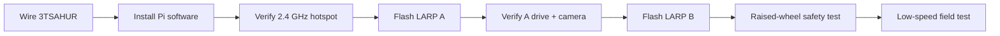
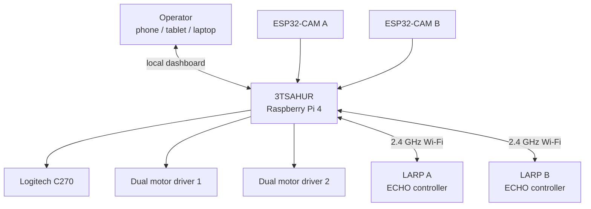
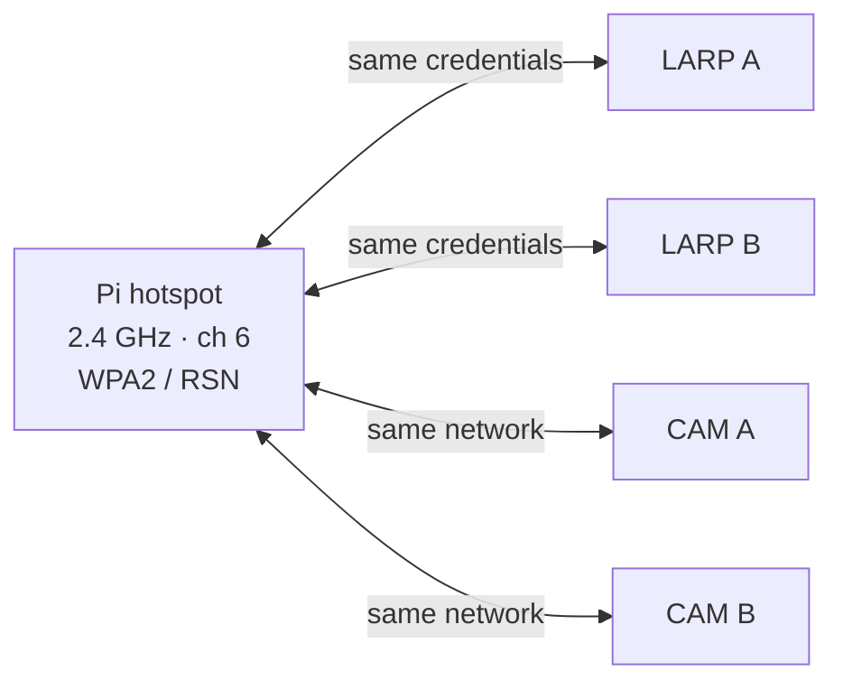
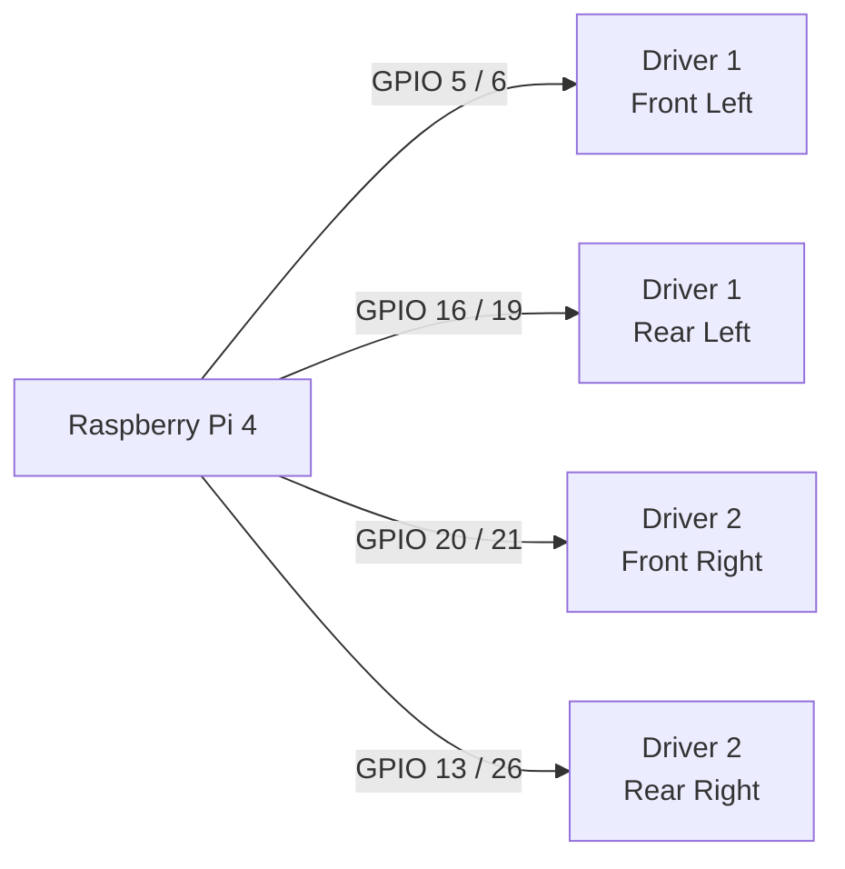
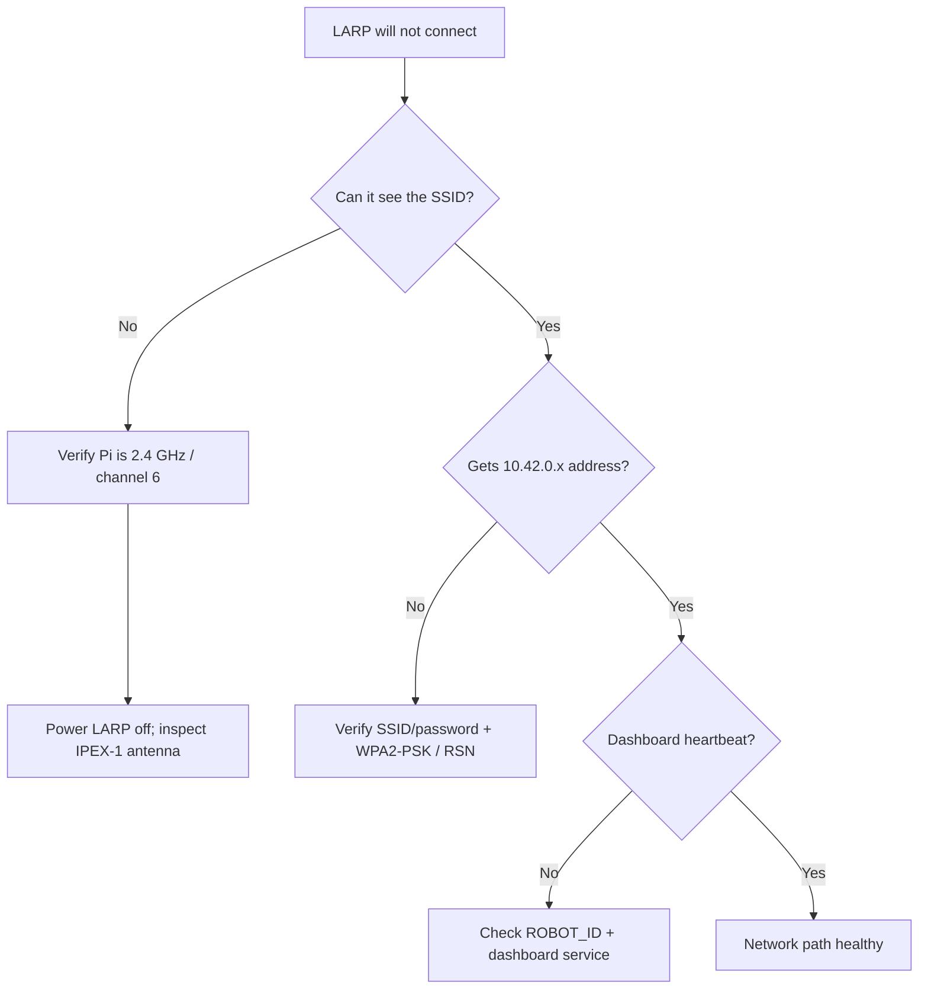
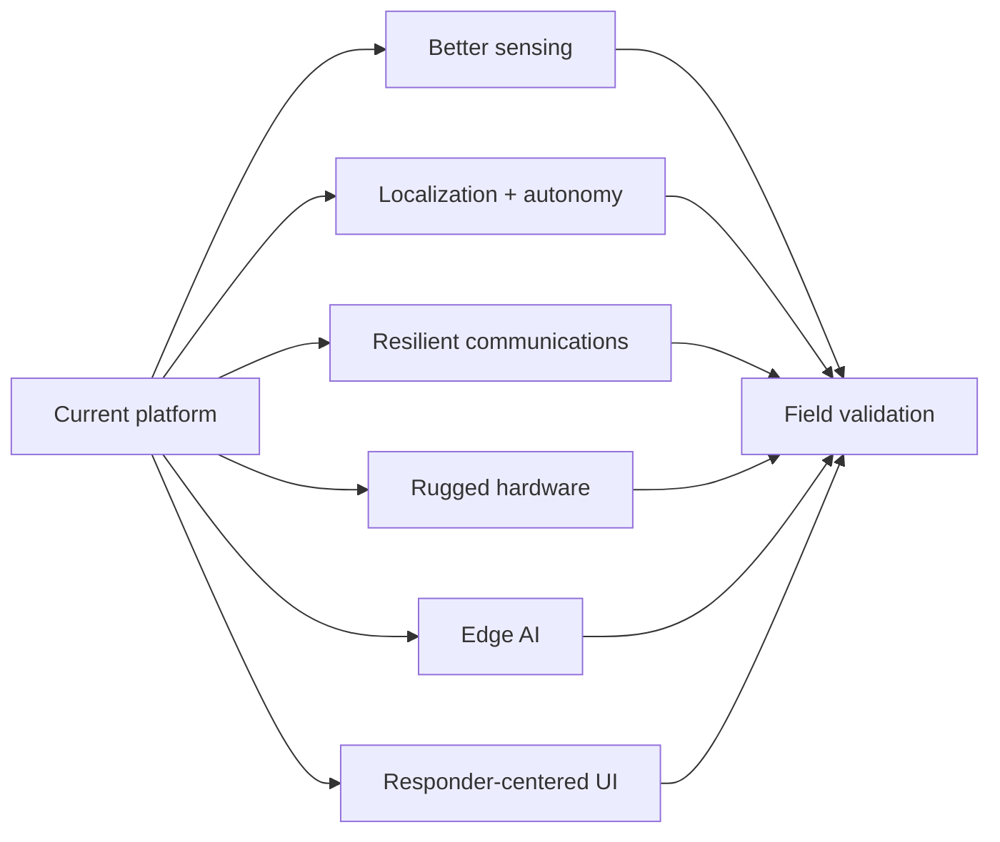

# 3TSAHUR + LARP Reconnaissance Swarm

> A local-first multi-robot reconnaissance platform designed to help first responders gather situational awareness before personnel enter uncertain or hazardous areas.

## Robot names and mission

**3TSAHUR** — **Terrain Tandem Transport Semi-Autonomous Hub Unit for Reconnaissance** — is the large Raspberry Pi 4 mecanum-drive robot and central control hub. Its role is to carry the main compute, networking, camera, and coordination workload while serving as a stable mobile base for reconnaissance.

**LARP** — **Lightweight Autonomous Reconnaissance Platform** — is the project name for each small Zippy/ECHO differential-drive scout. **LARP A** and **LARP B** are intended as lightweight forward scouts that extend the operator's view into areas that may be obstructed, difficult to access, or unsafe for responders to immediately enter.

Together, **3TSAHUR + the LARPs** form a distributed first-responder reconnaissance system. Human operators remain in control; autonomy and sensing are intended to improve situational awareness rather than replace responder judgment.

> [!NOTE]
> `Zippy` and `ECHO` describe the underlying small-robot hardware platform/controller. The project names are **LARP A** and **LARP B**. The existing SSID `3TSahur-Swarm` is retained for deployment compatibility even though the project/display name is **3TSAHUR**.

## Start here



## Current system architecture



Current design priorities are reliable manual control, independent robot/camera failure isolation, a local browser UI, a control watchdog, optional vision, and a simple network that can operate without internet access after setup.

## Critical network requirement

> [!IMPORTANT]
> **Use a dedicated 2.4 GHz robot network.** The Raspberry Pi hotspot and the LARP ECHO/ESP32-CAM clients must use the same **2.4 GHz** network. Do not deploy this configuration as 5 GHz-only or rely on dual-band/band-steering behavior.

| Setting | Project configuration |
| --- | --- |
| SSID | `3TSahur-Swarm` |
| Band | **2.4 GHz only** |
| Channel | **6** |
| Security | **WPA2-Personal / WPA2-PSK** |
| Protocol | **RSN** |
| Pi address | `10.42.0.1` |



## Raspberry Pi installation

Production installs use `main`:

```bash
curl -fsSL https://raw.githubusercontent.com/william-thompsonthe1st/STEM-Research-Academy/main/installer/curl-install.sh | bash
```

After reboot, join `3TSahur-Swarm` and open `http://10.42.0.1` or `http://3tsahur.local` when mDNS is available. The generated hotspot password is stored in `/etc/stem-research-academy/config.env`; copy the same SSID/password into both LARP ECHO sketches and both ESP32-CAM sketches, and never commit the password.

## 3TSAHUR pinout

The code uses **BCM GPIO numbering**.



| Wheel | Driver inputs | BCM GPIO | Physical pins |
| --- | --- | --- | --- |
| Front left | Driver 1 IN1/IN2 | `5 / 6` | `29 / 31` |
| Rear left | Driver 1 IN3/IN4 | `16 / 19` | `36 / 35` |
| Front right | Driver 2 IN1/IN2 | `20 / 21` | `38 / 40` |
| Rear right | Driver 2 IN3/IN4 | `13 / 26` | `33 / 37` |

> [!WARNING]
> Use a correctly rated fused external motor supply. Never power the drive motors from the Pi 5 V rail. Maintain the intended common logic ground and perform the first direction test with the wheels raised.

## LARP firmware and camera pairing

| Device | Firmware | Arduino profile | Identity |
| --- | --- | --- | --- |
| LARP ECHO controller | `firmware/larp-scout/larp-scout.ino` | ESP32S3 Dev Module | `ROBOT_ID=A/B` |
| Inland ESP32-CAM | `firmware/larp-esp32-cam/larp-esp32-cam.ino` | AI Thinker ESP32-CAM | `CAMERA_ID=A/B` |

The ECHO controller and ESP32-CAM are separate Wi-Fi clients; matching IDs pair the drive controller and camera in the dashboard.

## Wi-Fi, WPA2, and IPEX-1 troubleshooting

The **IPEX-1 antenna connector and WPA2 are separate layers**. WPA2 handles authentication/encryption; IPEX-1 is part of the radio antenna path. Correct credentials cannot compensate for a loose antenna, and reseating an antenna cannot correct the wrong WPA profile.



See [docs/TROUBLESHOOTING.md](docs/TROUBLESHOOTING.md).

## Future research and recommended improvements

The current platform is a teleoperated research baseline. Future work should be judged by whether it increases useful situational awareness, improves reliability in degraded environments, or reduces operator workload without removing meaningful human control.



### Localization, mapping, and navigation
Add wheel encoders and IMUs, then evaluate odometry, visual-inertial odometry, LiDAR/depth/stereo sensing, and SLAM. Useful semi-autonomous functions include assisted obstacle avoidance, return-to-home, waypoint driving, and communications-aware navigation, all with immediate operator override.

### Sensor fusion
Evaluate thermal imaging, depth, temperature/humidity, smoke/particulate, appropriately calibrated gas sensing, audio, light, and structural/vibration sensors. Research should emphasize combining data into a simple operator picture rather than presenting raw telemetry. Prototype environmental sensing must not be represented as certified life-safety equipment without appropriate validation.

### CSI human-presence research
Collect controlled Wi-Fi Channel State Information datasets across rooms, materials, distances, antenna orientations, moving machinery, and occupant counts. Report false positives and false negatives. Compare CSI alone with CSI fused with RGB, thermal, or depth observations.

### Communications resilience
Study a dedicated second radio, external/protected antennas, better antenna placement, mesh/relay nodes, store-and-forward telemetry, and separate backhaul where compatible. Keep command traffic isolated from video/AI load. Measure latency, packet loss, range, recovery time, and stop behavior during link degradation.

### Drivetrain, power, and endurance
Add encoders, current sensing, hardware PWM, thermal monitoring, and closed-loop wheel-speed control. Add battery voltage/current telemetry and log subsystem energy consumption so mission endurance can be measured and predicted.

### Edge AI and perception
Benchmark NCNN and other Pi-compatible inference approaches or accelerators using latency, power, CPU temperature, video delay, and control responsiveness. Expand perception only for clear responder tasks, and display confidence/uncertainty rather than presenting AI output as guaranteed truth.

### Multi-robot coordination
Study shared maps, task allocation, communications-aware scout placement, duplicate-exploration avoidance, and observation handoff between 3TSAHUR and the LARPs. Measure whether automation actually lowers operator workload.

### Mechanical ruggedization
Improve impact protection, strain relief, connector retention, antenna protection, wheel/camera guards, dust/water resistance, cooling, and serviceability. The LARP IPEX-1 antenna connection is a particularly useful target for mechanical protection.

### Human factors
Conduct timed user studies for robot selection, target identification, lost-camera recovery, low-battery recognition, emergency stopping, and source identification. Compare keyboard, touchscreen, and gamepad control and test the interface in low-light and gloved-use scenarios.

### Reliability and cybersecurity
Deliberately test camera loss, scout reboot, service restart, delayed commands, congestion, low battery, stalled motors, and browser loss. Add structured mission logs/replay. Future security work can study stronger device authentication, credential rotation, signed releases, least-privilege services, and protection of mission recordings.

### Field-validation methodology
Create a repeatable test matrix covering rooms, hallways, corners, obstacles, low light, safe simulated visibility degradation, RF interference, and increasing range. Record command/video latency, packet loss, reconnection time, endurance, detection accuracy, operator task time, and recovery success.

| Priority | Research area | Why |
| --- | --- | --- |
| 1 | Reliability + instrumentation | Establish a trustworthy baseline |
| 2 | Encoders/IMU + battery telemetry | Improve control and mission awareness |
| 3 | Communications resilience | Protect control/video availability |
| 4 | Thermal/depth/environment sensing | Add information beyond RGB video |
| 5 | CSI validation + sensor fusion | Test the distinctive non-camera sensing concept |
| 6 | SLAM + assisted navigation | Reduce workload in complex environments |
| 7 | Edge-AI optimization | Add perception without sacrificing control latency |
| 8 | Multi-robot autonomy | Build on a reliable measured platform |

**Recommended research strategy:** instrument first, establish a baseline, change one subsystem at a time, and compare measured results.

## Documentation

- [Setup guide](docs/SETUP.md)
- [Troubleshooting guide](docs/TROUBLESHOOTING.md)
- [Wiring reference](docs/WIRING.md)
- [ESP32-CAM setup](docs/ESP32_CAM_SETUP.md)
- [LARP camera/controller integration](docs/LARP_CAMERA_CONTROLLER_INTEGRATION.md)
- [Latency tuning](docs/LATENCY_TUNING.md)
- [Vision setup](docs/VISION_SETUP.md)
- [Robot naming](docs/ROBOT_NAMES.md)

## Safety

Test every direction with the wheels clear of the floor first. Disconnect motor power while wiring or flashing electronics. Use a fused external motor supply and an accessible physical motor-power switch. Verify the intended common logic ground. Test emergency stop, browser disconnect, and network-loss stopping before operating near people or property. Power a LARP off before inspecting or reseating its IPEX-1 antenna connector.

---

Built as a research platform for distributed robotic reconnaissance and first-responder situational awareness.