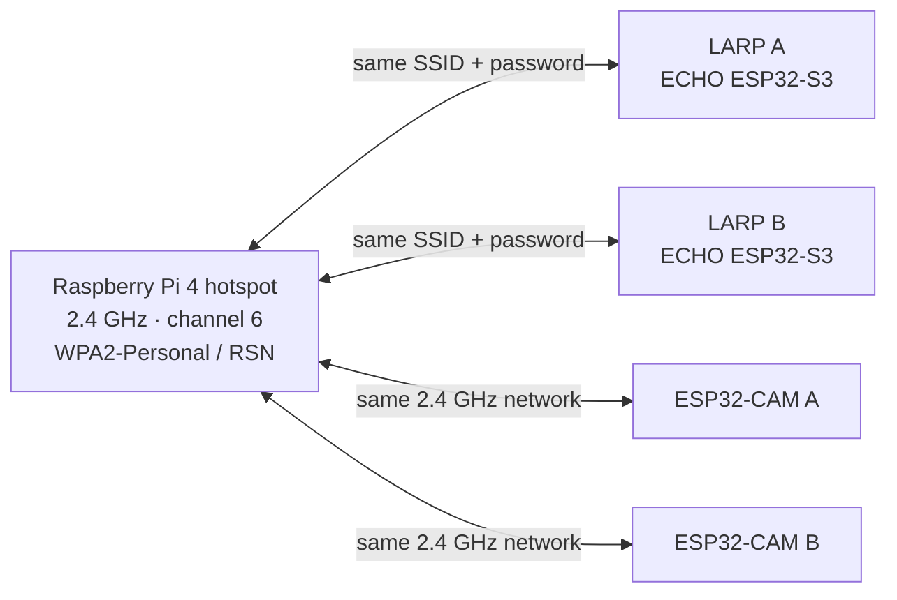
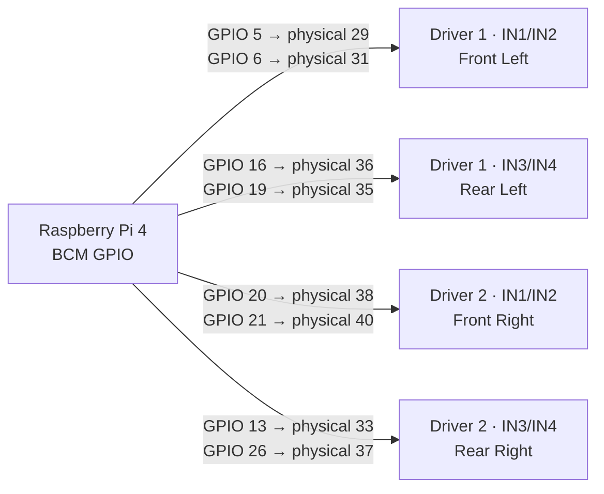
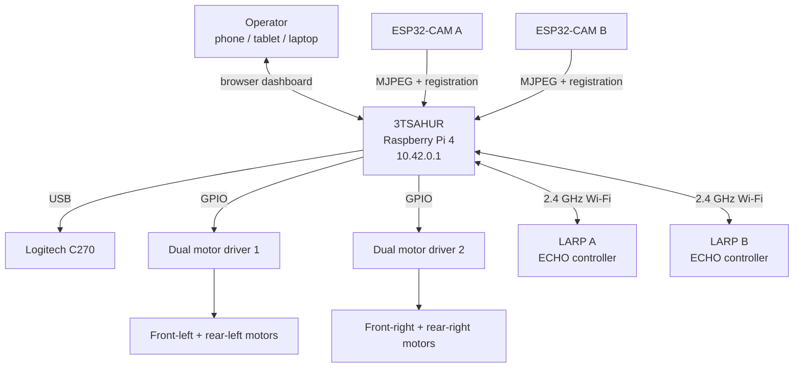
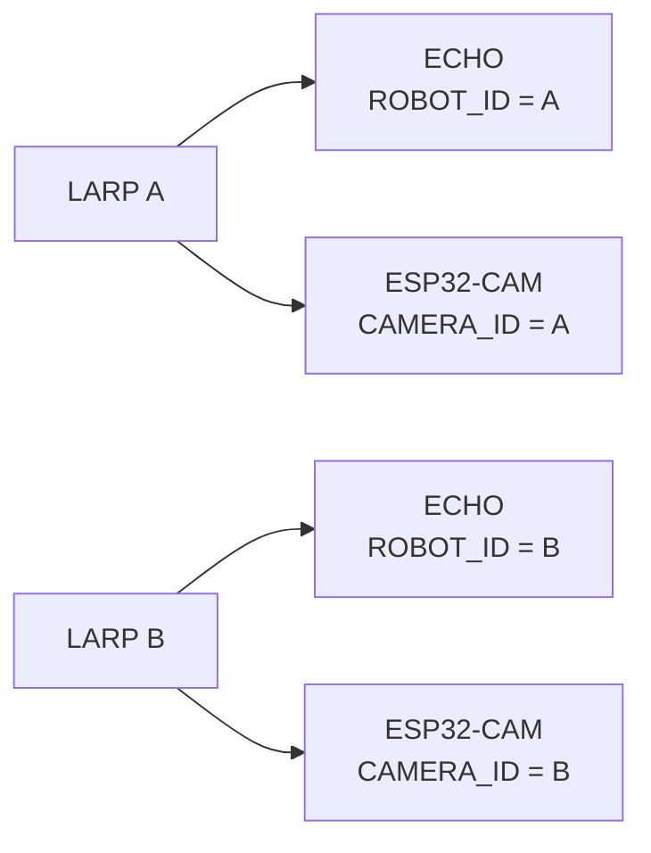
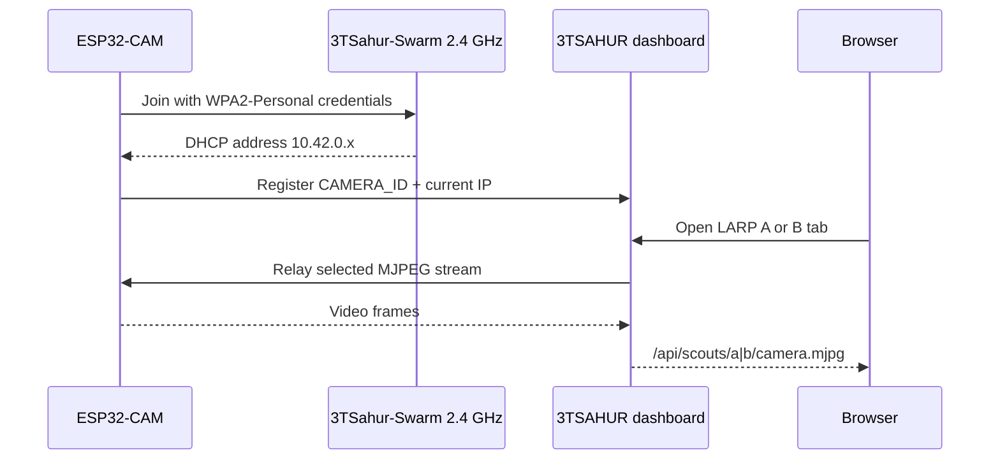
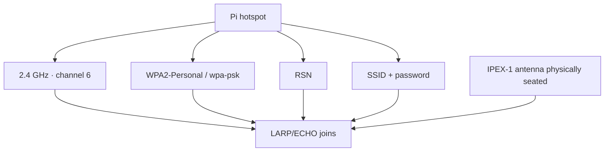
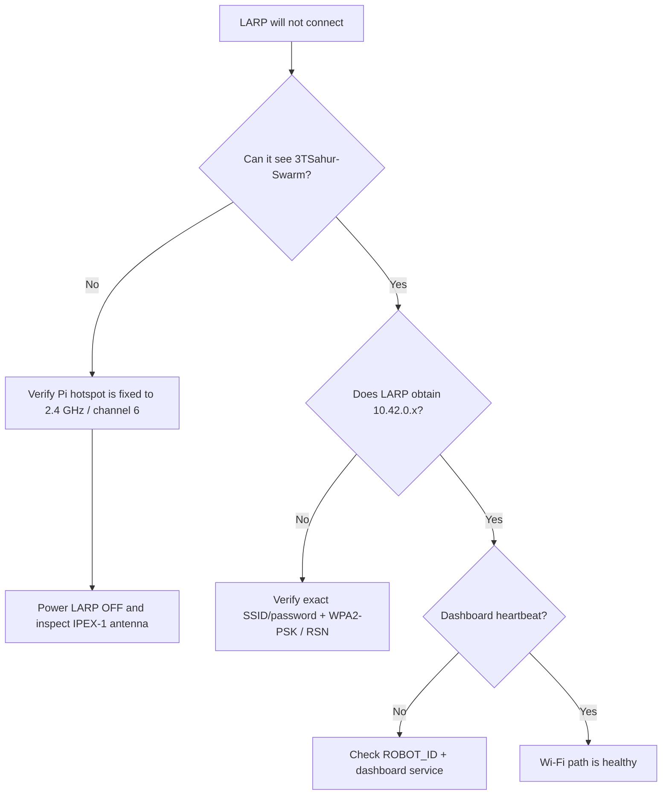
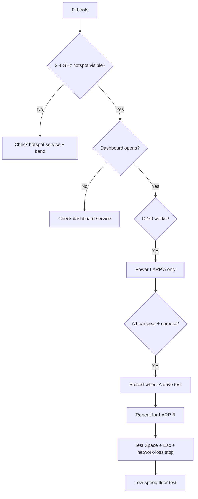

# 3TSAHUR + LARP Reconnaissance Swarm

<p align="center">
  
  
  
  
  
  
</p>

> A local-first multi-robot reconnaissance platform designed to help first responders gather situational awareness before personnel enter uncertain or hazardous areas.

## Robot names and mission

**3TSAHUR** stands for **Terrain Tandem Transport Semi-Autonomous Hub Unit for Reconnaissance**. It is the large Raspberry Pi 4 mecanum-drive robot and central control hub. The name reflects its job in the system: carrying the main compute, networking, camera, and coordination workload while serving as a stable mobile base for reconnaissance operations.

**LARP** stands for **Lightweight Autonomous Reconnaissance Platform**. **LARP A** and **LARP B** are the two small Zippy/ECHO differential-drive scout robots. Their name reflects their intended role as lightweight forward scouts that can extend the team's view into areas that may be difficult, obstructed, or unsafe for responders to immediately enter.

Together, **3TSAHUR + the LARPs** form a distributed first-responder reconnaissance system: 3TSAHUR acts as the central hub and mobile command node, while the LARPs provide smaller, more maneuverable remote viewpoints. The design goal is to give operators video, sensing, and remote-control capability that can improve situational awareness while keeping human responders in control of the mission.

> [!NOTE]
> `Zippy` and `ECHO` describe the underlying small-robot hardware platform/controller. The project names of the small robots are **LARP A** and **LARP B**.

## Start here


| If you are... | Go here |
| --- | --- |
| Building the large mecanum robot | [3TSAHUR pinout](#3tsahur-pinout) |
| Installing the Raspberry Pi | [Pi installation](#raspberry-pi-installation) |
| Flashing a LARP | [Flash the LARP devices](#flash-the-larp-devices) |
| Fixing Wi-Fi/WPA problems | [Wi-Fi + WPA2 troubleshooting](#wi-fi--wpa2-troubleshooting) |
| Fixing camera problems | [Camera pairing visual](#camera-pairing-visual) |
| Doing the first drive test | [First-boot verification](#first-boot-verification) |

## Critical network requirement

> [!IMPORTANT]
> **Use a dedicated 2.4 GHz robot network.** The Raspberry Pi hotspot must be configured for **2.4 GHz**, and the LARP ECHO and ESP32-CAM clients must use that same 2.4 GHz network. Do not configure the robot hotspot as 5 GHz-only. For this validated deployment, keep the Pi robot hotspot fixed to 2.4 GHz rather than relying on dual-band or band-steering behavior.

| Network setting | Required project configuration |
| --- | --- |
| SSID | `3TSahur-Swarm` |
| Band | **2.4 GHz only** |
| Channel | **6** |
| Security | **WPA2-Personal / WPA2-PSK** |
| Protocol | **RSN** |
| Pi address | `10.42.0.1` |



> The SSID remains `3TSahur-Swarm` for compatibility with the current deployed configuration. The display/project name is **3TSAHUR**.

## Raspberry Pi installation

Production installs use **`main`**. The `merge` branch is retained for development/integration work; if you intentionally want that branch, explicitly set `STEM_REPO_BRANCH=merge`.

Install the production build as the normal Pi user:

```bash
curl -fsSL https://raw.githubusercontent.com/william-thompsonthe1st/STEM-Research-Academy/main/installer/curl-install.sh | bash
```

Or clone it first:

```bash
git clone https://github.com/william-thompsonthe1st/STEM-Research-Academy.git
cd STEM-Research-Academy
git checkout main
bash installer/install.sh
```

<details>
<summary><strong>Install the merge branch instead</strong></summary>

```bash
curl -fsSL https://raw.githubusercontent.com/william-thompsonthe1st/STEM-Research-Academy/main/installer/curl-install.sh | STEM_REPO_BRANCH=merge bash
```

Use this only when you intentionally want to test the integration branch.

</details>

After reboot, join `3TSahur-Swarm` and open `http://10.42.0.1` or `http://3tsahur.local` when mDNS is available.

The generated hotspot password is stored locally in:

```text
/etc/stem-research-academy/config.env
```

Copy the same SSID/password into both LARP ECHO sketches and both ESP32-CAM sketches. Never commit the generated password to GitHub.

## 3TSAHUR pinout

All GPIO numbers in the code are **BCM GPIO numbers**. The table below also gives the matching Raspberry Pi 40-pin header position so a builder can wire directly from the board.

### Signal map



### Raspberry Pi header visual

```text
Relevant lower section of the Raspberry Pi 4 40-pin header
(physical pin numbers shown at the outside)

                 Raspberry Pi 4 header
              ┌────────────────────────┐
 physical 29  │ GPIO5   ●  ●   GND     │ 30
 physical 31  │ GPIO6   ●  ●   GPIO12  │ 32
 physical 33  │ GPIO13  ●  ●   GND     │ 34
 physical 35  │ GPIO19  ●  ●   GPIO16  │ 36
 physical 37  │ GPIO26  ●  ●   GPIO20  │ 38
 physical 39  │ GND     ●  ●   GPIO21  │ 40
              └────────────────────────┘

Use BCM numbers in software; use the physical numbers above while wiring.
```

### Motor-driver wiring visual

```text
              3TSAHUR MOTOR CONTROL WIRING

Raspberry Pi 4                  Driver 1                 Motors
──────────────                  ────────                 ──────
GPIO5  (pin 29) ──────────────► IN1  ┐
GPIO6  (pin 31) ──────────────► IN2  ├───────────────► Front Left
GPIO16 (pin 36) ──────────────► IN3  ┤
GPIO19 (pin 35) ──────────────► IN4  ┘───────────────► Rear Left

Raspberry Pi 4                  Driver 2                 Motors
──────────────                  ────────                 ──────
GPIO20 (pin 38) ──────────────► IN1  ┐
GPIO21 (pin 40) ──────────────► IN2  ├───────────────► Front Right
GPIO13 (pin 33) ──────────────► IN3  ┤
GPIO26 (pin 37) ──────────────► IN4  ┘───────────────► Rear Right

Pi GND ───────────────────────► driver logic/common ground
External fused motor supply ─► motor-driver power input
                               NEVER power drive motors from Pi 5 V
```

| Wheel | Driver | BCM GPIO pair | Physical Pi pins |
| --- | --- | --- | --- |
| Front left | Driver 1, IN1/IN2 | `5 / 6` | `29 / 31` |
| Rear left | Driver 1, IN3/IN4 | `16 / 19` | `36 / 35` |
| Front right | Driver 2, IN1/IN2 | `20 / 21` | `38 / 40` |
| Rear right | Driver 2, IN3/IN4 | `13 / 26` | `33 / 37` |

> [!WARNING]
> Do not reuse one Pi GPIO across multiple driver inputs. Keep the wheels raised for the first direction test, use a fused external motor supply, and maintain the intended common logic ground.

Full details: [docs/WIRING.md](docs/WIRING.md) and [docs/SETUP.md](docs/SETUP.md).

## System architecture



## Flash the LARP devices

| Board | Firmware | Arduino profile | Configure |
| --- | --- | --- | --- |
| LARP ECHO controller | [`firmware/larp-scout/larp-scout.ino`](firmware/larp-scout/larp-scout.ino) | **ESP32S3 Dev Module** | `ROBOT_ID`, SSID/password |
| Inland ESP32-CAM | [`firmware/larp-esp32-cam/larp-esp32-cam.ino`](firmware/larp-esp32-cam/larp-esp32-cam.ino) | **AI Thinker ESP32-CAM** | `CAMERA_ID`, SSID/password |

Arduino baseline:

- `esp32 by Espressif Systems` 3.0.7
- 3DBuffalo EchoLib 1.3.0
- Adafruit BusIO
- Serial Monitor at 115200 baud

### Identity pairing visual



The ECHO drive controller and ESP32-CAM are **separate Wi-Fi clients**. They do not need a GPIO connection to each other. Their matching A/A or B/B IDs tell the Pi which drive controller and camera belong together.

## Camera pairing visual



A camera can be offline while its matching LARP still drives. Troubleshoot camera and drive nodes separately.

## Wi-Fi + WPA2 troubleshooting

> [!NOTE]
> The **IPEX-1 connector and WPA2 are different layers**. WPA2 controls authentication/encryption. The IPEX-1 connector is part of the LARP ECHO radio antenna path. Correct WPA credentials will not fix a loose antenna, and reseating an antenna will not fix an incorrect password or security profile.

### What must match



With the LARP powered **off**, inspect the IPEX-1 connector if the robot cannot reliably see the Pi hotspot, works only at very short range, or disconnects much more often than the other robot. Make sure the tiny plug is centered and fully seated; do not pry sideways on it.

Check the Pi's non-secret Wi-Fi settings with:

```bash
nmcli -f 802-11-wireless.ssid,802-11-wireless.band,802-11-wireless.channel connection show stem-robot-hotspot
nmcli -f 802-11-wireless-security.key-mgmt,802-11-wireless-security.proto connection show stem-robot-hotspot
```

Expected values:

```text
SSID:      3TSahur-Swarm
Band:      bg (2.4 GHz)
Channel:   6
Key mgmt:  wpa-psk
Protocol:  rsn
```

### Wi-Fi fault-isolation visual



<details>
<summary><strong>Common WPA / antenna symptoms</strong></summary>

| Symptom | Most likely area | First check |
| --- | --- | --- |
| Hotspot not visible at all | Pi hotspot/band | Confirm `bg`, channel 6, hotspot service |
| LARP sees SSID but never gets IP | WPA/credentials | Exact password, `wpa-psk`, `rsn` |
| Works only inches from Pi | Antenna/RF | Power off; reseat IPEX-1, inspect lead |
| One LARP works, the other does not | Per-robot config/hardware | Compare ID, password, antenna, power |
| Gets IP but dashboard says offline | Registration/app | Check `ROBOT_ID` and dashboard service |
| Camera offline but drive works | Camera node | Check ESP32-CAM power/ID/registration |

</details>

Full guide: **[docs/TROUBLESHOOTING.md](docs/TROUBLESHOOTING.md)**.

## Dashboard controls

```text
┌─────────────────────────────────────────────────────────────┐
│             3TSAHUR-SWARM LOCAL COMMAND CENTER             │
├─────────────────┬──────────────────┬────────────────────────┤
│     3TSAHUR     │      LARP A      │        LARP B          │
├─────────────────┴──────────────────┴────────────────────────┤
│ Selected camera feed       │ Selected robot controls        │
│ Snapshot / optional vision │ Speed / status / stop          │
├────────────────────────────┴─────────────────────────────────┤
│ STOP ALL (Esc) · health · CSI · timeline · gamepad         │
└─────────────────────────────────────────────────────────────┘
```

| Robot | Keys | Action |
| --- | --- | --- |
| 3TSAHUR | `W` / `S` | Forward / reverse |
| 3TSAHUR | `A` / `D` | Strafe left / right |
| 3TSAHUR | `Q` / `E` | Rotate left / right |
| 3TSAHUR | `Space` | Stop 3TSAHUR |
| LARP A | Arrow keys | Forward / reverse / left / right |
| LARP B | `I` / `K` / `J` / `L` | Forward / reverse / left / right |
| All | `Esc` | Emergency stop all |

The Pi drivetrain watchdog is 200 ms. Releasing controls, losing the client, or missing command refreshes stops motion.

## First-boot verification



<details>
<summary><strong>First-boot command checklist</strong></summary>

```bash
sudo systemctl status stem-robot-hotspot --no-pager
sudo systemctl status stem-robot-dashboard --no-pager
curl --fail http://127.0.0.1:8080/healthz
nmcli -f 802-11-wireless.ssid,802-11-wireless.band,802-11-wireless.channel connection show stem-robot-hotspot
nmcli -f 802-11-wireless-security.key-mgmt,802-11-wireless-security.proto connection show stem-robot-hotspot
```

Pass conditions:

- hotspot is visible as `3TSahur-Swarm`;
- band reports `bg` and channel `6`;
- security reports `wpa-psk` and `rsn`;
- dashboard health endpoint succeeds;
- only then power one LARP at a time and verify its heartbeat.

</details>

## Optional vision

Only add optional vision after drive, stop, hotspot, and camera behavior are stable:

```bash
cd ~/STEMResearchAcademy
bash installer/install-vision.sh
```

Vision runs separately from the core control path and pauses during active robot motion. See [docs/VISION_SETUP.md](docs/VISION_SETUP.md).

## Project structure

```text
STEM-Research-Academy/
├── robot_server/                 # Dashboard, motors, camera, scouts, vision
├── firmware/
│   ├── larp-scout/               # LARP ECHO firmware
│   └── larp-esp32-cam/           # ESP32-CAM firmware
├── installer/                    # Pi installer, hotspot and services
├── docs/                         # Setup and troubleshooting documentation
├── tests/                        # Hardware-independent tests
├── run.py
└── requirements.txt
```

## Documentation

- [Robot names](docs/ROBOT_NAMES.md) — canonical 3TSAHUR and LARP names and acronym expansions.
- [Setup guide](docs/SETUP.md) — build, pinout, network setup and first-drive procedure.
- [Troubleshooting guide](docs/TROUBLESHOOTING.md) — 2.4 GHz, WPA2/RSN, IPEX-1 antenna, power and heartbeat diagnosis.
- [Wiring reference](docs/WIRING.md) — exact 3TSAHUR GPIO mapping.
- [ESP32-CAM setup](docs/ESP32_CAM_SETUP.md) — AI Thinker upload wiring and camera pin map.
- [LARP camera/controller integration](docs/LARP_CAMERA_CONTROLLER_INTEGRATION.md) — identity pairing and field testing.
- [Latency tuning](docs/LATENCY_TUNING.md) — control-priority behavior.
- [Vision setup](docs/VISION_SETUP.md) — optional YOLO11 Nano / NCNN installation.
- [Simulation results](docs/SIMULATION_RESULTS.md) — software test coverage and limitations.

## Safety

- Test every direction with wheels clear of the floor first.
- Disconnect motor power while wiring or flashing electronics.
- Use a fused external motor supply; never power drive motors from the Pi.
- Keep an accessible physical motor-power switch.
- Verify the intended common logic ground.
- Test `Space`, `Esc`, browser disconnect, and network-loss stopping before operating near people or property.
- Power a LARP off before inspecting or reseating its IPEX-1 antenna connector.
- Treat the platform as a reconnaissance aid, not a substitute for first-responder training, judgment, or established safety procedures.

---

**3TSAHUR — Terrain Tandem Transport Semi-Autonomous Hub Unit for Reconnaissance**  
**LARP — Lightweight Autonomous Reconnaissance Platform**
