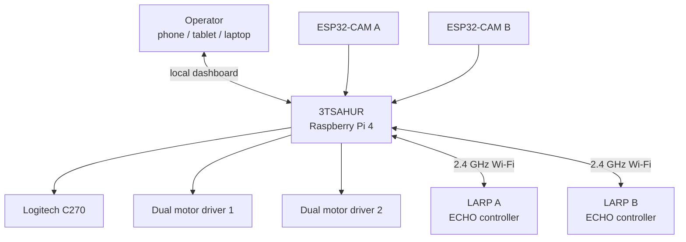
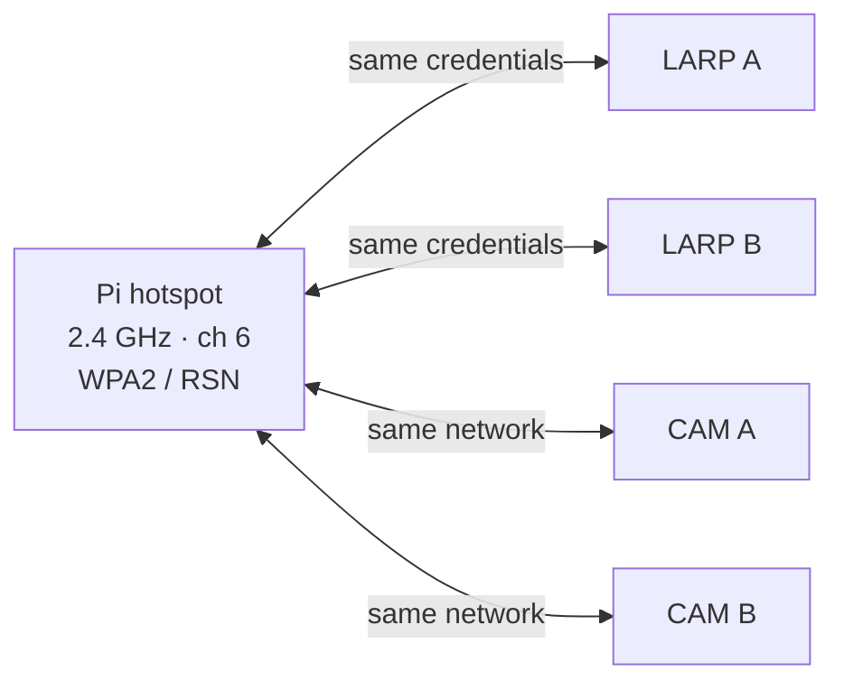
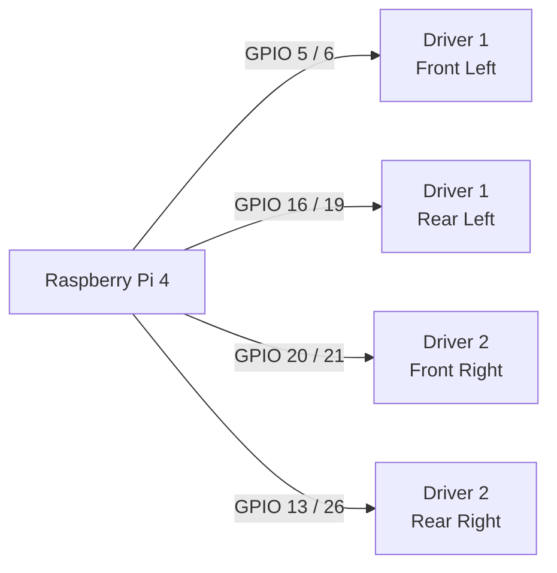
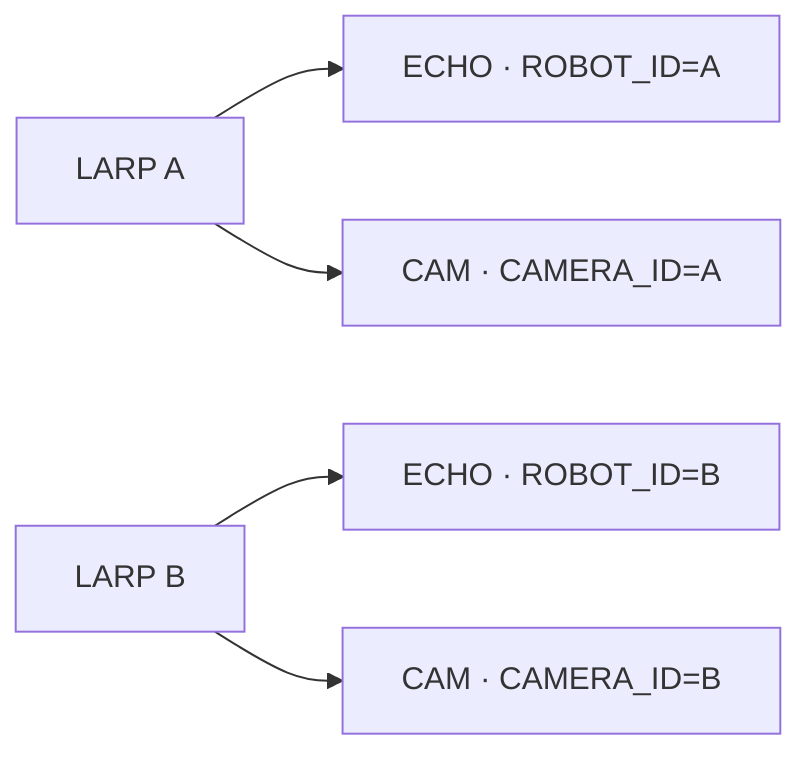
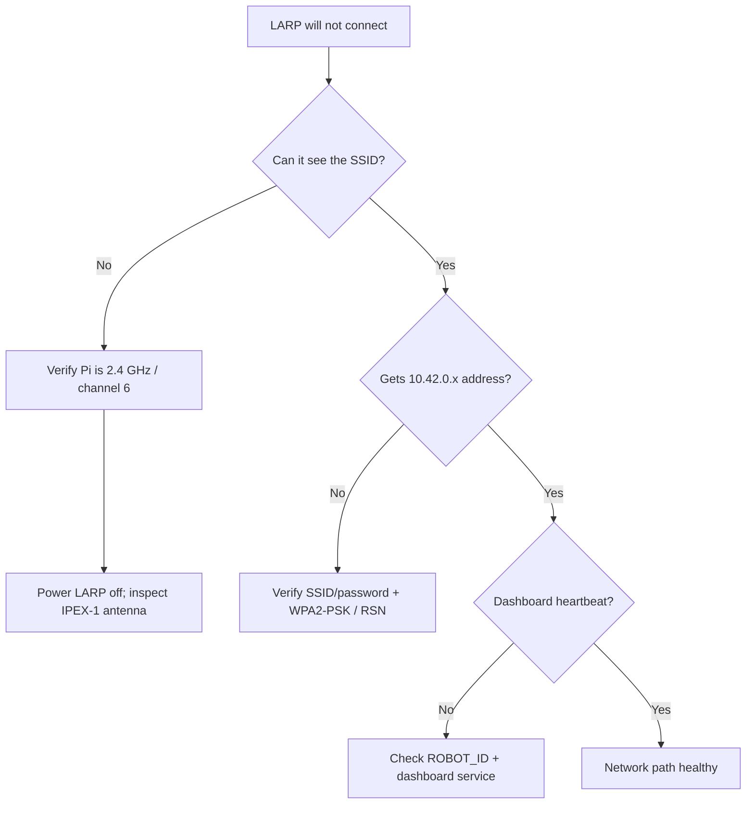
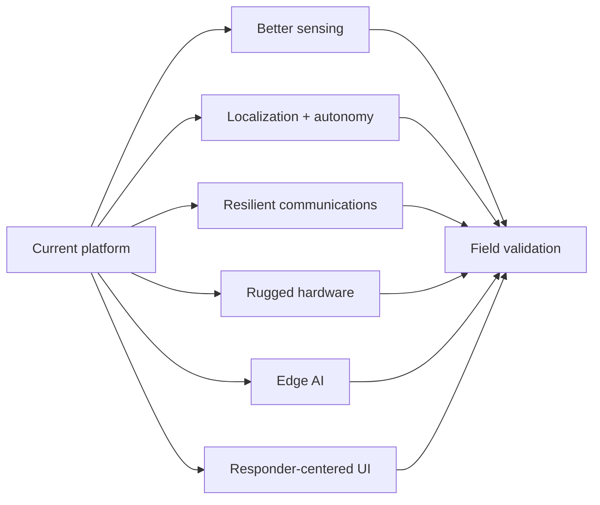

# 3TSAHUR + LARP Reconnaissance Swarm

> A local-first multi-robot reconnaissance platform designed to help first responders gather situational awareness before personnel enter uncertain or hazardous areas.

## Robot names and mission

**3TSAHUR** — **Terrain Tandem Transport Semi-Autonomous Hub Unit for Reconnaissance** — is the large Raspberry Pi 4 mecanum-drive robot and central control hub. Its role is to carry the main compute, networking, camera, and coordination workload while serving as a stable mobile base for reconnaissance.

**LARP** — **Lightweight Autonomous Reconnaissance Platform** — is the project name for each small Zippy/ECHO differential-drive scout. **LARP A** and **LARP B** are intended as lightweight forward scouts that extend the operator's view into areas that may be obstructed, difficult to access, or unsafe for responders to immediately enter.

Together, **3TSAHUR + the LARPs** form a distributed first-responder reconnaissance system. Human operators remain in control; autonomy and sensing are intended to improve situational awareness rather than replace responder judgment.

> [!NOTE]
> `Zippy` and `ECHO` describe the underlying small-robot hardware platform/controller. The project names are **LARP A** and **LARP B**. The existing SSID `3TSahur-Swarm` is retained for deployment compatibility even though the project/display name is **3TSAHUR**.

## Start here


## Current system architecture



Current design priorities are reliable manual control, independent robot/camera failure isolation, a local browser UI, a control watchdog, optional vision, and a simple network that can operate without internet access after setup.

## Critical network requirement

> [!IMPORTANT]
> **Use a dedicated 2.4 GHz robot network.** The Raspberry Pi hotspot and the LARP ECHO/ESP32-CAM clients must use the same **2.4 GHz** network. Do not deploy this configuration as 5 GHz-only or rely on dual-band/band-steering behavior.

| Setting | Project configuration |
| --- | --- |
| SSID | `3TSahur-Swarm` |
| Band | **2.4 GHz only** |
| Channel | **6** |
| Security | **WPA2-Personal / WPA2-PSK** |
| Protocol | **RSN** |
| Pi address | `10.42.0.1` |



## Raspberry Pi installation

Production installs use `main`:

```bash
curl -fsSL https://raw.githubusercontent.com/william-thompsonthe1st/STEM-Research-Academy/main/installer/curl-install.sh | bash
```

Or:

```bash
git clone https://github.com/william-thompsonthe1st/STEM-Research-Academy.git
cd STEM-Research-Academy
git checkout main
bash installer/install.sh
```

After reboot, join `3TSahur-Swarm` and open `http://10.42.0.1` or `http://3tsahur.local` when mDNS is available. The generated hotspot password is stored in `/etc/stem-research-academy/config.env`; copy the same SSID/password into both LARP ECHO sketches and both ESP32-CAM sketches, and never commit the password.

## 3TSAHUR pinout

The code uses **BCM GPIO numbering**.



| Wheel | Driver inputs | BCM GPIO | Physical pins |
| --- | --- | --- | --- |
| Front left | Driver 1 IN1/IN2 | `5 / 6` | `29 / 31` |
| Rear left | Driver 1 IN3/IN4 | `16 / 19` | `36 / 35` |
| Front right | Driver 2 IN1/IN2 | `20 / 21` | `38 / 40` |
| Rear right | Driver 2 IN3/IN4 | `13 / 26` | `33 / 37` |

```text
Raspberry Pi 4 relevant header pins

29 GPIO5   ●  ● GND    30
31 GPIO6   ●  ● GPIO12 32
33 GPIO13  ●  ● GND    34
35 GPIO19  ●  ● GPIO16 36
37 GPIO26  ●  ● GPIO20 38
39 GND     ●  ● GPIO21 40
```

> [!WARNING]
> Use a correctly rated fused external motor supply. Never power the drive motors from the Pi 5 V rail. Maintain the intended common logic ground and perform the first direction test with the wheels raised.

See [docs/WIRING.md](docs/WIRING.md) and [docs/SETUP.md](docs/SETUP.md).

## LARP firmware and camera pairing

| Device | Firmware | Arduino profile | Identity |
| --- | --- | --- | --- |
| LARP ECHO controller | `firmware/larp-scout/larp-scout.ino` | ESP32S3 Dev Module | `ROBOT_ID=A/B` |
| Inland ESP32-CAM | `firmware/larp-esp32-cam/larp-esp32-cam.ino` | AI Thinker ESP32-CAM | `CAMERA_ID=A/B` |



The ECHO controller and ESP32-CAM are separate Wi-Fi clients; they do not require a GPIO connection to each other. Matching IDs pair the drive controller and camera in the dashboard.

## Wi-Fi, WPA2, and IPEX-1 troubleshooting

The **IPEX-1 antenna connector and WPA2 are separate layers**. WPA2 handles authentication/encryption; IPEX-1 is part of the radio antenna path. Correct credentials cannot compensate for a loose antenna, and reseating an antenna cannot correct the wrong WPA profile.



With the LARP powered off, inspect the IPEX-1 connection if the robot has unusually poor range, cannot reliably see the hotspot, or disconnects much more often than the other LARP. See [docs/TROUBLESHOOTING.md](docs/TROUBLESHOOTING.md) for the full diagnostic procedure.

## First-boot verification

```bash
sudo systemctl status stem-robot-hotspot --no-pager
sudo systemctl status stem-robot-dashboard --no-pager
curl --fail http://127.0.0.1:8080/healthz
nmcli -f 802-11-wireless.ssid,802-11-wireless.band,802-11-wireless.channel connection show stem-robot-hotspot
nmcli -f 802-11-wireless-security.key-mgmt,802-11-wireless-security.proto connection show stem-robot-hotspot
```

Verify hotspot → dashboard → C270 → LARP A → LARP B → emergency stop/network-loss stopping, in that order. Power and test one scout at a time before testing the full system.

## Future research and recommended improvements

The current platform is a strong teleoperated research baseline, but a first-responder reconnaissance system can be improved substantially. Future work should be measured against three questions: **Does it increase useful situational awareness? Does it make the system more reliable in degraded environments? Does it reduce operator workload without removing meaningful human control?**



### 1. Localization, mapping, and navigation

The current system is primarily operator-driven. A major research direction is adding wheel encoders and an IMU to 3TSAHUR and the LARPs, then evaluating odometry, visual-inertial odometry, or SLAM. LiDAR, depth cameras, or stereo vision could provide obstacle geometry and improve navigation where GPS is unavailable. Useful semi-autonomous functions would include assisted obstacle avoidance, return-to-home, waypoint driving, automatic stopping near hazards, and maintaining a safe communications link. These should remain overrideable by the operator.

### 2. Sensor fusion for first-responder reconnaissance

RGB video alone cannot characterize many hazards. Future sensor packages could investigate thermal imaging, depth sensing, ambient temperature/humidity, smoke/particulate sensing, carbon monoxide or other appropriately calibrated gas sensing, microphone/audio, light level, and structural/vibration measurements. Research should focus on fusing these sources into a simple operator display rather than overwhelming the user with raw telemetry. Any safety-critical environmental sensor would require proper calibration and should not be treated as certified life-safety equipment without appropriate validation.

### 3. CSI human-presence research

Wi-Fi Channel State Information is particularly interesting because it could complement cameras when visibility is poor or a person is partially occluded. Future work should collect controlled CSI datasets across different rooms, wall materials, robot orientations, distances, antenna positions, moving machinery, and numbers of occupants. Performance should be reported with false-positive/false-negative rates rather than only demonstration accuracy. Combining CSI with thermal/RGB/depth observations could be compared against CSI alone.

### 4. Communications resilience

The fixed 2.4 GHz hotspot is appropriate for the current ECHO/ESP32 deployment, but it is also a single communications dependency. Future versions could study a dedicated second radio on 3TSAHUR, external antennas, better antenna placement, automatic channel selection, mesh or relay nodes, store-and-forward telemetry, and a separate high-bandwidth backhaul where compatible hardware is available. The control channel should remain isolated from bandwidth-heavy video/AI traffic. Research should measure latency, packet loss, range, recovery time, and emergency-stop behavior under congestion and partial link failure.

### 5. Closed-loop drivetrain control

The present GPIO motor interface is simple and effective for prototyping, but encoders and current sensing would enable closed-loop wheel-speed control, more repeatable mecanum motion, stall detection, traction analysis, and better odometry. Future motor electronics could add hardware PWM, per-channel current measurement, thermal monitoring, and protection appropriate to the selected motors and battery system.

### 6. Power and endurance

Add battery voltage/current telemetry and log energy use by drivetrain, cameras, Wi-Fi, and AI workloads. This would make it possible to estimate mission time instead of relying on a simple battery percentage guess. Future research could compare battery chemistry/capacity, regulated power architecture, swappable packs, low-voltage shutdown behavior, and whether the LARPs can return to 3TSAHUR or a charging point before reaching a critical battery level.

### 7. Edge AI and perception

YOLO11 Nano provides a useful starting point for local perception. Future experiments could compare NCNN, TensorFlow Lite, ONNX/runtime alternatives, or dedicated accelerators while measuring inference latency, power consumption, CPU temperature, video latency, and control responsiveness. Detection should expand only when it supports a clear responder task—for example person detection, doorway/egress identification, hazard-marker recognition, or change detection. AI output should be presented as decision support with confidence/uncertainty, not as guaranteed truth.

### 8. Multi-robot coordination

With two LARPs and a central hub, the project can study coordinated reconnaissance. Examples include assigning scouts to different rooms, automatically maintaining radio coverage, sharing a common map, avoiding duplicate exploration, and handing off camera/sensor observations between robots. A useful research question is how much coordination can be automated before the interface becomes harder for one responder to supervise.

### 9. Mechanical ruggedization

Future chassis work should evaluate impact protection, cable strain relief, connector retention, antenna protection, wheel guards, camera protection, dust/water resistance, thermal management, and serviceability. The LARP IPEX-1 connection deserves particular attention because a mechanically protected antenna installation could reduce field failures. 3TSAHUR could also be evaluated for payload mounting, sensor mast/gimbal designs, ramps, and modular sensor bays.

### 10. Human factors and dashboard design

A technically capable robot can still fail operationally if its interface creates too much cognitive load. Conduct timed user studies with representative tasks: select a robot, identify a target, recover from a lost camera, recognize a low battery, issue an emergency stop, and determine which robot produced an observation. Compare keyboard, touchscreen, and gamepad control; test large status indicators, map views, alert prioritization, and accessibility in gloves/low-light conditions.

### 11. Reliability, cybersecurity, and failure testing

Future research should intentionally test failure modes: camera loss, scout reboot, Pi service restart, corrupted/late commands, Wi-Fi congestion, low battery, sensor failure, stalled motors, and loss of the operator browser. Add structured logging and mission replay so failures can be reproduced. Security work could include device authentication beyond a shared WLAN password, credential rotation, signed firmware/software releases, least-privilege services, and protection of recorded mission data.

### 12. Field-validation methodology

The most important next step is repeatable testing rather than simply adding features. Build a test matrix covering open rooms, hallways, corners, multiple floors, obstacles, low light, smoke-like visual obstruction using safe test methods, RF interference, and increasing robot-to-hub distance. Record command latency, video latency, packet loss, reconnection time, battery endurance, detection accuracy, operator task time, and failure-recovery success. Comparing each hardware/software change against the same baseline will show whether it actually improves the reconnaissance mission.

### Suggested research priority

| Priority | Research area | Why it matters |
| --- | --- | --- |
| 1 | Reliability + field test instrumentation | Establishes trustworthy baseline data |
| 2 | Encoders/IMU + battery telemetry | Improves control, localization, and mission awareness |
| 3 | Communications resilience | Directly affects control/video availability |
| 4 | Thermal/depth/environmental sensing | Adds information responders cannot get from RGB alone |
| 5 | CSI validation + sensor fusion | Tests the project's distinctive non-camera sensing concept |
| 6 | SLAM + assisted navigation | Reduces workload in complex environments |
| 7 | Edge-AI optimization | Adds perception without sacrificing control latency |
| 8 | Multi-robot autonomy | Builds on a reliable, measured lower-level system |

The recommended research strategy is **instrument first, establish a baseline, change one subsystem at a time, and compare measured results**. That approach makes the project useful not only as a robot demonstration but as a reproducible research platform.

## Optional vision

After drive, stop, hotspot, and camera behavior are stable:

```bash
cd ~/STEMResearchAcademy
bash installer/install-vision.sh
```

Optional vision is isolated from the core control path and should pause during active robot motion so perception work does not compromise command responsiveness. See [docs/VISION_SETUP.md](docs/VISION_SETUP.md).

## Documentation

- [Setup guide](docs/SETUP.md) — build, network setup, and first-drive procedure.
- [Troubleshooting guide](docs/TROUBLESHOOTING.md) — 2.4 GHz, WPA2/RSN, IPEX-1, power, and heartbeat diagnosis.
- [Wiring reference](docs/WIRING.md) — exact 3TSAHUR GPIO mapping.
- [ESP32-CAM setup](docs/ESP32_CAM_SETUP.md) — AI Thinker upload wiring and camera pin map.
- [LARP camera/controller integration](docs/LARP_CAMERA_CONTROLLER_INTEGRATION.md) — identity pairing and field testing.
- [Latency tuning](docs/LATENCY_TUNING.md) — control-priority behavior.
- [Vision setup](docs/VISION_SETUP.md) — optional YOLO11 Nano / NCNN installation.
- [Robot naming](docs/ROBOT_NAMES.md) — canonical project names and acronym expansions.

## Safety

Test every direction with the wheels clear of the floor first. Disconnect motor power while wiring or flashing electronics. Use a fused external motor supply and an accessible physical motor-power switch. Verify the intended common logic ground. Test emergency stop, browser disconnect, and network-loss stopping before operating near people or property. Power a LARP off before inspecting or reseating its IPEX-1 antenna connector.

---

Built as a research platform for distributed robotic reconnaissance and first-responder situational awareness.