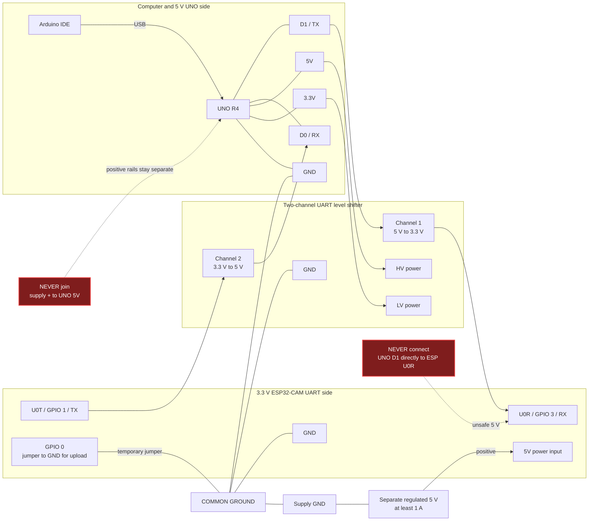

# Inland ESP32-CAM setup for LARP Scouts

Each LARP Scout uses two independent boards: its ECHO drive controller and an
Inland ESP32-CAM video node. The camera does not connect to, or control, the
ECHO motors. It mounts on the scout, receives stable power, joins the
3TSahur-Swarm Wi-Fi network, and streams video directly to the operator's
browser.

## Before connecting power

- Confirm that the Inland board is compatible with the common AI Thinker
  ESP32-CAM layout. Do not use this sketch on a different pinout without
  changing the pin definitions.
- Use a stable, regulated 5 V supply capable of at least 1 A for the camera.
  Do not power it from a Raspberry Pi GPIO pin or the ECHO controller's logic
  rail.
- Keep the camera and ECHO drive-controller grounds common only if they share
  a power system. Motor power must remain separately fused and switched.

## Camera board pin map used by the firmware

The following assignments are already encoded in
`firmware/larp-esp32-cam/larp_esp32_cam.ino`.

| Camera signal | ESP32-CAM GPIO |
| --- | ---: |
| PWDN | 32 |
| RESET | -1 (not connected) |
| XCLK | 0 |
| SIOD (SCCB data) | 26 |
| SIOC (SCCB clock) | 27 |
| D0 through D7 | 5, 18, 19, 21, 36, 39, 34, 35 |
| VSYNC / HREF / PCLK | 25 / 23 / 22 |

These are camera-module signals, not extra wires to the Pi. The Pi receives
the resulting MJPEG stream over Wi-Fi.

## Flash each camera

1. Install Arduino IDE and the **esp32 by Espressif Systems** board package.
2. Connect a USB-to-serial adapter for flashing:

   | USB-to-serial adapter | ESP32-CAM |
   | --- | --- |
   | 5 V | 5 V |
   | GND | GND |
   | TX | U0R / GPIO 3 |
   | RX | U0T / GPIO 1 |
   | GND, only while uploading | GPIO 0 |

3. Select the board profile that matches the printed module. For an
   AI Thinker-compatible camera, select **AI Thinker ESP32-CAM** and the
   correct serial port. Use a low upload speed if uploads are unreliable.
4. Open `firmware/larp-esp32-cam/larp_esp32_cam.ino`.
5. For Scout A, set `CAMERA_ID` to `'A'`; for Scout B, set it to `'B'`.
   Set `WIFI_SSID` and `WIFI_PASSWORD` to exactly match the Pi hotspot.
6. Upload. If the adapter cannot begin upload, hold the board's reset button
   briefly while the IDE starts connecting.
7. Remove the GPIO 0-to-ground upload jumper, reset the board, and reconnect
   only normal operating power. Leaving GPIO 0 grounded prevents normal boot.

### Flash through an Arduino UNO R4

Use this fallback procedure for an UNO R4 Minima or UNO R4 WiFi. A dedicated
3.3 V USB-to-UART adapter is still the easier option.

#### Parts and safety check

- UNO R4 and a data-capable USB cable
- two-channel, UART-capable **5 V-to-3.3 V logic-level shifter**
- separate regulated **5 V camera supply rated for at least 1 A**
- jumper wires

The UNO R4's serial pins use 5 V logic; the ESP32 serial port uses 3.3 V logic.
Never connect UNO D1/TX directly to ESP U0R/GPIO 3. A resistor divider translates
only one direction and is not the supported solution here. The level shifter
must translate **both** TX/RX paths. Never power the camera from UNO 3.3V.

#### Pin roles at a glance

| Board | Pin | Role during flashing | Connect to |
| --- | --- | --- | --- |
| UNO R4 | D1 / TX | Sends computer upload data at 5 V logic | Shifter 5 V-side input, channel 1 |
| Level shifter | Channel 1 | Converts UNO transmit from 5 V to 3.3 V | ESP U0R / GPIO 3 / RX |
| ESP32-CAM | U0T / GPIO 1 / TX | Sends bootloader replies at 3.3 V logic | Shifter 3.3 V-side input, channel 2 |
| Level shifter | Channel 2 | Converts ESP transmit from 3.3 V to 5 V | UNO D0 / RX |
| ESP32-CAM | GPIO 0 | Selects ROM upload mode when low during reset | GND temporarily; remove after upload |
| Separate supply | +5 V, at least 1 A | Powers the camera | ESP32-CAM 5V only |
| Every device | GND | Shared voltage reference | One common ground |



#### Step 1: turn the UNO into a serial relay

Keep all wires off UNO D0/D1. Connect the UNO to the computer. In Arduino IDE,
select the exact UNO R4 model and its USB serial port, then upload:

   ```cpp
   void setup() {
     Serial.begin(115200);
     Serial1.begin(115200);  // UNO R4 D0/RX, D1/TX
   }

   void loop() {
     while (Serial.available()) Serial1.write(Serial.read());
     while (Serial1.available()) Serial.write(Serial1.read());
   }
   ```

**Checkpoint:** the UNO sketch uploads successfully. Leave it running. Do not
hold the UNO in reset, because the relay sketch must run during camera upload.

#### Step 2: wire with every power source disconnected

Disconnect UNO USB and camera power first. Wire the level shifter according to
its own HV/LV and channel labels:

```text
COMPUTER --USB--> UNO R4

UNO 5V  ------> shifter HV power       UNO GND ---------+
UNO 3.3V -----> shifter LV power       shifter GND -----+-- common ground
UNO D1/TX ----> [5V -> 3.3V channel] --> ESP U0R/GPIO 3  |
UNO D0/RX <---- [5V <- 3.3V channel] <-- ESP U0T/GPIO 1  |
                                                           |
separate regulated 5V >=1A + ---------------> ESP 5V     |
separate supply GND --------------------------------------+
ESP GPIO 0 ------------------------------------> GND (upload only)
```

| Check before power | Correct result |
| --- | --- |
| Host transmit path | UNO D1/TX reaches ESP U0R/RX through a 5 V-to-3.3 V channel |
| Camera transmit path | ESP U0T/TX reaches UNO D0/RX through a 3.3 V-to-5 V channel |
| Grounds | UNO, shifter, camera, and separate supply grounds are connected |
| Positive camera power | Separate supply positive goes only to ESP 5V, not UNO 5V |
| Upload strap | ESP GPIO 0 is connected to GND |

#### Step 3: put the camera in its bootloader

Reconnect UNO USB and camera power. Keep ESP GPIO 0 grounded. Press the camera
**Reset** button once. If there is no Reset button, briefly remove and restore
camera power. GPIO 0 must be low at reset for the ROM upload mode.

#### Step 4: upload the camera firmware

1. Open `firmware/larp-esp32-cam/larp_esp32_cam.ino`.
2. Set `CAMERA_ID`, `WIFI_SSID`, and `WIFI_PASSWORD`.
3. Change the IDE board to **AI Thinker ESP32-CAM**.
4. Keep the **same UNO R4 USB serial port** selected.
5. Set upload speed to **115200** and close Serial Monitor.
6. Select **Upload**.

**Checkpoint:** the upload log reports success. If it stops at `Connecting...`,
press camera Reset once while GPIO 0 remains grounded. Then recheck that TX and
RX are crossed through the correct level-shifter directions.

#### Step 5: boot and verify the camera

1. Disconnect camera power.
2. Remove the ESP GPIO 0-to-GND jumper.
3. Restore camera power and press camera Reset if necessary.
4. Open Serial Monitor at **115200** and look for the camera hostname/IP.

#### Complete upload sequence

```mermaid
sequenceDiagram
    participant IDE as Arduino IDE
    participant UNO as UNO R4
    participant SHIFT as Level shifter
    participant CAM as ESP32-CAM

    Note over UNO,CAM: D0/D1 disconnected; camera power off
    IDE->>UNO: Select UNO R4 + UNO port
    IDE->>UNO: Upload Serial-to-Serial1 bridge
    Note over UNO,CAM: Disconnect USB and camera power; wire both UART channels and common ground
    Note over CAM: Connect GPIO 0 to GND
    IDE->>UNO: Reconnect UNO USB
    Note over CAM: Apply separate 5 V power and reset
    Note over CAM: ROM bootloader is now waiting
    IDE->>IDE: Select AI Thinker ESP32-CAM<br/>keep UNO port; close Serial Monitor; 115200
    IDE->>UNO: Send camera firmware
    UNO->>SHIFT: D1/TX at 5 V
    SHIFT->>CAM: U0R/RX at safe 3.3 V
    CAM->>SHIFT: U0T/TX replies at 3.3 V
    SHIFT->>UNO: D0/RX at safe 5 V
    Note over CAM: Upload succeeds; remove camera power
    Note over CAM: Remove GPIO 0 jumper, restore power, normal boot
    CAM-->>IDE: Boot/network log through bridge at 115200
```

The UNO relay cannot automatically control camera Reset/GPIO 0. If upload still
fails, use shorter wires, confirm the shifter supports UART at 115200, or use a
dedicated 3.3 V USB-to-UART adapter.

Primary references: [Arduino UNO R4 Minima](https://docs.arduino.cc/hardware/uno-r4-minima),
[Arduino UNO R4 WiFi](https://docs.arduino.cc/hardware/uno-r4-wifi/), [RA4M1
electrical characteristics](https://docs.arduino.cc/resources/datasheets/ra4m1-datasheet.pdf),
[Espressif 3.3 V serial connection](https://docs.espressif.com/projects/esptool/en/latest/esp32/esptool/serial-connection.html),
and [ESP32 boot-mode selection](https://docs.espressif.com/projects/esptool/en/latest/esp32/advanced-topics/boot-mode-selection.html).

The firmware waits for Wi-Fi without blocking, retries every five seconds, and
starts its HTTP stream after it joins the hotspot. It serves at most 10 frames
per second so drive commands keep priority on the shared network.

## Verify the feed

1. Power 3TSahur and wait for the `3TSahur-Swarm` hotspot.
2. Power the matching camera and open its serial monitor at 115200 baud. A
   successful connection prints the camera hostname and stream address.
3. From a device on the hotspot, open:

   ```text
   http://larp-a-cam.local/status
   http://larp-a-cam.local/stream
   ```

   Replace `a` with `b` for Scout B.
4. Open the matching LARP tab in the 3TSahur dashboard. The selected tab opens
   that feed automatically; inactive tabs intentionally close their streams to
   preserve Wi-Fi bandwidth for robot controls.

If `.local` names do not resolve, use the IP address printed by the serial
monitor. On the Pi, set that stream URL in
`/etc/stem-research-academy/config.env`, then restart the dashboard:

```bash
sudoedit /etc/stem-research-academy/config.env
# LARP_A_CAMERA_URL=http://10.42.0.31/stream
# LARP_B_CAMERA_URL=http://10.42.0.32/stream
sudo systemctl restart stem-robot-dashboard
```

## Troubleshooting

| Symptom | Check |
| --- | --- |
| No serial boot or repeated brownout | Use a regulated 5 V supply and short power leads; camera startup can draw more current than a USB adapter provides. |
| `Camera initialization failed` | Confirm the Inland board uses the AI Thinker-compatible pin map and that the ribbon cable is seated. |
| Camera joins Wi-Fi but no dashboard image | Open `/status` and `/stream` directly, then verify `LARP_A_CAMERA_URL` or `LARP_B_CAMERA_URL`. |
| Camera cannot join the hotspot | Use the 2.4 GHz `3TSahur-Swarm` network, verify the password, and keep it at least eight characters. |
| Controls become slow while video runs | Verify only one dashboard tab is active, keep the 10 FPS firmware setting, and move the cameras closer to the Pi hotspot. |

## CSI presence display

The camera is the verification tool. The separate ECHO controller measures
Wi-Fi Channel State Information (CSI) and reports a disturbance level through
its `/status` endpoint. The dashboard presents that as a **possible presence**
indicator and a 0-100% signal-variance meter. It cannot identify a person,
measure distance, or be used as the sole safety sensor. Confirm any indication
with the LARP camera before acting.
