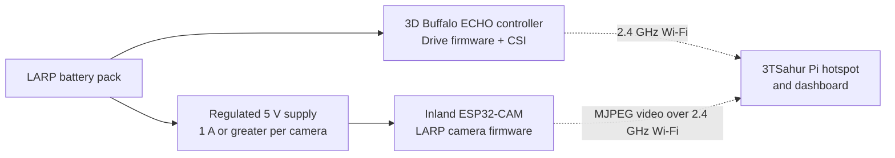

# LARP camera and controller integration guide

This guide connects one **LARP Scout** to its two separate ESP32-based
systems:

1. the 3D Buffalo ECHO controller, which drives the two motors and reports
   CSI activity; and
2. the Inland ESP32-CAM, which provides the scout's Wi-Fi video feed.

They are companion devices, not one combined circuit. The camera must never
be wired to motor outputs or treated as a motor-controller accessory.

## Required setup for each scout

| Item | Requirement | Why it matters |
| --- | --- | --- |
| ECHO controller | One working controller flashed with `larp_scout_controller.ino` | Drives the LARP and reports CSI; retain its existing motor wiring. |
| Inland ESP32-CAM | One camera board and correctly seated camera ribbon | Runs `larp_esp32_cam.ino` and serves the video feed. |
| Camera power | Stable **regulated 5 V**, designed for at least **1 A** per camera | Camera startup is sensitive to voltage dips and motor noise. |
| Wi-Fi | Pi hotspot `3TSahur-Swarm`, 2.4 GHz | Both boards communicate with the dashboard over this network. |
| Flashing method | Built-in USB, or a safe 3.3 V USB-to-UART connection | Most ESP32-CAM boards do not have a USB port. |
| Identity | Matching `ROBOT_ID` and `CAMERA_ID`: `A`/`A` or `B`/`B` | Keeps drive, CSI, and video labels matched in the dashboard. |

## Power and mounting: do this before networking

### Safe power layout

- Continue to power the ECHO controller and motors exactly as the 3D Buffalo
  system was designed. Do not change its motor wiring for the camera.
- Power the ESP32-CAM through its **`5V`** and **`GND`** pins from a regulated
  5 V rail. Do **not** connect the raw LARP battery pack to the camera's `5V`
  or `3.3V` pin.
- If one battery system supplies both boards, use a proper 5 V regulator for
  the camera and make the supply grounds common. Keep motor-current wiring
  away from the camera's short power leads.
- If a separate USB power bank powers the camera, do not add a data wire to
  the ECHO board. The camera still joins the same Wi-Fi network.
- Mount the antenna/camera where metal, battery cells, and motor leads do not
  obstruct the antenna. Secure the ribbon cable and provide strain relief.

### Recommended reliability additions

These are recommendations, not firmware requirements:

- Use a fused, switched 5 V camera branch.
- Keep camera power leads short and use a supply with headroom rather than the
  ECHO controller's logic rail.
- Add a bulk capacitor near the camera only if you already have the correct
  parts and polarity knowledge; it can reduce brownouts caused by motor noise.
- Bench-test each camera for ten minutes before mounting it on the LARP.

## Flash the Inland ESP32-CAM

First inspect the camera board. If it has a data-capable USB connector and a
serial port appears when it is connected to your computer, upload directly.
Otherwise it needs a USB-to-UART bridge.

### Can an Arduino board be the bridge?

Yes, **only when its USB-to-UART output is 3.3 V safe for the ESP32-CAM**. It
is being used as a serial bridge, not as an Arduino programmer.

| Available board | Recommendation |
| --- | --- |
| ESP32-CAM with built-in USB | Use its USB port directly. |
| USB-to-UART adapter with 3.3 V logic | Preferred; use the wiring below. |
| Arduino with a known 3.3 V UART interface | Usable as a bridge if its documented USB/UART path can be isolated. |
| Arduino UNO R4 Minima/WiFi | Usable only with a serial-relay sketch and a two-channel 5 V-to-3.3 V UART level shifter; see [ESP32-CAM setup](ESP32_CAM_SETUP.md#flash-through-an-arduino-uno-r4). Do not hold the R4 in reset. |
| Other 5 V Uno or 5 V Nano with only jumper wires | **Do not connect its TX directly to ESP32-CAM `U0R`.** Use a properly designed bidirectional level-shifting interface or a 3.3 V adapter instead. |
| 3D Buffalo ECHO controller | Do not repurpose it as a programmer without its exact board schematic and a documented USB-UART interface. It must remain the LARP drive controller. |

For any bridge, the terminal's actual transmit line must reach ESP32-CAM
`U0R`/GPIO 3 and its receive line must reach `U0T`/GPIO 1. Do not rely only on
an Arduino header label without checking whether that board's USB serial chip
or microcontroller owns the pin.

### Upload wiring and sequence

| Bridge or regulated supply | ESP32-CAM |
| --- | --- |
| Regulated 5 V | `5V` |
| GND | `GND` |
| 3.3 V UART TX | `U0R` / GPIO 3 |
| UART RX | `U0T` / GPIO 1 |
| GND **only while uploading** | `GPIO0` |

1. In Arduino IDE Preferences, add the Espressif boards URL:
   `https://espressif.github.io/arduino-esp32/package_esp32_index.json`.
2. In Boards Manager, install **esp32 by Espressif Systems**.
3. Confirm the camera is AI Thinker-compatible before selecting **AI Thinker
   ESP32-CAM**. Do not use this project sketch with an unknown camera pin map.
4. Open `firmware/larp-esp32-cam/larp_esp32_cam.ino`.
5. Set `CAMERA_ID = 'A'` for the first camera or `CAMERA_ID = 'B'` for the
   second. Set `WIFI_SSID` and `WIFI_PASSWORD` to the Pi hotspot values.
6. Connect `GPIO0` to GND, then reset or power-cycle the camera. Upload at a
   conservative speed such as 115200 baud if the first upload is unreliable.
7. When upload completes, disconnect `GPIO0` from GND, then reset/power-cycle
   again. Leaving GPIO0 low prevents normal boot.

See [ESP32-CAM setup](ESP32_CAM_SETUP.md) for the camera pin map and specific
browser troubleshooting.

## Pair the camera to its LARP controller

Flash the two firmware targets independently:

| LARP | ECHO controller firmware | Camera firmware | Expected stream |
| --- | --- | --- | --- |
| Scout A | `ROBOT_ID = 'A'` | `CAMERA_ID = 'A'` | `http://larp-a-cam.local/stream` |
| Scout B | `ROBOT_ID = 'B'` | `CAMERA_ID = 'B'` | `http://larp-b-cam.local/stream` |

Both sketches must contain the exact same `WIFI_SSID` and `WIFI_PASSWORD`.
There is intentionally no UART, I2C, SPI, or motor-control link between the
camera and ECHO controller after flashing. Their only runtime relationship is
their paired `A`/`B` identity and shared Wi-Fi network.

## First field test

1. Raise the LARP's wheels or remove motor power for the first test.
2. Start 3TSahur and wait for the `3TSahur-Swarm` hotspot.
3. Power the ECHO controller and confirm its LARP dashboard tab reports online
   status and CSI information.
4. Power the matching camera. At 115200 baud, its serial log should show it
   joining Wi-Fi and print its stream URL.
5. On a device connected to the hotspot, open the camera's `/status` endpoint,
   then its `/stream` endpoint.
6. Open that LARP's dashboard tab. Only the active tab opens a video stream;
   this is deliberate to keep motor-control latency low.
7. Test a brief drive command and then release the key. Verify the watchdog
   stops the LARP even if the camera is unplugged or the stream fails.

If `.local` discovery does not work, use the camera IP shown in the serial log
and configure `LARP_A_CAMERA_URL` or `LARP_B_CAMERA_URL` on the Pi. The
dashboard and motor control continue operating when camera, CSI, or vision
features are unavailable.

## Troubleshooting quick reference

| Symptom | Likely cause and corrective action |
| --- | --- |
| Camera reboots, browns out, or shows stripes | Improve the regulated 5 V supply, shorten power leads, and separate it from motor noise. |
| Upload will not connect | Confirm `GPIO0` was low during reset, common GND is present, and UART logic is 3.3 V. |
| `Camera initialization failed` | Confirm AI Thinker-compatible pinout and reseat the camera ribbon cable. |
| Video works directly but not in dashboard | Open `/status` and `/stream`, then set the appropriate `LARP_*_CAMERA_URL` to the camera IP on the Pi. |
| LARP drive works but CSI/video is unavailable | This is an expected degraded mode. Drive control and its watchdog remain independent. |
| Motor movement disrupts video | Check camera power isolation, antenna placement, and that only one dashboard camera tab is active. |

## Information to provide before changing hardware-specific firmware

Send a clear photo of both sides of the Inland ESP32-CAM and the exact Arduino
model before using an Arduino as a serial bridge. Send the ECHO controller
model/pinout before asking it to power or program the camera. That information
is required to verify voltage levels and avoid changing the retained LARP
motor architecture.
