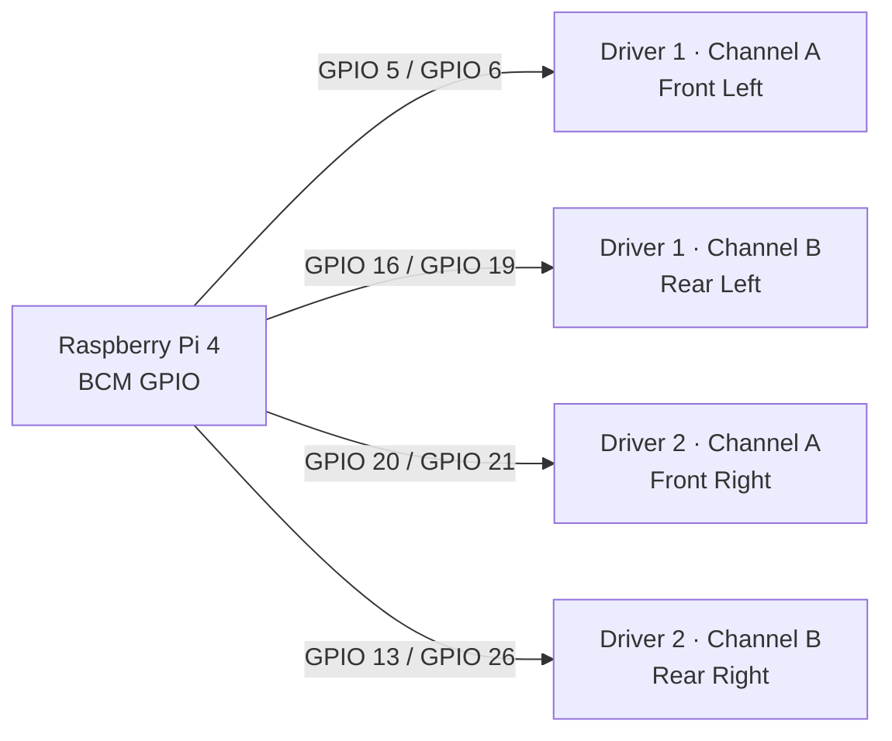

# 3TSahur/LARP setup guide

## 1. Prepare hardware safely

Keep the 3TSahur wheels raised. Connect a physical motor-power switch and fuse.
Connect a shared ground between the Pi, both drivers, and motor supply. Do not
power drive motors from the Pi's 5 V rail.

Wire the Pi exactly as [WIRING.md](WIRING.md) specifies and attach the Logitech
C270. Do not connect the Inland camera or ECHO boards until their correct board
profiles are selected in Arduino IDE.

### 3TSahur Raspberry Pi pinout visual

All GPIO numbers below are **BCM numbers**, not physical header-pin numbers.



```text
Raspberry Pi 4 (BCM)             Dual H-bridge drivers
────────────────────             ─────────────────────
GPIO 5  / GPIO 6  ─────────────► Driver 1 Channel A ──► Front Left
GPIO 16 / GPIO 19 ─────────────► Driver 1 Channel B ──► Rear Left
GPIO 20 / GPIO 21 ─────────────► Driver 2 Channel A ──► Front Right
GPIO 13 / GPIO 26 ─────────────► Driver 2 Channel B ──► Rear Right

Pi GND ─────────────────────────► Driver logic/common ground
External motor supply ─────────► Driver motor-power input (not Pi 5 V)
```

Do not reuse one GPIO for multiple motor-driver inputs. See [WIRING.md](WIRING.md)
for the full wiring reference.

## 2. Flash the LARP devices

1. Open `firmware/larp-scout/larp-scout.ino`; set `ROBOT_ID` to A
   and flash LARP Scout A. Change it to B and flash LARP Scout B.
2. Open `firmware/larp-esp32-cam/larp-esp32-cam.ino`; set `CAMERA_ID` to A and
   flash the camera on Scout A. Repeat with B for Scout B.
3. Copy `HOTSPOT_PASSWORD` from the Pi's
   `/etc/stem-research-academy/config.env` into `WIFI_PASSWORD` in all four
   sketches before deployment. New installations generate this password
   automatically; never add it to `installer/install.sh` or source control.

For this deployment, use the dedicated **2.4 GHz** `3TSahur-Swarm` robot
network. Do not configure it as 5 GHz-only. Keep the Pi hotspot fixed to the
project's validated 2.4 GHz configuration rather than using band steering.

For WPA2 and IPEX-1 antenna troubleshooting, see
[TROUBLESHOOTING.md](TROUBLESHOOTING.md).

## 3. Install on the Raspberry Pi

Use a current Raspberry Pi OS image with internet access. Clone this repository
and run the installer as the normal Pi user:

If `sudo` first reports `unable to resolve host`, repair the local hostname and
`/etc/hosts` mismatch with the paste-ready block in [README: Fix a Pi hostname
warning before installing](../README.md#fix-a-pi-hostname-warning-before-installing),
then return here. That warning is unrelated to Git/GitHub.

```bash
git clone https://github.com/william-thompsonthe1st/STEM-Research-Academy.git
cd STEM-Research-Academy
bash installer/install.sh
```

The installer configures the `3TSahur-Swarm` 2.4 GHz hotspot, sets the host to
`3tsahur`, starts the dashboard after boot, and reboots. Connect an operator
device to the hotspot and browse to `http://10.42.0.1`.

## 4. Configure camera addresses

The default mDNS URLs are `http://larp-a-cam.local/stream` and
`http://larp-b-cam.local/stream`. If your network does not resolve mDNS, edit
`/etc/stem-research-academy/config.env` and set `LARP_A_CAMERA_URL` and
`LARP_B_CAMERA_URL` to each camera's DHCP address, then restart:

```bash
sudo systemctl restart stem-robot-dashboard
```

For the complete Inland board flash wiring, camera pin map, stream checks, and
troubleshooting procedure, read [ESP32_CAM_SETUP.md](ESP32_CAM_SETUP.md).

## 5. Validate without driving

Open the dashboard and confirm all three camera panels and both LARP heartbeat
indicators. With wheels raised and low speed selected, test forward/reverse,
strafe, and rotation. Release each key/button and verify the motors stop. Only
perform a ground test after every direction is correct.
