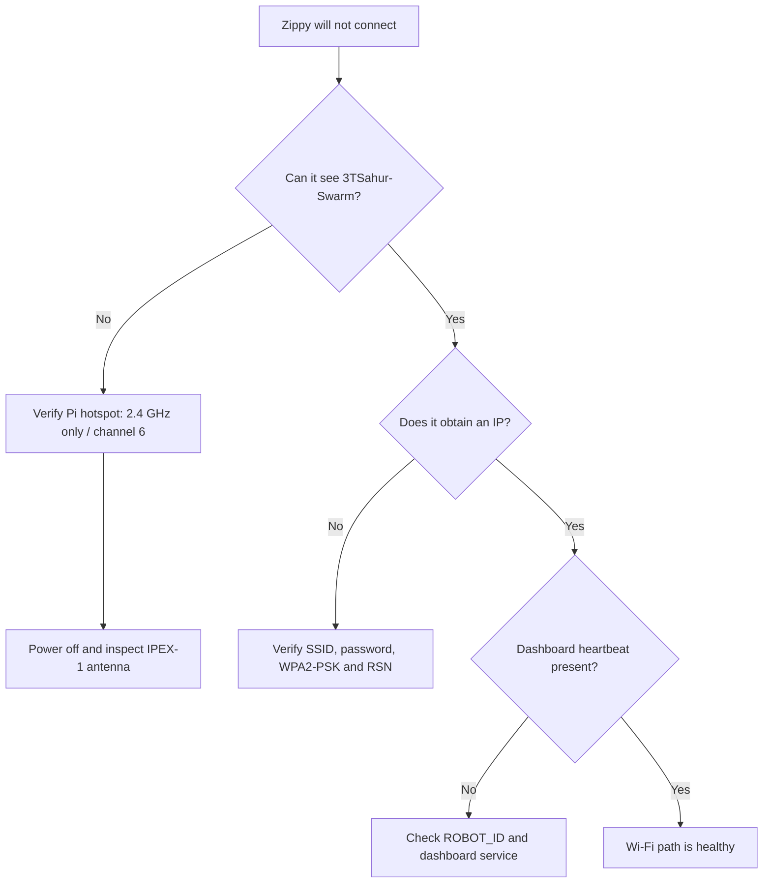

# 3TSahur / Zippy troubleshooting guide

## Required Wi-Fi configuration

For this robot deployment, configure the Raspberry Pi hotspot and every Zippy/LARP Wi-Fi client for the project's validated **2.4 GHz** network.

| Setting | Required value |
| --- | --- |
| Pi hotspot band | **2.4 GHz only** |
| Channel | **6** |
| Security | **WPA2-Personal / WPA2-PSK** |
| Protocol | **RSN** |
| SSID | `3TSahur-Swarm` |

Do not configure the robot network as 5 GHz-only. The ESP32-class Zippy/LARP clients used here operate on 2.4 GHz. For this project, also avoid dual-band/band-steered hotspot configuration: keep the dedicated Pi robot hotspot explicitly on 2.4 GHz so the deployment matches the tested configuration.

A dual-band access point can technically include a usable 2.4 GHz network, but that is not the configuration validated by this project. The requirement here is a dedicated 2.4 GHz robot network.

## IPEX-1 antenna check

The Zippy/ECHO IPEX-1 connector is part of the radio antenna path. It is separate from WPA2 authentication: correct WPA settings cannot compensate for a loose or damaged antenna connection.

With the robot powered off, inspect the IPEX-1 antenna plug and socket. Make sure the plug is centered and fully seated, the cable is not pinched, and the antenna lead is not damaged. Avoid repeatedly twisting or prying the small connector. After inspection, power the robot on and test close to the Pi first.

If a Zippy connects only at short range, drops frequently, or has much weaker reception than the other robot, check the IPEX-1 connection, antenna routing, and power stability before changing software.

## WPA2 checks

The project expects WPA2-Personal (`wpa-psk`) with RSN. Do not switch the dedicated robot hotspot to WPA3-only/SAE or enterprise authentication.

On the Pi, verify the non-secret profile fields with:

```bash
nmcli -f 802-11-wireless.ssid,802-11-wireless.band,802-11-wireless.channel connection show stem-robot-hotspot
nmcli -f 802-11-wireless-security.key-mgmt,802-11-wireless-security.proto connection show stem-robot-hotspot
```

Expected values are `3TSahur-Swarm`, `bg`, channel `6`, `wpa-psk`, and `rsn`.

## Symptom guide

### Zippy cannot see `3TSahur-Swarm`

Confirm the Pi hotspot is running and is explicitly configured for 2.4 GHz. Then test the Zippy close to the Pi and inspect the IPEX-1 antenna connection with power off.

### Zippy sees the network but will not join

Confirm the SSID and password in the ECHO firmware exactly match the Pi hotspot configuration. Confirm the Pi is using the required 2.4 GHz WPA2-Personal/RSN profile. Reflash the firmware after changing credentials and inspect serial output at 115200 baud.

### Zippy joins and then disconnects

Check the IPEX-1 antenna connection, antenna placement, battery/regulator stability, distance, and motor-related electrical noise. Testing with the drive motors disabled can help separate a radio/power problem from an application problem.

### Zippy has an IP but the dashboard says offline

The Wi-Fi association has already succeeded, so check `ROBOT_ID`, registration/heartbeat behavior, and the dashboard service instead of repeatedly changing WPA settings.

### Drive works but camera is offline

The ECHO drive controller and ESP32-CAM are separate Wi-Fi clients. Troubleshoot the camera's credentials, power, and `CAMERA_ID` independently.

## Quick isolation flow



When troubleshooting, change one variable at a time and validate one Zippy/LARP robot before bringing the second robot and camera nodes online.